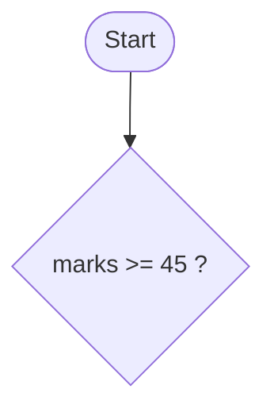

# Authoring Guide

How the DSC 481 notes are written and rebuilt. Read this first, then read `docs/unit-03-control.md` in full. It is the model page: copy its voice, its structure and its markup.

## Who the notes are for

- Complete beginners to programming, Python and AI. Assume nothing.
- Simple everyday English, short sentences. Define every technical term in one line the first time it appears (bold the term).
- Cover exactly what the syllabus lists. Skip history lectures, edge cases and advanced theory unless the syllabus names them.
- Use relatable data first: student marks, shop sales, mobile data use, cricket scores. Use `Rs.` for money and Nepali names and places (Asha, Bikash, Pokhara, Kathmandu, Butwal).
- The teacher reads each section aloud in class, so every section must read well out loud. Add an occasional "Ask the Class" box.
- No emoji. No jokes that need culture to understand. No filler.

## Page template (every unit page)

1. `# Unit N: Title` then `**Teaching time:** N hours`.
2. `!!! abstract "Learning Objectives"` with the syllabus "Specific Objectives" sentence copied word for word, then a short "In plain words" list.
3. One `##` heading per syllabus sub-point, with the syllabus number in the heading, in syllabus order (for example `## 3.1 Conditional Statements, Loops, Break and Continue`). Use `###` headings for the topics inside it. If the syllabus has no sub-numbers (Unit XI), use plain `##` headings in syllabus order.
4. Under each topic (`###`, or `##` when it has no children):
    - a short explanation, 3 to 6 sentences, in plain language;
    - a diagram or figure where it helps (Mermaid or a generated PNG);
    - a minimal code example, with its real output right below it;
    - one `!!! warning "Common Mistake"` box when beginners usually trip up here.
5. `## Quick Recap` with 4 to 6 one-line bullets.
6. `## Try It Yourself` with 3 to 5 short exercises. Answers go in collapsible `??? success "Answer"` blocks.
7. `## Exam Questions for This Unit` with one sentence linking to the unit's section of `exam-questions.md` (anchors below).

Page length follows teaching hours: Unit IX (6 h) is the longest, Units I and II (3 h) the shortest. Aim for roughly 70 to 90 lines of markdown per teaching hour (not counting generated Output blocks).

Heading case: Title Case for prose headings. Keep code spans exactly as written (`print()`, `pandas`, `df.head()`). Never change the wording of `#` comments inside code. Do not use trailing punctuation in headings.

### Unit titles and anchors

| Page | H1 | Exam page |
|---|---|---|
| `unit-01-intro.md` (3 h) | Unit I: Introduction to Data Science and Python | `exam/unit-01.md` |
| `unit-02-basics.md` (3 h) | Unit II: Python Programming Basics and Operators | `exam/unit-02.md` |
| `unit-03-control.md` (4 h) | Unit III: Control Structures | `exam/unit-03.md` |
| `unit-04-functions.md` (4 h) | Unit IV: Functions and Modules | `exam/unit-04.md` |
| `unit-05-structures.md` (5 h) | Unit V: Data Structures in Python | `exam/unit-05.md` |
| `unit-06-files.md` (4 h) | Unit VI: File Handling and Exception | `exam/unit-06.md` |
| `unit-07-cleaning.md` (4 h) | Unit VII: Data Collection and Cleaning with Python | `exam/unit-07.md` |
| `unit-08-eda.md` (5 h) | Unit VIII: Exploratory Data Analysis | `exam/unit-08.md` |
| `unit-09-ml.md` (6 h) | Unit IX: Introduction to Machine Learning with Python | `exam/unit-09.md` |
| `unit-10-visualization.md` (4 h) | Unit X: Data Visualization and Reporting | `exam/unit-10.md` |
| `unit-11-lab.md` (6 h) | Unit XI: Practical Lab Work | `exam/unit-11.md` |

Other pages: `index.md`, `setup.md`, `references.md`, the lab overview `practicals.md` and one lab sheet per file in `labs/lab-NN.md`, the exam overview `exam-questions.md` and one exam page per unit in `exam/unit-NN.md`. Pages in subfolders use `../` in links and image paths. Pages are published only if they are in the nav (see README, "Releasing topics gradually"); add every new page to BOTH `mkdocs.yml` (commented) and `mkdocs-all.yml`. Link between pages with relative `.md` links (`[Unit III](unit-03-control.md)`). `mkdocs build --strict` checks every link and every `#anchor`.

## Code examples and their output

All code is Python 3, beginner-readable, and runs exactly as written. Data comes only from `docs/assets/data/` (listed below) or from libraries (`sklearn.datasets.load_iris()`), so every example works offline. Add a `#` comment only where a beginner would get stuck.

**Never type an output by hand.** Write only the code block, then run:

```
.venv/bin/python scripts/run_examples.py --write docs/unit-XX-name.md
```

The script runs every ```` ```python ```` block in a clean temporary folder that holds copies of the data files (so `pd.read_csv("students.csv")` works), and writes the real output in an Output block right under it:

````
```python
print("hello")
```

```{ .text .output title="Output" }
hello
```
````

`python scripts/run_examples.py docs/unit-XX-name.md` (no flag) checks that every Output block still matches a real run. Read the generated outputs. If one looks wrong or noisy, fix the example, not the output.

Each block runs on its own. Do not rely on variables from an earlier block unless you mark it `<!-- continue -->` (below). Examples inside admonitions and collapsible blocks are indented four spaces; the script handles that.

### Directives

Put an HTML comment on the line just above the code block. Several can share one comment, separated by `;`.

| Directive | Use it for |
|---|---|
| `<!-- stdin: Asha | 78 -->` | Values typed in for `input()` calls, in order, separated by a plain `|`. The output shows each prompt followed by the typed value. |
| `<!-- error -->` | The example is meant to fail (a Common Mistake). The traceback is shown as its output. |
| `<!-- continue -->` | Run this block in the same session as the one above it (variables are kept). Only the new output is shown. Use sparingly and say "continuing the same program" in the text. |
| `<!-- file: helpers.py -->` | The block is a file that later blocks on the page can `import`. Not run itself. Give it `title="helpers.py"`. |
| `<!-- figure: u08-hist-marks -->` | The block draws a plot ending in exactly one `plt.show()`. `make_figures.py` saves it as a PNG (see below). |
| `<!-- plotly: u10-scatter -->` | The block builds a Plotly figure ending in exactly one `fig.show()`. Saved as an interactive HTML file. |
| `<!-- answer -->` | Run the block, but show its output in a later Output block inside a collapsible answer (for "predict the output" questions). The answer must already contain an Output block (any text); the script fills it. |
| `<!-- serve: 8; script: app.py -->` | A web server (a Dash app). It runs for 8 seconds, is stopped, and what it printed on start-up becomes the output. `script:` sets the file name the code runs as (it appears in tracebacks and as the Flask app name). Give the app a fixed `port=` that is not 8050 so parallel runs do not clash. |
| `<!-- script: name.py -->` | Run the block under this file name instead of `example.py`. |
| `<!-- online -->` | Needs the internet. Only run with `--online`. Use for at most one web-API example. |
| `<!-- no-run -->` | Never run (servers, infinite loops). Explain in the text why. Use rarely. |

Rules for runnable examples:

- No random output. Seed anything random (`random_state=42`, `np.random.default_rng(42)`).
- Do not print file paths, dates of "today", memory addresses, or timings.
- The order of a `set` of strings can differ between runs for students. Print `sorted(...)` or use sets of numbers, and say so in the text.
- No warnings in the output. If a library prints a warning, change the example. The script fails on any line containing `Warning`.
- Round floats (`round(x, 2)`, `f"{x:.2f}"`) so output is short and stable.
- Keep each output under about 25 lines and 78 characters wide (it shows on a projector).
- Use plain modern pandas (3.x) and scikit-learn (1.x). Reference versions used for the outputs: Python 3.12, pandas 3.0, NumPy 2.5, Matplotlib 3.11, seaborn 0.13, scikit-learn 1.9, Plotly 7, Dash 4.
- Never call `input()` without `stdin:`. Never open a window or a browser.

## Data files (`docs/assets/data/`)

Run examples from this folder's point of view: `pd.read_csv("students.csv")`, no path prefix.

| File | What it is | Columns |
|---|---|---|
| `students.csv` | 10 students, 3 subjects | `roll, name, math, science, english, attendance` |
| `students.json` | the same table as a list of records | same keys |
| `students_raw.csv` | the same class with real-world mess: a missing value in `science`, a missing `english`, one duplicate row (roll 4), an outlier (`math` 880 for Elina), mixed-case `gender`, `attendance` stored as text like `92%`, `joined` stored as text dates | `roll, name, gender, math, science, english, attendance, joined` |
| `shop_sales.csv` / `shop_sales.xlsx` | 42 sales rows, one shop, three weeks (sheet name `sales` in the xlsx) | `date, item, category, quantity, price, city` |
| `mobile_data.csv` | one phone, 30 days of data use in MB; day 18 is a 6200 MB outlier | `day, mb_used` |
| `cricket.csv` | 12 made-up batters | `player, role, matches, runs, balls_faced, fours, sixes` |
| `study_marks.csv` | 60 students: hours studied vs marks (strong positive link), pass mark 45 | `student_id, hours_studied, attendance, marks, result` |
| `shop_customers.csv` | 90 shoppers in three natural groups, for clustering | `customer_id, monthly_visits, monthly_spend` (spend in Rs. thousands) |
| `tips.csv` | the classic restaurant tips table (244 rows) | `total_bill, tip, sex, smoker, day, time, size` |
| `api_response.json` | what a small weather web API sends back | nested: `city, country, unit, forecast[{day, temp_max, temp_min, rain_mm}]` |
| `course-data.zip` | all of the above in one download | |

Also allowed: `sklearn.datasets.load_iris()` (ships with scikit-learn, works offline). Do not use `seaborn.load_dataset(...)` (it downloads) or any other download. If you really need a new tiny dataset, add it to `scripts/make_data.py` (seeded) and say so in your final message.

## Figures

Two kinds, both rebuilt by `.venv/bin/python scripts/make_figures.py`.

**1. Plot code in the notes.** Mark the block with `<!-- figure: uNN-short-name -->`, end it with exactly one `plt.show()`, and write plain beginner code: do not set colours, fonts, sizes or call `sns.set_theme()` or `plt.style.use()`. The generator runs the block with the site's light and dark style applied and saves `docs/assets/img/uNN-short-name.png` and `uNN-short-name-dark.png`. Name figures with your unit prefix (`u08-...`) so names never clash.

```
.venv/bin/python scripts/make_figures.py docs/unit-08-eda.md
```

Embed both files with a light/dark pair, right after the code block, with real alt text that says what the picture shows:

```markdown


```

Plot guidance: always label axes and give a title. Use at most 3 series in scatter plots, and always a legend or direct labels. Use `cmap="Blues"` for sequential data and `cmap="coolwarm"` for diverging (such as correlation). Both are restyled for each theme. Plot text must be big enough for a classroom projector, which the style already handles, so do not shrink it. Keep one idea per figure.

**2. Concept pictures** (train/test split, supervised vs unsupervised, under-fitting, and so on) that are not a student's code. Write a function in your own file `scripts/figures/uNN_something.py`:

```python
import matplotlib.pyplot as plt
from figstyle import figure, current

@figure("u09-train-test")
def train_test():
    c = current()          # colour dictionary for the theme being drawn
    fig, ax = plt.subplots()
    ax.bar(...)            # use c["series"][0], c["ink"], c["muted"], c["paper"] ...
```

Do not call `savefig`. The generator saves it in both themes. Only create concept pictures when Mermaid cannot show the idea; flowcharts and lifecycles belong in Mermaid.

**3. Interactive Plotly plots** (`<!-- plotly: name -->`). Embed both files with:

```html
<div class="ds-only-light"><iframe class="ds-plotly" src="../assets/plotly/u10-scatter.html" title="Interactive scatter plot of tips" loading="lazy"></iframe></div>
<div class="ds-only-dark"><iframe class="ds-plotly" src="../assets/plotly/u10-scatter-dark.html" title="Interactive scatter plot of tips" loading="lazy"></iframe></div>
```

## Diagrams

Use Mermaid fences for flowcharts, the data science lifecycle, supervised vs unsupervised, train/test split flow, and so on:

````

````

Put node text containing symbols or punctuation in double quotes. Keep diagrams small: 3 to 9 nodes. Prefer `flowchart LR` for short pipelines and `flowchart TD` for decisions.

## Other markup (all enabled in `mkdocs.yml`)

- Boxes: `!!! abstract "Learning Objectives"`, `!!! warning "Common Mistake"`, `!!! ask "Ask the Class"` (custom), `!!! tip`, `!!! note`.
- Collapsible answers: `??? success "Answer"` (content indented four spaces). `???+` opens by default.
- Tabs: `=== "Windows"` blocks. Definition lists (`Term` newline `: meaning`) are fine for glossaries.
- Tables with pipes. Checklists `- [ ] item`.
- Not enabled: emoji shortcodes, `++key++` shortcuts, footnotes, math. Do not use them. Write keys as plain `Ctrl+C` in code spans.
- Do not hotlink images. Do not use raw HTML except the Plotly iframes above.

## Practice questions for the exam page

`docs/exam-questions.md` is one file with a section per unit. Each unit has `### Past Paper Questions` (questions copied word for word from a real paper, each with its source name, year and link, and no invented ones) and `### Practice Questions (Not from Past Papers)` (written for these notes). Edit that file directly, using the format below, and run `python scripts/run_examples.py --write docs/exam-questions.md` so every output is real. A figure inside an answer uses `<!-- figure: ex-... -->` and `python scripts/make_figures.py docs/exam-questions.md`. Write 8 to 12 questions mixing these kinds, labelled in bold: `(Short answer)`, `(Long answer)`, `(Predict the output)`, `(Write a program)`. Format:

````markdown
**P1. (Short answer)** What is the difference between `break` and `continue`?

??? success "Model Answer"

    `break` ends the whole loop. `continue` skips only the current round.

**P2. (Predict the output)** What does this program print?

<!-- answer -->
```python
for i in range(3):
    print(i * 2)
```

??? success "Model Answer"

    ```{ .text .output title="Output" }
    TBD
    ```

    Brief explanation of why.
````

For "Write a program" questions, put the model program (and its output when it prints something) inside the collapsible answer, never above it. Questions must be answerable from the unit's content only. Do not invent a "past paper" source for them.

## Checklist before you finish a page

1. `python scripts/run_examples.py --write docs/unit-XX-name.md` finishes with `0 problem(s)`.
2. `python scripts/make_figures.py docs/unit-XX-name.md` builds every figure; look at each PNG (open it) for overlap, clipped labels or unreadable text, in both themes.
3. `NO_MKDOCS_2_WARNING=true .venv/bin/mkdocs build -d /tmp/your-own-site-dir` shows no warnings for your page. Warnings about other pages that are still placeholders are not yours to fix.
4. Every term is defined on first use; every section can be read aloud; hours and headings match the syllabus.

Do not edit `mkdocs.yml`, `docs/stylesheets/extra.css`, other people's pages, or the shared scripts (`mdblocks.py`, `run_examples.py`, `make_figures.py`, `figstyle.py`). If you need a change there, say so in your final message. Do not run git commands.

## Checking the whole site

`make check` runs the example checker, a strict build into `/tmp/sitecheck`, and `scripts/verify_site.py`, which reads the BUILT HTML and reports leaked markdown, broken links and `#anchors`, missing images, CSS problems (unbalanced braces, `@import` order, tokens missing from the light or dark scheme), wrong syllabus facts (hours, marks, sub-point numbers, objectives) and headings that break the Title Case rule.

More checks, each a small script in `scripts/`:

| Script | What it does |
|---|---|
| `page_stats.py` | Lines, examples, figures and diagrams per unit, so page length can be compared with teaching hours |
| `screenshot.py SITE OUT PAGE... [--dark] [--width N] [--full]` | Real browser screenshots of built pages (needs `playwright install chromium`) |
| `mobile_check.py SITE` | Opens every page at 390 px and reports any sideways page scroll |
| `offline_check.py SITE PAGE...` | Opens pages with all non-local requests blocked; checks fonts load from the site and Mermaid diagrams are drawn |
| `dash_screenshot.py` | Starts the Unit X dashboard and saves its screenshot |

Heading rule used by `verify_site.py` (Chicago style, same as the syllabus unit names): articles, conjunctions and prepositions stay lowercase (`with`, `from`, `over`, `of`, `to` ...) unless they start or end the heading or follow a colon; everything else is capitalized (`Is`, `Not`, `Up`); `code spans`, acronyms (CSV, JSON) and hyphenated terms stay as written.

Tracebacks shown for `<!-- error -->` blocks keep only lines from the example's own file, so a library error shows the line you wrote and the real error message, without paths from the machine that built the notes.
