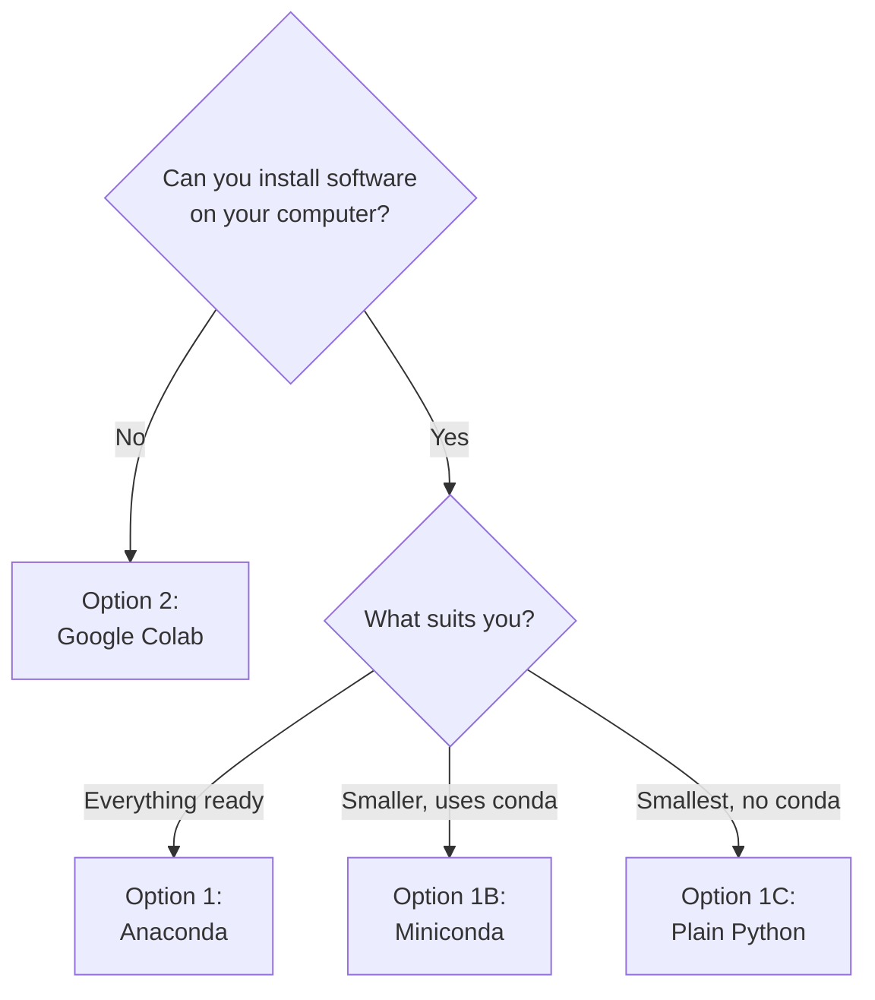
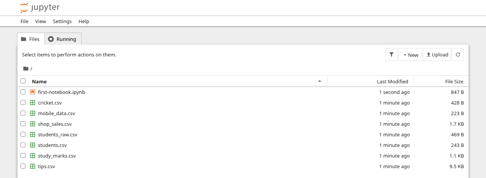
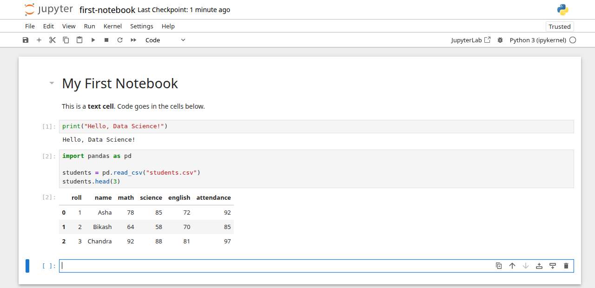

# Setting Up Python

This page gets Python working on your computer, or in your browser, so you can run every example in these notes. Do this once, before Unit II. It takes about 20 to 30 minutes, mostly waiting for a download. You need the ideas from [Unit I, section 1.2](unit-01-intro.md#12-python-environment-setup-anaconda-jupyter-notebook-google-colab) first: what Anaconda, Jupyter Notebook and Google Colab are. Miniconda (the light version of Anaconda) and plain Python with `venv` and `pip` (no conda at all) are covered here too.

## Choose Your Tool

You only need one of the options below. All of them run every example in these notes.

| | Anaconda | Miniconda | Plain Python | Google Colab |
|---|---|---|---|---|
| Where it runs | your computer | your computer | your computer | Google's computers, in your browser |
| Disk space | about 9.7 GB (Anaconda's documentation) | about 900 MB (same source), plus the libraries you add | Python itself, plus the libraries you add | none |
| What you get | Python, 600+ packages, Jupyter, Anaconda Navigator | Python and conda only | Python and `pip` only | notebooks with the common libraries ready |
| Extra steps | none | one command to add the libraries | one command to add the libraries | none, but it needs internet all the time |
| Needs conda? | yes | yes | **no** | no |



Many students do both a local tool and Colab. Your own Python is your main tool at home, and Colab is the backup when you are on someone else's computer.

## Option 1: Anaconda on Your Computer

**Anaconda** installs Python, the data science libraries and Jupyter Notebook together. The download is large, so do it on a good connection.

1. Open the official download page, [anaconda.com/download](https://www.anaconda.com/download), in your browser.
2. Pick **Anaconda Distribution**. If the page asks you to register, you can do so, or use the option to skip and download directly if one is shown.
3. Download the installer for your operating system.
4. Run the installer, following the steps for your system below. Keep the default choices unless a step says otherwise.

=== "Windows"

    1. Download the graphical installer for Windows, then double-click the file in your Downloads folder.
    2. Click **Next** and agree to the terms.
    3. When asked who to install for, choose **Just Me** (the installer marks it as recommended).
    4. Keep the default folder. A folder name without spaces or special characters is safest.
    5. Leave the option to add Anaconda to your PATH switched off. The installer warns that it can cause conflicts. You will open Anaconda from the Start menu instead.
    6. Click **Install**, wait, then click **Finish**.

    To confirm it worked, open the Start menu, search for **Anaconda Prompt** and open it. You should see `(base)` at the start of the line. Type:

    ```bash
    conda list
    ```

    A long list of packages and version numbers means Anaconda is installed. You can also open **Anaconda Navigator** from the Start menu.

=== "macOS"

    1. Download the graphical installer for macOS. It is a `.pkg` file.
    2. Double-click it, then click **Continue** through the screens. When the terms appear, read them and click **Agree**.
    3. Click **Install** and type your Mac password if it asks.
    4. When the install finishes, Anaconda Navigator may open by itself. If not, open **Launchpad** and click the Anaconda Navigator icon.

    To confirm it worked, open the **Terminal** app. You should see `(base)` at the start of the line. Type:

    ```bash
    conda list
    ```

    A long list of packages and version numbers means Anaconda is installed.

=== "Linux"

    1. Download the Linux installer. It is a `.sh` file.
    2. Open a terminal in the folder where it was saved and run it with `bash`. Use the real file name you downloaded in place of the part in angle brackets:

        ```bash
        bash Anaconda3-<version>-Linux-x86_64.sh
        ```

    3. Press `Enter` to read the terms, then type `yes` to agree.
    4. When it asks whether to initialize conda, type `yes`.
    5. Close the terminal and open a new one, so the change takes effect.

    To confirm it worked, you should see `(base)` at the start of the line in the new terminal. Type:

    ```bash
    conda list
    ```

    A long list of packages and version numbers means Anaconda is installed. To open Navigator, type `anaconda-navigator`.

## Option 1B: Miniconda, the Light Alternative

**Miniconda** is a small version of Anaconda. It installs only **conda** (the tool that installs packages), Python, and what they need. It has no Anaconda Navigator window and no data libraries. You add the libraries yourself, with one command. Choose it when disk space is small or the computer is old. Do this section instead of Option 1, not as well.

1. Open the official download page, [anaconda.com/download](https://www.anaconda.com/download), and pick **Miniconda**. The page may ask you to register first. Follow what it shows.
2. Download the installer for your operating system and install it as below.

=== "Windows"

    1. Download the **Windows 64-bit Graphical Installer** and double-click it. Do not start it from the Favorites folder.
    2. Choose **Just Me**. Keep the default folder, or one without spaces or special characters.
    3. Leave **Add Miniconda3 to my PATH environment variable** switched off. Anaconda does not recommend it.
    4. Finish the install. Open the Start menu, search for **Anaconda Prompt** and open it. You should see `(base)` at the start of the line.

=== "macOS"

    1. Download the macOS installer from the same page and run it. Click through the screens and agree to the terms.
    2. Open the **Terminal** app. You should see `(base)` at the start of the line. If you do not, close the terminal and open a new one.

    The wording of the macOS screens may differ from one version to the next. Follow what the installer shows.

=== "Linux"

    1. Download the Linux installer, a `.sh` file. The common name is `Miniconda3-latest-Linux-x86_64.sh` (`aarch64` instead of `x86_64` on ARM computers).
    2. In a terminal, run it with `bash`:

        ```bash
        bash Miniconda3-latest-Linux-x86_64.sh
        ```

    3. Press `Enter` to read the terms, type `yes` to agree, press `Enter` to keep the default folder, and type `yes` when it asks whether to initialize conda.
    4. Close the terminal and open a new one. You should see `(base)` at the start of the line.

### Add the Course Libraries

Miniconda starts empty, so create an **environment** for the course. An environment is a separate folder with its own Python and its own libraries, so this course cannot disturb anything else on your computer. Type these three commands in Anaconda Prompt (Windows) or the terminal (macOS and Linux). The last one downloads the libraries and may take several minutes.

```bash
conda create -n dsc481 python=3.12 -y
conda activate dsc481
pip install notebook pandas numpy matplotlib seaborn scikit-learn openpyxl requests plotly dash
```

After `conda activate dsc481` you should see `(dsc481)` at the start of the line. **Every time you open a new terminal, type `conda activate dsc481` first.** To check that it worked:

```bash
python -c "import pandas, sklearn; print('Ready')"
```

If conda stops and asks you to accept terms of service, read the message. It prints the command to run. Then start Jupyter Notebook from the terminal, as shown in the next section.

## Option 1C: Plain Python with `venv` and `pip`

This option uses only Python itself. There is no conda and no Anaconda. Python comes with **`venv`**, a tool that makes an **environment** (a separate folder with its own Python and its own libraries), and **`pip`**, the tool that installs libraries into it. Choose it when you want the smallest setup, or when Python is already on your computer. Do this section instead of Option 1 or 1B.

### Install Python

1. Open the official download page, [python.org/downloads](https://www.python.org/downloads/), and download Python 3 for your system. A recent version (3.11 or newer) is safest, because the libraries used in these notes are recent.
2. On Windows, run the installer. If it offers to add Python to your `PATH`, accept, so the `python` command works in a terminal. On macOS, run the installer from python.org. On Linux, Python 3 is usually there already. On Ubuntu or Debian, you may also need `sudo apt install python3-venv python3-pip`.
3. Open a terminal (Command Prompt or PowerShell on Windows, **Terminal** on macOS and Linux) and check:

```bash
python --version
```

On macOS and Linux the command may be `python3 --version` instead. On Windows, `py --version` also works. You should see a version number such as `Python 3.12.3`. Use the same command name (`python` or `python3`) in the steps below.

### Make an Environment and Add the Libraries

Make one folder for the course and create the environment inside it.

=== "Windows"

    ```bash
    mkdir dsc481
    cd dsc481
    python -m venv .venv
    .venv\Scripts\activate.bat
    ```

    In **PowerShell**, use `.venv\Scripts\Activate.ps1` for the last line. If PowerShell refuses to run it, type this once, then try again:

    ```bash
    Set-ExecutionPolicy -ExecutionPolicy RemoteSigned -Scope CurrentUser
    ```

=== "macOS and Linux"

    ```bash
    mkdir dsc481
    cd dsc481
    python3 -m venv .venv
    source .venv/bin/activate
    ```

After activation you should see `(.venv)` at the start of the line. Now install the course libraries. This downloads a few hundred megabytes and may take several minutes.

```bash
pip install notebook pandas numpy matplotlib seaborn scikit-learn openpyxl requests plotly dash
```

Check that it worked:

```bash
python -c "import pandas, sklearn; print('Ready')"
```

**Every time you open a new terminal, go to the folder and activate the environment first:** `cd dsc481`, then the activate line for your system. Type `deactivate` to leave it. Then start Jupyter Notebook from the terminal, as shown in the next section. Keep your notebooks and the practice data files in the `dsc481` folder.

## Opening Jupyter Notebook

There are two ways to start **Jupyter Notebook**. Both open it in your web browser.

**From Anaconda Navigator** (Anaconda only; Miniconda and plain Python have no Navigator, so use the terminal way below)

1. Open Anaconda Navigator.
2. On the **Home** tab, find the **Jupyter Notebook** tile and click its **Launch** button.

**From a terminal**

1. Open **Anaconda Prompt** (Windows) or the **Terminal** app (macOS and Linux). If you use Miniconda, type `conda activate dsc481` first. If you use plain Python, go to your `dsc481` folder and activate `.venv` first.
2. Move into the folder where you keep your course work. For example, `cd Documents/dsc481`.
3. Type the command below and press `Enter`.

```bash
jupyter notebook
```

Starting from a terminal is the better habit. Jupyter shows the files of the folder it was started from. If you start it inside your course folder, your data files are right there.

The terminal prints some lines, including an address such as `http://localhost:8888/`, and your browser opens that address. **Keep the terminal window open.** It is the Jupyter **server**, the program that runs your code. If you close it, Jupyter stops.

### The File Browser

The first page you see is the **file browser**. It lists the notebooks, files and folders in the folder where Jupyter was started. Use it to move between folders, to find your data files and to open a notebook you made earlier. Notebook files end with `.ipynb`.

{ .ds-shot }

*The file browser in Jupyter Notebook 7. Newer or older versions look a little different.*

### Creating and Using a Notebook

1. In the file browser, open the **New** menu and choose a Python 3 notebook. The exact wording changes a little between versions. If it asks you to pick a **kernel** (the engine that runs your code), choose Python 3.
2. A new notebook opens, with one empty cell. Click the name at the top to give it a proper name, such as `unit02-practice`.
3. A notebook has two kinds of cells you will use. A **code cell** holds Python code and shows the result below it when you run it. A **text cell** (called a **Markdown cell** in Jupyter) holds notes for humans. Use the cell type menu in the toolbar to switch between them.
4. Click in a code cell, type `print("Hello")` and press `Shift+Enter`. This runs the cell and moves to the next one. Use `Ctrl+Enter` to run a cell and stay on it.
5. Save with `Ctrl+S`. Jupyter also saves from time to time, but save yourself before you close.
6. To stop, save your work, close the browser tab, then go to the terminal and press `Ctrl+C`. Confirm if it asks. If you started Jupyter from Navigator, close it from Navigator in the same way. Closing the browser tab alone does not stop the server.

Here is a finished notebook. It has one text cell and two code cells. The number in square brackets, such as `[1]:`, tells you the order in which the cells were run. The result of each code cell appears right below it.

{ .ds-shot }

## Option 2: Google Colab

**Google Colab** is a notebook that runs on Google's computers. Nothing is installed on your machine. You need a **Google account** (a Gmail address works) and an internet connection.

1. Go to [colab.research.google.com](https://colab.research.google.com) and sign in with your Google account.
2. Choose **New notebook**. A notebook opens in your browser, with one empty code cell.
3. Click the cell and type `print("Hello")`.
4. Press `Shift+Enter`, or click the round play button at the left of the cell. The first run may take a few seconds while Colab connects to a computer.
5. Your notebook is saved to your Google Drive as an `.ipynb` file.

### Using the Practice Data Files in Colab

Colab does not have your files. You upload them for each session.

1. Download the files you need from the [Practice Data Files](#practice-data-files) section below.
2. In Colab, open the **Files** panel. It is the folder icon on the left side of the screen.
3. Use the upload button in that panel and choose your file, such as `students.csv`.
4. The file appears in the list. Your code can now read it by name, for example `pd.read_csv("students.csv")`.

!!! warning "Common Mistake"

    Expecting uploaded files to stay. Colab runs on a temporary computer. When the session ends, that computer is deleted, and the files you uploaded are deleted with it. Your notebook is kept in Google Drive, but the data is not. Keep your own copy of every data file, and upload it again at the start of the next session.

## Running a Script from the Terminal

A **script** is a file of Python code that ends in `.py`. You can run it without Jupyter. Create a file named `hello.py` in a text editor such as Notepad or VS Code, and type one line into it. Make sure the file name really ends in `.py`, and not `.py.txt`.

<!-- script: hello.py -->
```python title="hello.py"
print("Hello from a script")
```

```{ .text .output title="Output" }
Hello from a script
```

Open a terminal in the folder where you saved it, and ask Python to run the file. The output shown above is what appears.

```bash
python hello.py
```

On macOS and Linux, type `python3 hello.py` if `python` is not found.

## Checking Your Setup

Run this in a notebook cell. It prints your Python version, then the version of each library this course uses. If any line fails, go to [Installing Extra Libraries](#installing-extra-libraries).

```python
import sys

import dash
import matplotlib
import numpy
import pandas
import plotly
import seaborn
import sklearn

v = sys.version_info
print(f"Python: {v.major}.{v.minor}.{v.micro}")
print("pandas:", pandas.__version__)
print("numpy:", numpy.__version__)
print("matplotlib:", matplotlib.__version__)
print("seaborn:", seaborn.__version__)
print("scikit-learn:", sklearn.__version__)
print("plotly:", plotly.__version__)
print("dash:", dash.__version__)
```

```{ .text .output title="Output" }
Python: 3.12.3
pandas: 3.0.6
numpy: 2.5.3
matplotlib: 3.11.2
seaborn: 0.13.2
scikit-learn: 1.9.1
plotly: 7.1.0
dash: 4.4.1
```

Your version numbers may be different from the ones shown here, and that is fine. Any recent Python 3 and recent library versions work for this course. Small differences between versions rarely change the results.

## Installing Extra Libraries

Anaconda already has most of the libraries listed above. (With Miniconda or plain Python you already installed them, so nothing is missing; if you skipped one, use `pip` as below, with your environment active.) A few, such as `dash` (Unit X) and `openpyxl` (for Excel files in Unit VII), may be missing. Install them from a terminal (Anaconda Prompt on Windows). Use `pip`, Python's own installer:

```bash
pip install openpyxl dash
```

Or, if you use Anaconda or Miniconda, use `conda`, which is their installer:

```bash
conda install -c conda-forge openpyxl dash
```

Pick one of the two, not both. After installing, restart Jupyter, or choose to restart the kernel from the notebook's menu, so the notebook can see the new library. In Colab, put an exclamation mark in front and run it in a cell, for example `!pip install openpyxl`. Colab usually has the common libraries already.

## Practice Data Files

The notes use small data files so every example works offline. Download the ones you need by clicking the name, or download them all in one go from [course-data.zip](assets/data/course-data.zip) and unzip it.

| File | What it holds |
|---|---|
| [students.csv](assets/data/students.csv) | 10 students with marks in maths, science and English, and attendance |
| [students.json](assets/data/students.json) | The same student table, written as a list of records in JSON |
| [students_raw.csv](assets/data/students_raw.csv) | The same class with real-world mess: missing marks, a repeated row, an outlier and text-style numbers and dates |
| [shop_sales.csv](assets/data/shop_sales.csv) | 42 sales rows from one shop over three weeks |
| [shop_sales.xlsx](assets/data/shop_sales.xlsx) | The same shop sales as an Excel file (sheet name `sales`) |
| [mobile_data.csv](assets/data/mobile_data.csv) | One phone's data use in MB for 30 days, with one unusually big day |
| [cricket.csv](assets/data/cricket.csv) | 12 made-up batters with matches, runs, balls faced, fours and sixes |
| [study_marks.csv](assets/data/study_marks.csv) | 60 students: hours studied, attendance, marks and pass or fail result |
| [shop_customers.csv](assets/data/shop_customers.csv) | 90 shoppers with monthly visits and monthly spend, used for grouping (clustering) |
| [tips.csv](assets/data/tips.csv) | A well-known table of 244 restaurant bills and tips |
| [api_response.json](assets/data/api_response.json) | What a small weather web service sends back: a city and a daily forecast |
| [course-data.zip](assets/data/course-data.zip) | All the files above in one download |

**Where to put them.** In Jupyter, save the files in the same folder as your notebook, or start Jupyter from the folder that holds them. In Colab, upload them with the Files panel for every session, as described above. The notes read them by plain name, with no folder in front, as in the check below.

```python
import pandas as pd

students = pd.read_csv("students.csv")
print(students.head(3))
```

```{ .text .output title="Output" }
   roll     name  math  science  english  attendance
0     1     Asha    78       85       72          92
1     2   Bikash    64       58       70          85
2     3  Chandra    92       88       81          97
```

If you see a table like this, your files are in the right place. Python reads `students.csv` from the folder where your notebook runs. If the file is somewhere else, Python reports a `FileNotFoundError`.

## Troubleshooting

| Problem | Likely cause | What to try |
|---|---|---|
| `python` is not found or not recognized | Python is not installed, or the system cannot find it | On Windows, open **Anaconda Prompt** from the Start menu, or try `py`. On macOS and Linux, type `python3` instead. |
| The wrong Python opens, or `import pandas` fails in the terminal but works in Jupyter | Another Python is earlier on your PATH | Type `where python` (Windows) or `which python` (macOS, Linux) to see which one runs. Use Anaconda Prompt on Windows. |
| You see `>>>` and your commands fail with a `SyntaxError` | You are inside Python itself, not at the system prompt | Type `exit()` and press `Enter`. Run `pip` and `jupyter` commands at the normal prompt. |
| Jupyter will not start, or `jupyter` is not found | You are not in Anaconda Prompt, or Anaconda is not installed | Open Anaconda Prompt or a new terminal and try again, or start it from Anaconda Navigator. |
| The browser does not open when Jupyter starts | The browser was not launched automatically | Copy the `http://localhost:8888/...` address printed in the terminal into your browser. |
| `ModuleNotFoundError: No module named 'dash'` | The library is not installed for this Python | Run `pip install dash`, then restart the kernel. |
| `FileNotFoundError` when reading a data file | The file is not in the notebook's folder, or the name is spelled differently | Move the file next to your notebook, and match the name exactly, including lower case. |
| Colab lost my files | The session ended, so the temporary computer was deleted | Upload the files again. Keep your own copies. |
