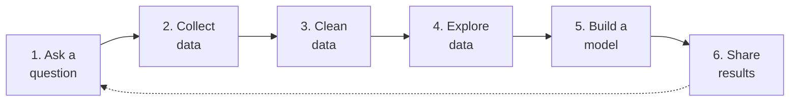
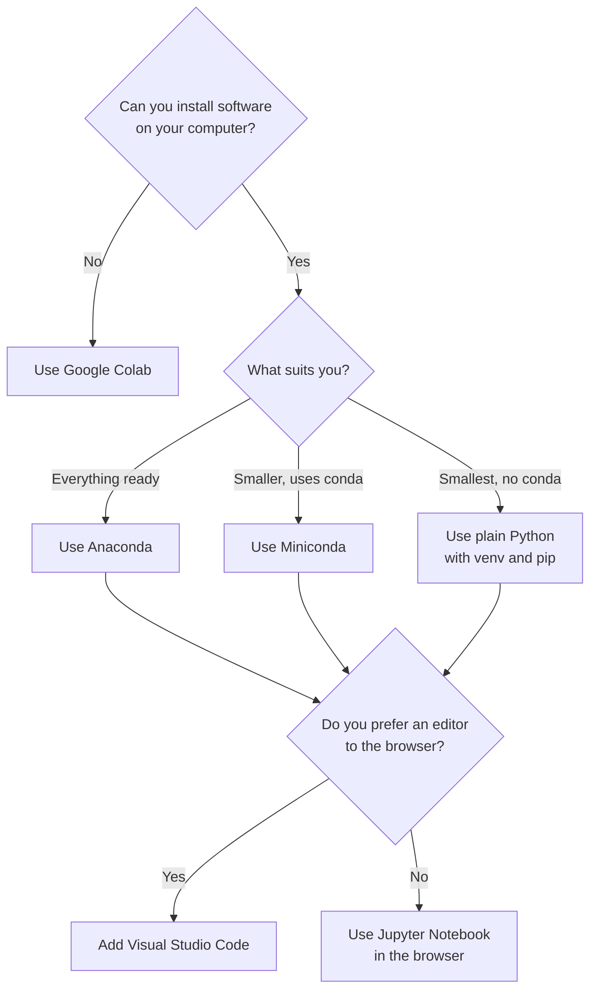

# Unit I: Introduction to Data Science and Python

**Teaching time:** 3 hours

!!! abstract "Learning Objectives"

    Understand Data Science concepts; set up Python environment and write basic scripts.

    In plain words, by the end of this unit you can:

    - explain what data science is and name places where it is used,
    - describe the steps of a data science project from question to result,
    - say why Python is a good tool for data work,
    - choose between Anaconda, Jupyter Notebook and Google Colab, and run your first cell.

## 1.1 Overview of Data Science, Applications, Workflow and Python Basics

### What Is Data Science

**Data** is a record of facts: marks in a register, prices in a shop book, the temperature at noon. On its own, a pile of data does not tell us much. **Data science** is the work of using data to answer questions and to make better decisions.

A data scientist does three things again and again. They collect data, they look for patterns in it, and they explain what the patterns mean. Programming is the tool that does this work quickly, even when the data has millions of rows.

Think of a class teacher with the marks of 40 students. A glance at the register shows nothing. After a little work, the teacher can say: "Most students are weak in English, and students with high attendance score better." That sentence is useful. Turning a pile of numbers into such a sentence is data science.

!!! ask "Question"

    Your mobile phone keeps a record of how much internet data you use each day. What question could that record answer for you?

### Where Data Science Is Used

Data science is not only for big companies. Anyone who has data and a question can use it. Here are everyday examples.

| Place | A question | The data used | What the answer helps with |
|---|---|---|---|
| Weather forecast | Will it rain in Pokhara tomorrow? | Past temperature, wind and rain records | Farmers and travellers plan their day |
| A shop | How many packets of rice should we stock for next week? | Daily sales of past weeks | Fewer empty shelves and less waste |
| A bank | Is this payment very different from this customer's usual payments? | Past payments of the customer | Strange payments are checked before money is lost |
| A hospital | On which days do most patients arrive? | Visit records of past months | Enough doctors and beds on busy days |
| Tourism in Pokhara | In which months do most visitors come? | Hotel bookings of past years | Hotels and guides plan staff and prices |
| A school or college | Which subject has the most failures? | Exam results of all students | The teacher knows where extra classes are needed |

Look at the pattern in the table. Each row starts with a question. Each row uses data that already exists. Each row ends with a better decision.

!!! ask "Question"

    Pick a place you know, such as your college, a local shop or a bus route. Name one question that its data could answer.

### The Data Science Workflow

A **workflow** is the list of steps a project follows from start to finish. Data science projects follow the same steps almost every time, and the steps form a cycle. The answer often raises a new question, so the cycle starts again. The dotted arrow in the diagram shows this.



Follow one example: a shop owner in Butwal wants to know which items to stock.

1. **Ask a question.** "Which three items sell the most each week?" A clear question keeps the project on track.
2. **Collect data.** Gather the sales records from the shop book, a spreadsheet or a billing machine.
3. **Clean data.** Fix the mess in the data: missing values, repeated rows, typing mistakes. Real data is never perfect.
4. **Explore data.** Look at totals, averages and charts to see what the data is saying.
5. **Build a model.** A **model** is a small program that learns a pattern from past data and uses it to predict. For example, it can predict next week's sales.
6. **Share results.** Show the answer in a chart or a short report that the owner can understand.

Then the owner asks a new question, such as "Do sales go up before a festival?", and the cycle begins again. Not every project needs all six steps in full, but cleaning and exploring are almost always needed. Units VII to X of this course follow these steps one by one.

!!! warning "Common Mistake"

    Thinking that data arrives ready to use. Here one mark is typed as the word `absent` instead of a number. Adding the marks fails.

    <!-- error -->
    ```python
    marks = [78, 64, "absent", 92]
    print(sum(marks))
    ```

    ```{ .text .output title="Output" }
    Traceback (most recent call last):
      File "example.py", line 2, in <module>
        print(sum(marks))
              ^^^^^^^^^^
    TypeError: unsupported operand type(s) for +: 'int' and 'str'
    ```

    This is why the cleaning step exists. A person or a program must fix the value before any calculation.

### Why Python

**Python** is a programming language, a way of giving instructions to a computer. Data scientists across the world use it. Here is why it suits beginners and professionals alike.

- **Easy to read.** Python code looks close to plain English, so it is easier to learn than many languages.
- **Free.** You can download it and use it at no cost.
- **Many libraries.** A **library** is a ready-made toolbox of code written by other people. You use it instead of writing everything yourself.
- **Large community.** Millions of learners and experts share answers, so help is easy to find.
- **Runs everywhere.** It works on Windows, macOS and Linux.

The libraries below are the ones this course uses.

| Library | What it is used for | Unit |
|---|---|---|
| `pandas` | Tables of data: loading, cleaning, summarising | VII, VIII |
| `numpy` | Fast calculations on numbers | VIII |
| `matplotlib` | Drawing charts | VIII |
| `seaborn` | Good-looking statistical charts | VIII, X |
| `scikit-learn` | Machine learning models | IX |
| `plotly` and `dash` | Interactive charts and dashboards | X |

### A First Look at Python

This is only a taste. [Unit II](unit-02-basics.md) teaches every idea below in detail. For now, read the code and the output, and notice how plain it looks.

**Syntax** means the rules for writing code, just as grammar is the rules for writing English. The `print()` command shows a result on the screen. A **variable** is a name that stores a value, such as `marks`.

```python
name = "Asha"
marks = 78
print(name, "scored", marks)
```

```{ .text .output title="Output" }
Asha scored 78
```

Every value has a **data type**. The four basic types are whole numbers (`int`), numbers with a decimal point (`float`), text (`str`) and True or False (`bool`). The `type()` command tells you which one a value has.

```python
print(type(78))
print(type(78.5))
print(type("Asha"))
print(type(True))
```

```{ .text .output title="Output" }
<class 'int'>
<class 'float'>
<class 'str'>
<class 'bool'>
```

An **operator** is a symbol that does a calculation, such as `+` and `/`. Python also lets you write a note for human readers after a `#`. Python ignores that note.

```python
math = 78
science = 64
english = 85

# Add the three marks, then divide by 3
average = (math + science + english) / 3
print("Average:", round(average, 2))
```

```{ .text .output title="Output" }
Average: 75.67
```

!!! ask "Question"

    What do you think `print(type(3.0))` shows: `int` or `float`? Why?

## 1.2 Python Environment Setup (Anaconda, Jupyter Notebook, Google Colab)

To write and run Python you need a **Python environment**: a place on your computer or on the internet where Python is installed and ready. This course uses a few names that students often mix up. They do different jobs.

### Anaconda

**Anaconda** is a free package that installs Python and many data science libraries in one go. After installing it, you already have `pandas`, `numpy`, `matplotlib` and more. It also installs Jupyter Notebook and a window called Anaconda Navigator, from which you can start your tools. The download is large, so it needs a good internet connection once. After that it works without internet. Choose Anaconda when you want your own Python on your own computer.

### Miniconda and Plain Python

Anaconda is large. If your computer is short of disk space, there are two smaller ways to get Python on your own computer. **Miniconda** is a much smaller version of Anaconda. It has Python and the package installer only, and you add the libraries you need with one command. **Plain Python** skips conda completely. You install Python from python.org and use its own tools, `venv` (makes a separate folder for your libraries) and `pip` (installs them). It is the smallest setup of all. With both, you add the libraries yourself with one command.

### Visual Studio Code

**Visual Studio Code** is a free code editor from Microsoft. It is not a way to get Python. It is a place to write and run Python, and notebooks too, once Python is installed by one of the methods above. Students who like an editor with a file list and a built-in terminal choose it instead of a browser. The setup page explains how.

### Jupyter Notebook

**Jupyter Notebook** is a tool for writing and running Python in your web browser. You write code in boxes called **cells**. When you run a cell, the result appears right below it. A notebook can also hold text, tables and charts, so it is both a lab book and a report. Anaconda installs Jupyter Notebook for you. With Miniconda or plain Python, you add it with one `pip install` command. Notebook files end with `.ipynb`. We use notebooks for most of this course.

### Google Colab

**Google Colab** (short for Colaboratory) is a free notebook service run by Google. It works like Jupyter Notebook, but it runs on Google's computers, not yours. Nothing needs to be installed. You open it in a browser and sign in with a Google account. It is a good choice on a shared or school computer. It needs the internet all the time. The files you upload are deleted when the session ends, so keep your own copies.

### Which One Should I Use?



In the diagram, Visual Studio Code is an extra step, not a way to get Python. First choose how to get Python, then choose where to write your code. All the choices work for this course. Every example in these notes runs the same in each of them. Many students use one tool on their own computer and keep Colab as a backup.

The step-by-step instructions for each option are on the [Setting Up Python](setup.md) page. Follow them at your computer.

### Running Your First Cell

Once your notebook is open, follow these steps. They are the same in Jupyter Notebook and in Colab.

1. Click the first cell. It is an empty box with a cursor.
2. Type the code below.
3. Press `Shift+Enter` to run the cell. In Colab you can also click the round play button at the left of the cell.
4. Read the output that appears right below the cell.

```python
print("Hello, Data Science!")
```

```{ .text .output title="Output" }
Hello, Data Science!
```

!!! warning "Common Mistake"

    Running cells out of order. A notebook remembers a variable only after the cell that creates it has run. If you open a fresh notebook and run a cell that uses `marks` first, Python does not know the name yet.

    <!-- error -->
    ```python
    print(marks)
    ```

    ```{ .text .output title="Output" }
    Traceback (most recent call last):
      File "example.py", line 1, in <module>
        print(marks)
              ^^^^^
    NameError: name 'marks' is not defined
    ```

    Run the cell that sets `marks = 78` first. In a notebook the error box looks a little different, but its last line says the same thing. When a notebook behaves strangely, run all cells again from the top.

## Quick Recap

- Data science uses data to answer questions and make better decisions.
- The workflow is a cycle: ask, collect, clean, explore, model, share, and ask again.
- Python is easy to read, free, runs everywhere and has many data libraries.
- A variable stores a value, `type()` shows its data type, and operators do calculations.
- Anaconda installs Python on your computer; Jupyter Notebook is the browser tool with cells; Colab is a notebook that runs online with nothing to install.
- Run a cell with `Shift+Enter`.

## Try It Yourself

**1.** Name two places where data science is used. For each, write one question that its data could answer.

??? success "Answer"

    Many answers are correct. Two examples:

    - A hospital: "On which days of the week do most patients arrive?"
    - A shop: "Which item sold the most last month?"

**2.** These workflow steps are mixed up: *share results, clean data, ask a question, build a model, collect data, explore data.* Write them in the correct order.

??? success "Answer"

    1. Ask a question
    2. Collect data
    3. Clean data
    4. Explore data
    5. Build a model
    6. Share results

    After step 6, the answer often leads to a new question, so the cycle starts again.

**3.** Store your name and a mark in two variables. Print them in one line like this: `Bikash scored 72`.

??? success "Answer"

    ```python
    name = "Bikash"
    marks = 72
    print(name, "scored", marks)
    ```

    ```{ .text .output title="Output" }
    Bikash scored 72
    ```

**4.** A student has marks of 62, 71 and 80. Use Python to print the average.

??? success "Answer"

    ```python
    average = (62 + 71 + 80) / 3
    print("Average:", average)
    ```

    ```{ .text .output title="Output" }
    Average: 71.0
    ```

**5.** A student has no laptop at home but can use a shared computer in the library. Which environment should they choose, and why?

??? success "Answer"

    Google Colab. A shared computer may not allow installing software, and Colab needs only a browser and a Google account. The student must keep their own copy of any file they upload, because Colab deletes uploaded files when the session ends.

## Exam Questions for This Unit

Past-paper and practice questions for this unit are collected in [Unit I: Introduction to Data Science and Python](exam/unit-01.md).
