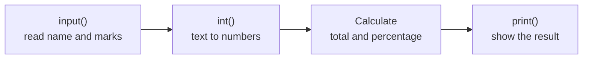

# Unit II: Python Programming Basics and Operators

**Teaching time:** 3 hours

!!! abstract "Learning Objectives"

    Understand Python syntax and use operators effectively; write basic Python programs.

    In plain words, by the end of this unit you can:

    - tell the short story of Python and name its main features,
    - check that Python is installed on your computer,
    - store values in variables and know the basic data types,
    - use arithmetic, comparison, logical and assignment operators,
    - convert between types and write a small program that reads input and prints a result.

## 2.1 Python History, Features, Installation

### A Short History of Python

Python was created by **Guido van Rossum**. He began writing it during the Christmas holidays of 1989, and shared it with the public in February 1991. He named it after *Monty Python's Flying Circus*, a British comedy series from BBC television that he loved.

- **2000:** Python 2.0 is released (16 October).
- **2008:** Python 3.0 is released (3 December).

Python 2 is no longer maintained, and old Python 2 programs may not run on Python 3. This course uses **Python 3** only.

### Features of Python

- **Easy to read.** The code looks close to English, so a short program is often only a few lines.
- **Interpreted.** An **interpreter** is a program that reads your code and runs it line by line. You write, run and see the result at once.
- **Free.** You can download and use Python at no cost, even for work.
- **A huge collection of libraries.** Python comes with a **standard library** of ready-made tools, such as `math` and `statistics`. Thousands more can be added.
- **Runs everywhere.** The same program runs on Windows, macOS and Linux.

### Installing Python

If you installed Anaconda on the [setup page](setup.md), you already have Python and can skip this. Otherwise, download the installer for your operating system from [python.org/downloads](https://www.python.org/downloads/), run it, and then ask Python for its version. It answers with the word `Python` and a version number that starts with 3.

=== "Windows"

    Open the **Command Prompt** from the Start menu and type `python --version`. If `python` is not found, try `py --version`. If the installer offers to add Python to your **PATH** (the list of places where Windows looks for programs), accept.

=== "macOS"

    Open the **Terminal** app and type `python3 --version`.

=== "Linux"

    Python is already installed on most systems. Open a terminal and type `python3 --version`.

## 2.2 IDEs, Variables, Data Types, Operators, Expressions, Type Conversion and Your First Program

### IDEs

An **IDE** (Integrated Development Environment) is one program in which you write, run and fix your code. It is like a word processor made for programmers.

| Tool | What it is |
|---|---|
| **IDLE** | A simple editor that comes with Python on most systems. Good for the first programs. |
| **VS Code** | A free code editor from Microsoft. You add the Python extension. |
| **PyCharm** | A full IDE made by JetBrains for Python projects. |
| **Jupyter Notebook** | Runs code in cells and shows the output below each one. Strictly not an IDE, but the tool this course uses (see [Setting Up Python](setup.md)). |

### Variables

A **variable** is a name that stores a value. Think of a labelled box: the label is the name, and what is inside is the value. You create one with `=`, called **assignment**: the name goes on the left and the value on the right. A variable can change. The old value is replaced.

```python
student = "Asha"
marks = 78
print(student, marks)

marks = 85
print(student, marks)
```

```{ .text .output title="Output" }
Asha 78
Asha 85
```

Names follow rules. Use only letters, digits and underscores. Do not start with a digit. Do not use spaces. Do not use a **keyword**, a word Python keeps for itself, such as `if`, `for` or `class`. Capital letters matter: `marks` and `Marks` are two different names. A good name, such as `total_marks`, tells the reader what is inside.

!!! warning "Common Mistake"

    Putting a space inside a name. Python thinks `first` and `name` are two separate things. Write `first_name`.

    <!-- error -->
    ```python
    first name = "Asha"
    ```

    ```{ .text .output title="Output" }
      File "example.py", line 1
        first name = "Asha"
              ^^^^
    SyntaxError: invalid syntax
    ```

### Data Types

A **data type** tells Python what kind of value something is, and so what you can do with it. The four basic types are `int` (whole numbers such as `78`), `float` (numbers with a decimal point such as `72.5`), `str` (text, called a **string**, such as `"Pokhara"`) and `bool` (`True` or `False`, called a **Boolean**). The `type()` command shows the type of a value.

```python
print(type(7))
print(type(5.4))
print(type("Pokhara"))
print(type(True))
```

```{ .text .output title="Output" }
<class 'int'>
<class 'float'>
<class 'str'>
<class 'bool'>
```

!!! ask "Ask the Class"

    What is the type of `5`, of `5.0`, and of `"5"`? They look alike, but are they the same to Python?

### Operators

An **operator** is a symbol that tells Python to do something with values, called **operands**. **Arithmetic operators** do calculations.

| Operator | Meaning | Example | Result |
|---|---|---|---|
| `+` `-` `*` | add, subtract, multiply | `17 + 5` | `22` |
| `/` | divide | `17 / 5` | `3.4` |
| `//` | floor division (whole part only) | `17 // 5` | `3` |
| `%` | modulus (the remainder) | `17 % 5` | `2` |
| `**` | power | `17 ** 2` | `289` |

Seventeen students sit on benches of five. `//` says how many benches are full, and `%` says how many students are left over.

```python
students = 17
per_bench = 5

print("Full benches:", students // per_bench)
print("Students left over:", students % per_bench)
```

```{ .text .output title="Output" }
Full benches: 3
Students left over: 2
```

!!! warning "Common Mistake"

    Expecting `/` to give a whole number. The `/` operator always gives a `float`, even when the answer is exact. Use `//` for the whole part.

    ```python
    print(5 / 2)
    print(5 // 2)
    print(4 / 2)
    ```

    ```{ .text .output title="Output" }
    2.5
    2
    2.0
    ```

**Comparison operators** compare two values and give a `bool`. They are `==` (equal to), `!=` (not equal to), `>`, `<`, `>=` and `<=`. **Logical operators** join conditions: `and` is `True` only when both sides are `True`, `or` when at least one side is, and `not` turns `True` into `False` and back. **Assignment operators** store a value. `=` is the basic one. The short forms `+=`, `-=`, `*=`, `/=`, `//=`, `%=` and `**=` update a variable in one step: `marks += 10` means `marks = marks + 10`. Comparison and logical operators matter most in [Unit III](unit-03-control.md), where they help a program make decisions.

```python
marks = 62
attendance = 70

print(marks >= 45)
print(marks >= 45 and attendance >= 75)
print(marks >= 45 or attendance >= 75)
print(not marks >= 45)

marks += 10
print(marks)
```

```{ .text .output title="Output" }
True
False
True
False
72
```

!!! ask "Ask the Class"

    Without running it, what are `10 % 3`, `10 // 3` and `2 ** 3`?

### Expressions and Operator Order

An **expression** is a mix of values, variables and operators that Python works out into one value. Python does not simply go from left to right. It follows an order, like the "multiply before add" rule from school mathematics, called **operator precedence**. From first to last: brackets `( )`, then `**`, then `*` `/` `//` `%`, then `+` `-`, then comparisons, then `not`, then `and`, then `or`. Operators at the same level go from left to right. When in doubt, use brackets.

```python
print(2 + 3 * 4)
print((2 + 3) * 4)
```

```{ .text .output title="Output" }
14
20
```

!!! warning "Common Mistake"

    Forgetting brackets when finding an average. Division works before addition, so only the last mark is divided by 3.

    ```python
    math = 78
    science = 64
    english = 85

    wrong = math + science + english / 3
    right = (math + science + english) / 3
    print(round(wrong, 2))
    print(round(right, 2))
    ```

    ```{ .text .output title="Output" }
    170.33
    75.67
    ```

### Type Conversion

**Type conversion** means changing a value from one type to another with `int()`, `float()` or `str()`. `int()` cuts off decimals and does not round.

```python
print(int("42") + 8)
print(int(3.9))
print("Marks: " + str(78))
```

```{ .text .output title="Output" }
50
3
Marks: 78
```

The `input()` command asks the user to type something. It always gives back **text** (`str`), even when the user types digits. So to calculate with typed numbers, convert them first. The mistake below shows what goes wrong when we forget (the user typed `78`).

!!! warning "Common Mistake"

    Adding a number to the text that `input()` returns. The `78` is text, and Python cannot add a `str` and an `int`.

    <!-- stdin: 78 -->
    <!-- error -->
    ```python
    marks = input("Enter your marks: ")
    total = marks + 5
    print(total)
    ```

    ```{ .text .output title="Output" }
    Enter your marks: 78
    Traceback (most recent call last):
      File "example.py", line 2, in <module>
        total = marks + 5
                ~~~~~~^~~
    TypeError: can only concatenate str (not "int") to str
    ```

    The fix is to convert first: `int(marks) + 5` gives `83`. Note that `int("12.5")` also fails, because of the decimal point. Use `float("12.5")` for such text.

### Your First Python Program

A program is a set of instructions that Python runs from top to bottom. This one reads a student's name and three marks, then prints the total and the percentage. It has three parts: take input, calculate, show output.



An **f-string** is a string that starts with the letter `f`. Anything inside `{ }` is replaced by its value. In `{percentage:.2f}`, the `:.2f` part means "show 2 digits after the decimal point". The program below runs with `Asha`, `78`, `64` and `85` typed as the answers.

<!-- stdin: Asha | 78 | 64 | 85 -->
```python
# Marks percentage calculator
name = input("Enter student name: ")
math = int(input("Enter marks in Maths: "))
science = int(input("Enter marks in Science: "))
english = int(input("Enter marks in English: "))

total = math + science + english
percentage = total / 300 * 100

print()
print(f"Name: {name}")
print(f"Total: {total} out of 300")
print(f"Percentage: {percentage:.2f}%")
```

```{ .text .output title="Output" }
Enter student name: Asha
Enter marks in Maths: 78
Enter marks in Science: 64
Enter marks in English: 85

Name: Asha
Total: 227 out of 300
Percentage: 75.67%
```

Each `input()` is wrapped in `int()` so that the marks become numbers. To run it as a script, save the code as `marks.py` and type `python marks.py` in a terminal (see [Setting Up Python](setup.md#running-a-script-from-the-terminal)). In a notebook, put it in a cell and press `Shift+Enter`.

!!! ask "Ask the Class"

    What would happen if we wrote `math = input("Enter marks in Maths: ")` without `int()`? On which line would Python complain?

## Quick Recap

- Python was created by Guido van Rossum, first released in 1991 and named after a comedy show. Python 3.0 came in 2008.
- Python is easy to read, interpreted, free, rich in libraries and runs everywhere.
- A variable stores a value; names are case-sensitive and never start with a digit. Basic types are `int`, `float`, `str` and `bool`; `type()` shows them.
- Operators: arithmetic (`//` whole part, `%` remainder, `**` power), comparison, logical and assignment. Use brackets to be clear about order.
- `input()` always gives text. Convert with `int()` or `float()`. Use f-strings to print results.

## Try It Yourself

**1.** Predict the output of this code, then check it.

<!-- answer -->
```python
print(7 // 2, 7 % 2, 7 ** 2)
```

??? success "Answer"

    ```{ .text .output title="Output" }
    3 1 49
    ```

    `7 // 2` is the whole part of 3.5, which is 3. `7 % 2` is the remainder, 1. `7 ** 2` is 49.

**2.** Write a bill calculator. Read the price of one item and the quantity. Give a 10 percent discount on the total. Print the total, the discount and the amount to pay in Rs., with two decimal places. Test it with a price of 450 and a quantity of 3.

??? success "Answer"

    <!-- stdin: 450 | 3 -->
    ```python
    price = float(input("Price of one item (Rs.): "))
    quantity = int(input("Quantity: "))

    total = price * quantity
    discount = total * 10 / 100
    to_pay = total - discount

    print(f"Total: Rs. {total:.2f}")
    print(f"Discount: Rs. {discount:.2f}")
    print(f"To pay: Rs. {to_pay:.2f}")
    ```

    ```{ .text .output title="Output" }
    Price of one item (Rs.): 450
    Quantity: 3
    Total: Rs. 1350.00
    Discount: Rs. 135.00
    To pay: Rs. 1215.00
    ```

**3.** This code gives an error when the user types `15`. Say why, and fix it so that it prints the age next year.

<!-- stdin: 15; error; answer -->
```python
age = input("Age: ")
print(age + 1)
```

??? success "Answer"

    Running the code gives this error.

    ```{ .text .output title="Output" }
    Age: 15
    Traceback (most recent call last):
      File "example.py", line 2, in <module>
        print(age + 1)
              ~~~~^~~
    TypeError: can only concatenate str (not "int") to str
    ```

    `input()` returns text, so Python cannot add 1 to it. Convert it with `int()`.

    <!-- stdin: 15 -->
    ```python
    age = int(input("Age: "))
    print(age + 1)
    ```

    ```{ .text .output title="Output" }
    Age: 15
    16
    ```

**4.** Which of these are valid variable names: `total_marks`, `2nd_mark`, `first name`, `class`? Give the reason for each one that is not valid.

??? success "Answer"

    Only `total_marks` is valid. `2nd_mark` starts with a digit. `first name` has a space. `class` is a keyword that Python keeps for itself.

## Exam Questions for This Unit

Past-paper and practice questions for this unit are collected in [Unit II: Python Programming Basics and Operators](exam-questions.md#unit-ii-python-programming-basics-and-operators).
