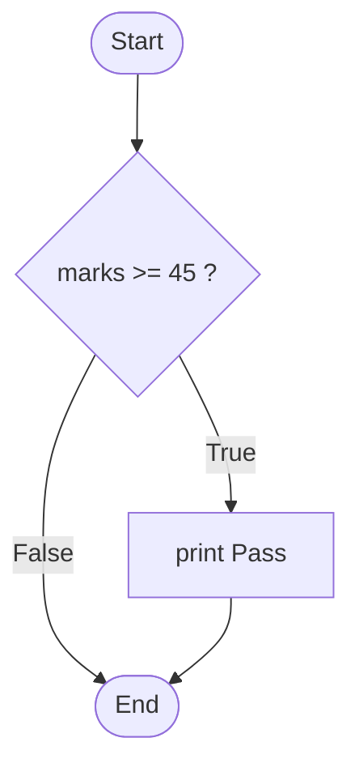
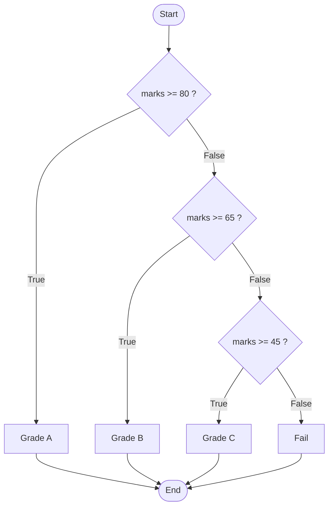
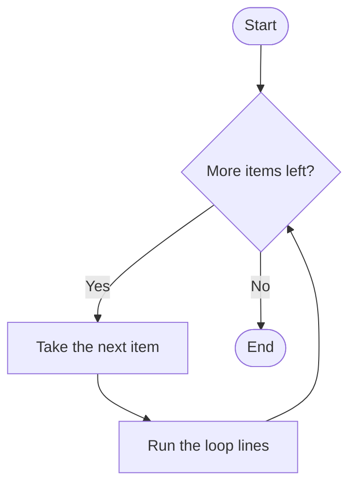

# Unit III: Control Structures

**Teaching time:** 4 hours

!!! abstract "Learning Objectives"

    Implement decision-making and iterative programming in Python.

    In plain words, by the end of this unit you can:

    - make a program choose between paths with `if`, `else` and `elif`,
    - repeat work with `for` and `while` loops,
    - stop a loop early with `break` and skip one round with `continue`.

## 3.1 Conditional Statements, Loops, Break and Continue

A program normally runs line by line, from top to bottom. A **control structure** is a tool that changes this order. There are two kinds. A **decision** lets the program choose which lines to run. A **loop** lets the program run the same lines again and again.

Think about a teacher checking exam papers. For each paper, the teacher asks a question: "Is it 45 or more?" That is a decision. The teacher does this for every paper in the pile. That is a loop.

### Making Decisions with `if`

A **condition** is a question that has only two answers: `True` or `False`. These two values are called **Booleans**. An `if` statement runs its lines only when the condition is `True`.



The lines that belong to the `if` are pushed to the right. This push is called **indentation**, and Python uses four spaces for it. The colon `:` at the end of the `if` line is required.

```python
marks = 62
if marks >= 45:
    print("Pass")
print("Done")
```

```{ .text .output title="Output" }
Pass
Done
```

Python compares numbers with these **comparison operators**. Joining two conditions needs the **logical operators** `and`, `or` and `not`.

| Symbol | Meaning | Example | Result |
|--------|---------|---------|--------|
| `==` | equal to | `5 == 5` | `True` |
| `!=` | not equal to | `5 != 5` | `False` |
| `>` `<` | greater, less | `7 > 3` | `True` |
| `>=` `<=` | greater or equal, less or equal | `45 >= 45` | `True` |

```python
marks = 62
attendance = 70
if marks >= 45 and attendance >= 75:
    print("Eligible")
print("Checked")
```

```{ .text .output title="Output" }
Checked
```

!!! ask "Question"

    A student has 62 marks and 70% attendance. The rule needs both conditions. Why did the word "Eligible" not print?

!!! warning "Common Mistake"

    One `=` stores a value. Two `==` ask a question. Beginners write `=` inside an `if`.

    <!-- error -->
    ```python
    marks = 45
    if marks = 45:
        print("Exactly pass marks")
    ```

    ```{ .text .output title="Output" }
      File "example.py", line 2
        if marks = 45:
           ^^^^^^^^^^
    SyntaxError: invalid syntax. Maybe you meant '==' or ':=' instead of '='?
    ```

### Choosing Between Two Paths with `else`

`else` gives the program a second path. It runs when the `if` condition is `False`. Exactly one of the two paths runs, never both and never none.

```python
marks = 38
if marks >= 45:
    print("Pass")
else:
    print("Fail")
```

```{ .text .output title="Output" }
Fail
```

### Choosing Between Many Paths with `elif`

`elif` is short for "else if". Use it when there are more than two paths, like grade bands. Python checks the conditions from top to bottom. It runs the first one that is `True` and skips the rest.



```python
marks = 72
if marks >= 80:
    print("Grade A")
elif marks >= 65:
    print("Grade B")
elif marks >= 45:
    print("Grade C")
else:
    print("Fail")
```

```{ .text .output title="Output" }
Grade B
```

!!! warning "Common Mistake"

    Writing separate `if` statements instead of `elif`. Python then checks every one of them. A student with 85 marks gets three grades.

    ```python
    marks = 85
    if marks >= 80:
        print("Grade A")
    if marks >= 65:
        print("Grade B")
    if marks >= 45:
        print("Grade C")
    ```

    ```{ .text .output title="Output" }
    Grade A
    Grade B
    Grade C
    ```

### Repeating with `for`

A `for` loop repeats its lines once for each item in a collection. The variable after `for` holds the current item. Each round of a loop is called an **iteration**.



```python
marks = [78, 64, 92, 45]
for m in marks:
    print("Marks:", m)
```

```{ .text .output title="Output" }
Marks: 78
Marks: 64
Marks: 92
Marks: 45
```

`range()` makes a sequence of numbers for you. `range(1, 6)` gives 1, 2, 3, 4, 5. It starts at the first number and stops just before the last one.

```python
for day in range(1, 6):
    print("Day", day)
```

```{ .text .output title="Output" }
Day 1
Day 2
Day 3
Day 4
Day 5
```

A loop can also build up a result. Start a total at zero and add one item in every round.

```python
sales = [1200, 850, 430, 990]
total = 0
for amount in sales:
    total = total + amount
print("Total sales:", total)
```

```{ .text .output title="Output" }
Total sales: 3470
```

!!! warning "Common Mistake"

    `range(5)` starts at 0 and stops at 4. It never reaches 5. To count 1 to 5, write `range(1, 6)`.

    ```python
    for n in range(5):
        print(n)
    ```

    ```{ .text .output title="Output" }
    0
    1
    2
    3
    4
    ```

### Repeating with `while`

A `while` loop repeats as long as its condition stays `True`. Use it when you do not know in advance how many rounds you need. Here a phone has 1000 MB of data. Each video uses 300 MB.

```python
data_left = 1000
videos = 0
while data_left >= 300:
    data_left = data_left - 300
    videos = videos + 1
print("Videos watched:", videos)
print("Data left:", data_left, "MB")
```

```{ .text .output title="Output" }
Videos watched: 3
Data left: 100 MB
```

The loop lines must change something that the condition looks at. If they do not, the condition stays `True` forever. This is an **infinite loop**, and the program never stops.

!!! warning "Common Mistake"

    Forgetting to change the variable in the condition. This loop never ends. Do not run it. If it happens to you, press `Ctrl+C` to stop it.

    <!-- no-run -->
    ```python
    data_left = 1000
    while data_left >= 300:
        print("Watching a video")
    ```

### Stopping Early with `break`

`break` ends the loop at once, even if there are more items. Use it when you have already found what you were looking for. Here we look for the first student who failed.

```python
marks = [78, 64, 92, 38, 88, 41]
for m in marks:
    if m < 45:
        print("First failing mark:", m)
        break
print("Search finished")
```

```{ .text .output title="Output" }
First failing mark: 38
Search finished
```

### Skipping One Round with `continue`

`continue` skips the rest of the current round and jumps to the next one. The loop itself keeps going. Here we add up only the marks of students who were present. A mark of `-1` means absent.

```python
marks = [78, -1, 92, 64, -1, 88]
total = 0
for m in marks:
    if m == -1:
        continue
    total = total + m
print("Total of present students:", total)
```

```{ .text .output title="Output" }
Total of present students: 322
```

!!! ask "Question"

    What is the difference? `break` leaves the whole loop. `continue` leaves only this round. Which one would you use to ignore a single bad reading in a list of 1000 sensor readings?

| | `for` loop | `while` loop |
|---|---|---|
| Use it when | you have a list or a count | you repeat until something changes |
| Number of rounds | known before it starts | not known before it starts |
| Example | go through 40 marks | keep asking until the password is right |

## Quick Recap

- `if` runs lines only when its condition is `True`; `else` handles the other case.
- `elif` adds more paths. Python runs the first `True` one and skips the rest.
- `for` repeats once per item; `range(1, 6)` gives 1 to 5.
- `while` repeats until its condition becomes `False`. Always change something inside it.
- `break` leaves the loop; `continue` skips to the next round.
- Indentation (four spaces) and the colon `:` are required.

## Try It Yourself

**1.** Write a program that checks if the number `17` is even or odd. Print the result.

??? success "Answer"

    A number is even if dividing by 2 leaves nothing left over. The `%` operator gives the remainder.

    ```python
    number = 17
    if number % 2 == 0:
        print("Even")
    else:
        print("Odd")
    ```

    ```{ .text .output title="Output" }
    Odd
    ```

**2.** Use a `for` loop to print the table of 5, from `5 x 1 = 5` to `5 x 10 = 50`.

??? success "Answer"

    ```python
    for i in range(1, 11):
        print("5 x", i, "=", 5 * i)
    ```

    ```{ .text .output title="Output" }
    5 x 1 = 5
    5 x 2 = 10
    5 x 3 = 15
    5 x 4 = 20
    5 x 5 = 25
    5 x 6 = 30
    5 x 7 = 35
    5 x 8 = 40
    5 x 9 = 45
    5 x 10 = 50
    ```

**3.** Use a `while` loop to add the numbers 1 to 100 and print the total.

??? success "Answer"

    ```python
    n = 1
    total = 0
    while n <= 100:
        total = total + n
        n = n + 1
    print(total)
    ```

    ```{ .text .output title="Output" }
    5050
    ```

**4.** Mobile data used in the last six days (in MB) was `[850, 920, 1500, 780, 3100, 640]`. Print the first day that used more than 2000 MB, then stop.

??? success "Answer"

    ```python
    data = [850, 920, 1500, 780, 3100, 640]
    day = 0
    for mb in data:
        day = day + 1
        if mb > 2000:
            print("Day", day, "used", mb, "MB")
            break
    ```

    ```{ .text .output title="Output" }
    Day 5 used 3100 MB
    ```

**5.** Print only the odd numbers from 1 to 10 using `continue`.

??? success "Answer"

    ```python
    for n in range(1, 11):
        if n % 2 == 0:
            continue
        print(n)
    ```

    ```{ .text .output title="Output" }
    1
    3
    5
    7
    9
    ```

## Exam Questions for This Unit

Past-paper and practice questions for this unit are collected in [Unit III: Control Structures](exam/unit-03.md).
