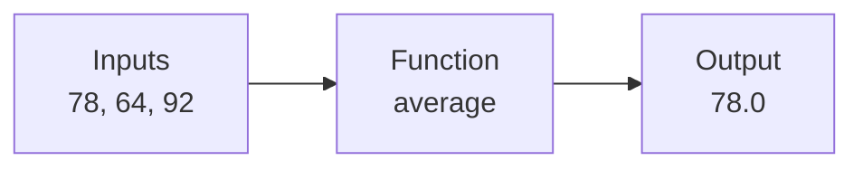
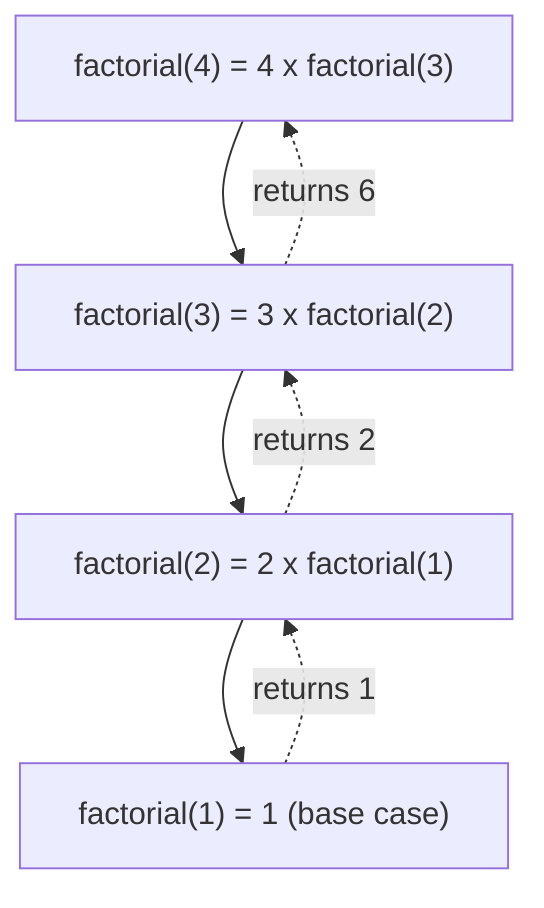

# Unit IV: Functions and Modules

**Teaching time:** 4 hours

!!! abstract "Learning Objectives"

    Write reusable Python functions and use modules.

    In plain words, by the end of this unit you can:

    - write your own function with `def`, give it parameters and call it,
    - send a result back from a function with `return`,
    - write a function that calls itself (recursion),
    - use ready-made code with `import`, and write a small module of your own.

## 4.1 Defining Functions, Parameters, Return Values, Recursion and Importing Modules

In Unit III we already used functions such as `print()`, `len()` and `range()`. Each one has a name and does one job. In this unit we write our own functions. Then we borrow functions that other people wrote, by using `import`.

### What a Function Is and Why Use One

A **function** is a named block of code that does one job. You write it once. After that you can use it as many times as you like, just by calling its name. Think of a calculator button: you press "square root" and get the answer. You do not need to know how the button works inside.

A function takes **inputs**, does some work, and can give back an **output**. Functions stop us repeating code, make a rule easy to fix in one place, and give a rule a name that is easy to read.



Here is the problem. We want the average marks of two students, and we write the same rule twice.

```python
asha = (78 + 64 + 92) / 3
bikash = (55 + 70 + 61) / 3
print(round(asha, 1), round(bikash, 1))
```

```{ .text .output title="Output" }
78.0 62.0
```

If the rule changes, we must fix every line. With 300 students it would be a disaster. In the next topics we turn this rule into one function.

### Defining and Calling a Function

You **define** a function with the keyword `def`. After `def` comes the function name, round brackets `()` and a colon `:`. The lines of the function are pushed to the right with four spaces (indentation), just like an `if` or a `for`. Defining a function does not run it. To run it, you **call** it by writing its name and brackets.

```python
def greet():
    print("Welcome to DSC 481")

greet()
greet()
```

```{ .text .output title="Output" }
Welcome to DSC 481
Welcome to DSC 481
```

Define first, call after: Python reads the file from top to bottom, so calling `greet()` before its `def` gives `NameError: name 'greet' is not defined`. Also remember the brackets. `greet` alone names the function, and `greet()` runs it.

### Parameters and Arguments

A function becomes useful when it can work on different data each time. A **parameter** is a name in the brackets of the `def` line. It is a placeholder for a value. An **argument** is the real value you give when you call the function.

```python
def show_average(m1, m2, m3):
    avg = (m1 + m2 + m3) / 3
    print("Average:", round(avg, 1))

show_average(78, 64, 92)
show_average(55, 70, 61)
```

```{ .text .output title="Output" }
Average: 78.0
Average: 62.0
```

`m1`, `m2` and `m3` are parameters. The numbers `78`, `64` and `92` are arguments. The same three lines now serve every student.

With **positional arguments** Python matches values to parameters by position: first value to first parameter, and so on. The order matters. With **keyword arguments** you write the parameter name, like `marks=78`, and then the order does not matter.

```python
def describe(name, marks):
    print(name, "scored", marks)

describe("Asha", 78)
describe(78, "Asha")
describe(marks=78, name="Asha")
```

```{ .text .output title="Output" }
Asha scored 78
78 scored Asha
Asha scored 78
```

The second call has the values in the wrong order, so the sentence is wrong. Python did not complain, because it cannot know what you meant.

A **default value** is a value written in the `def` line with `=`. If the caller gives no argument for that parameter, Python uses the default. Parameters with defaults go after the ones without.

```python
def show_percentage(marks, total=100):
    print(marks, "out of", total, "is", round(marks / total * 100, 1), "%")

show_percentage(45)
show_percentage(45, 60)
```

```{ .text .output title="Output" }
45 out of 100 is 45.0 %
45 out of 60 is 75.0 %
```

!!! warning "Common Mistake"

    Giving too few or too many arguments. Python counts them and stops with a `TypeError`.

    <!-- error -->
    ```python
    def describe(name, marks):
        print(name, "scored", marks)

    describe("Asha")
    ```

    ```{ .text .output title="Output" }
    Traceback (most recent call last):
      File "example.py", line 4, in <module>
        describe("Asha")
    TypeError: describe() missing 1 required positional argument: 'marks'
    ```

### Return Values

So far our functions only printed. Often we want the function to hand a value back so the program can use it again. The keyword `return` does this. The value that comes back is called the **return value**. The function stops as soon as it reaches `return`. Unlike `print()`, which only shows text on the screen, `return` gives the program a value to store, add or compare.

```python
def average(a, b, c):
    return (a + b + c) / 3

avg = average(72, 65, 90)
print("Average:", round(avg, 2))
if avg >= 45:
    print("Pass")
```

```{ .text .output title="Output" }
Average: 75.67
Pass
```

We stored the result in `avg`, printed it, and then used it in an `if`. That would not be possible if the function had only printed it.

A function can have several `return` lines, but only one of them runs. This is a good fit for the grade bands of Unit III. Two more examples that data scientists write all the time: adding tax to a bill, and changing mobile data from MB (megabytes) to GB (gigabytes), where we use 1 GB = 1024 MB.

```python
def grade(marks):
    if marks >= 80:
        return "A"
    elif marks >= 65:
        return "B"
    elif marks >= 45:
        return "C"
    else:
        return "Fail"

def bill_with_tax(price, tax_rate=13):
    return price + price * tax_rate / 100

def mb_to_gb(mb):
    return round(mb / 1024, 2)

print(grade(72), grade(31))
print("Two items:", bill_with_tax(1000) + bill_with_tax(250))
print("Data used:", mb_to_gb(3100), "GB")
```

```{ .text .output title="Output" }
B Fail
Two items: 1412.5
Data used: 3.03 GB
```

A function can also return more than one value. Write them after `return`, separated by commas. Python packs them into a **tuple**, which is a fixed group of values in round brackets (Unit V explains tuples in full). You can catch them in two variables at once.

```python
def min_max(marks):
    return min(marks), max(marks)

low, high = min_max([78, 64, 92, 45])
print(low, high)
print(min_max([78, 64, 92, 45]))
```

```{ .text .output title="Output" }
45 92
(45, 92)
```

If a function never reaches a `return`, it gives back the special value `None`, which means "nothing here". Our `show_average` function only printed, so its return value is `None`.

!!! warning "Common Mistake"

    Using `print()` inside a function and then trying to use the answer. The function gives back `None`, and `None` cannot be added to a number.

    <!-- error -->
    ```python
    def show_total(a, b):
        print(a + b)

    result = show_total(100, 50)
    print(result)
    grand_total = result + 20
    ```

    ```{ .text .output title="Output" }
    150
    None
    Traceback (most recent call last):
      File "example.py", line 6, in <module>
        grand_total = result + 20
                      ~~~~~~~^~~~
    TypeError: unsupported operand type(s) for +: 'NoneType' and 'int'
    ```

    The `150` came from the `print` inside the function. If you want to use the answer, use `return`.

!!! ask "Ask the Class"

    You write a function to calculate tax. Will you use `print` or `return` inside it, if another function needs the tax amount later? Why?

### Recursion

**Recursion** means a function calls itself. Each call solves a smaller copy of the same problem, until the problem is so small that the answer is obvious. A recursive function always has two parts:

- the **base case**: the smallest problem, which the function answers directly. It makes the recursion stop.
- the **recursive case**: the function calls itself with a smaller input.

A good example is the **factorial**. The factorial of 4 is written `4!` and means `4 x 3 x 2 x 1`, which is 24. Notice that `4!` is just `4 x 3!`, and `3!` is `3 x 2!`. A big problem contains a smaller copy of itself.

```python
def factorial(n):
    if n <= 1:
        return 1                      # base case
    return n * factorial(n - 1)       # recursive case

print(factorial(4))
```

```{ .text .output title="Output" }
24
```

The diagram follows the call `factorial(4)`. Solid arrows go down: each call waits for the next. Dotted arrows come back up: each call receives the answer and finishes.



To watch this happen, we add `print` lines to the same function. The calls go down 4, 3, 2, 1. The answers come back up 1, 2, 6, 24. The last call to start is the first one to finish.

```python
def factorial(n):
    print("Called with", n)
    if n <= 1:
        return 1
    answer = n * factorial(n - 1)
    print("Return", answer, "for n =", n)
    return answer

factorial(4)
```

```{ .text .output title="Output" }
Called with 4
Called with 3
Called with 2
Called with 1
Return 2 for n = 2
Return 6 for n = 3
Return 24 for n = 4
```

A second example is a countdown. The base case is `n == 0`, where we print "Go!" and stop. Otherwise we print the number and count down from one less.

```python
def countdown(n):
    if n == 0:
        print("Go!")
    else:
        print(n)
        countdown(n - 1)

countdown(3)
```

```{ .text .output title="Output" }
3
2
1
Go!
```

!!! ask "Ask the Class"

    In the call `factorial(4)`, which call finishes first: `factorial(4)` or `factorial(1)`? Why?

!!! warning "Common Mistake"

    Forgetting the base case. The function keeps calling itself and never stops. Python protects itself: after about 1000 nested calls it gives up with a `RecursionError`.

    <!-- error -->
    ```python
    def factorial(n):
        return n * factorial(n - 1)

    print(factorial(4))
    ```

    ```{ .text .output title="Output" }
    Traceback (most recent call last):
      File "example.py", line 4, in <module>
        print(factorial(4))
              ^^^^^^^^^^^^
      File "example.py", line 2, in factorial
        return n * factorial(n - 1)
                   ^^^^^^^^^^^^^^^^
      File "example.py", line 2, in factorial
        return n * factorial(n - 1)
                   ^^^^^^^^^^^^^^^^
      File "example.py", line 2, in factorial
        return n * factorial(n - 1)
                   ^^^^^^^^^^^^^^^^
      [Previous line repeated 992 more times]
    RecursionError: maximum recursion depth exceeded
    ```

    Python shortens the long list of repeated calls into one note. The exact number can differ on your computer. The cure is to check that every path reaches the base case.

### Importing Modules and Libraries

Nobody writes everything from scratch. A **module** is a Python file that holds functions (and other things) ready to use. A **library** is a bigger collection of modules, built around one purpose. Python comes with many modules, and you can install more libraries. To use one, you **import** it. There are three common ways:

- `import math` brings in the whole module. You write `math.sqrt(144)`.
- `from math import sqrt` brings in only the names you list. You write `sqrt(144)` without the prefix.
- `import math as m` gives the module a short nickname. Data scientists do this all the time, for example `import pandas as pd`.

```python
import math
from math import sqrt
import math as m

print(math.sqrt(144))
print(sqrt(81))
print(m.ceil(7.2), m.floor(7.8))
```

```{ .text .output title="Output" }
12.0
9.0
8 7
```

#### The `random` Module

The `random` module makes random choices. A **seed** is a starting number that fixes the sequence, so the same seed always gives the same "random" numbers. In data science we set a seed so that anyone can repeat our results. The function `random.choice()` picks one item from a list, and `random.sample()` picks several different items. Because we reset the seed in the middle, the two `randint` lines print the same number.

```python
import random

random.seed(7)
print(random.randint(1, 6))
random.seed(7)
print(random.randint(1, 6))

students = ["Asha", "Bikash", "Sita", "Ram", "Gita", "Hari"]
print(random.choice(students))
print(random.sample(students, 3))
```

```{ .text .output title="Output" }
3
3
Bikash
['Ram', 'Asha', 'Gita']
```

#### The `statistics` Module

The `statistics` module calculates the common summary numbers of a list. The **mean** is the average. The **median** is the middle value after sorting. The **mode** is the value that appears most often. Unit VIII uses these ideas a lot.

```python
import statistics

marks = [78, 64, 92, 45, 64, 88]
print("Mean:", round(statistics.mean(marks), 2))
print("Median:", statistics.median(marks))
print("Mode:", statistics.mode(marks))
```

```{ .text .output title="Output" }
Mean: 71.83
Median: 71.0
Mode: 64
```

#### Writing Your Own Module

Any Python file can be a module. Save these two functions in a file called `data_tools.py`. Another file in the same folder can then import it. The module name is the file name without `.py`.

<!-- file: data_tools.py -->
```python title="data_tools.py"
def average(marks):
    return sum(marks) / len(marks)


def mb_to_gb(mb):
    return round(mb / 1024, 2)
```

```python
import data_tools
from data_tools import mb_to_gb

print(data_tools.average([78, 64, 92, 45]))
print(mb_to_gb(3100))
```

```{ .text .output title="Output" }
69.75
3.03
```

If the name is spelled wrong, or the file is not in the same folder, Python stops with `ModuleNotFoundError: No module named 'data_tool'` (here the last letter is missing).

#### Installing Libraries with `pip`

Many libraries do not come with Python. **pip** is Python's tool for installing them. It downloads the library from the internet so that Python can find it. You install a library once per computer, in a terminal, and then `import` it in any program.

```bash
pip install pandas
```

In a Jupyter notebook or Google Colab, write `!pip install pandas` in a cell. Anaconda and Colab already include most libraries of this course. These are the ones we use later:

- **NumPy** (`import numpy as np`): fast number arrays and maths, in [Unit VIII](unit-08-eda.md).
- **Pandas** (`import pandas as pd`): tables of data, like Excel inside Python, in [Unit VII](unit-07-cleaning.md).
- **Matplotlib** (`import matplotlib.pyplot as plt`): charts and plots, in [Unit VIII](unit-08-eda.md).
- **Seaborn** (`import seaborn as sns`): good-looking statistical charts, in [Unit VIII](unit-08-eda.md).
- **Scikit-learn** (install it as `scikit-learn`, import it as `sklearn`): machine learning models, in [Unit IX](unit-09-ml.md).

## Quick Recap

- A function is a named block of code. Define it with `def`, run it by calling `name()`.
- Parameters are the names in the `def` line. Arguments are the values you pass in.
- Arguments can be positional, keyword (`marks=78`) or default (`total=100`).
- `return` sends a value back and ends the function. A function without `return` gives `None`.
- A recursive function calls itself. It needs a base case, or it ends in a `RecursionError`.
- `import`, `from ... import` and `import ... as` bring in ready-made code. Libraries such as NumPy and Pandas are installed with `pip`.

## Try It Yourself

**1.** Write a function `percentage(marks, total)` that returns the percentage. Call it for 45 marks out of 60.

??? success "Answer"

    ```python
    def percentage(marks, total):
        return marks / total * 100

    print(percentage(45, 60))
    ```

    ```{ .text .output title="Output" }
    75.0
    ```

**2.** Write a function `is_pass(marks)` that returns `True` when marks are 45 or more. Use it in a loop to print each mark of `[78, 38, 45]` with its result.

??? success "Answer"

    ```python
    def is_pass(marks):
        return marks >= 45

    for m in [78, 38, 45]:
        print(m, is_pass(m))
    ```

    ```{ .text .output title="Output" }
    78 True
    38 False
    45 True
    ```

**3.** Write a recursive function `sum_to(n)` that returns `1 + 2 + ... + n`. Check it with `sum_to(5)`.

??? success "Answer"

    ```python
    def sum_to(n):
        if n == 1:
            return 1
        return n + sum_to(n - 1)

    print(sum_to(5))
    ```

    ```{ .text .output title="Output" }
    15
    ```

**4.** Daily mobile data use in MB was `[850, 920, 1500, 780, 3100, 640]`. Use the `statistics` module to print the mean and the median. Which one is closer to a typical day?

??? success "Answer"

    ```python
    import statistics

    data = [850, 920, 1500, 780, 3100, 640]
    print("Mean:", round(statistics.mean(data), 1))
    print("Median:", statistics.median(data))
    ```

    ```{ .text .output title="Output" }
    Mean: 1298.3
    Median: 885.0
    ```

    The one big day (3100 MB) pulls the mean up. The median is closer to a typical day.

## Exam Questions for This Unit

Past-paper and practice questions for this unit are collected in [Unit IV: Functions and Modules](exam/unit-04.md).
