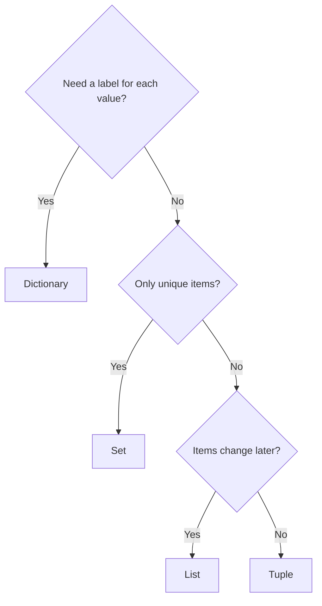

# Unit V: Data Structures in Python

**Teaching time:** 5 hours

!!! abstract "Learning Objectives"

    Use Python data structures for data storage and manipulation.

    In plain words, by the end of this unit you can:

    - store many values under one name in a list, tuple, set or dictionary,
    - pick the right structure for the job,
    - add, remove, find and loop over items with the common operations and methods,
    - combine structures, for example a list of dictionaries, to hold a small table of data.

## 5.1 Lists, Tuples, Sets, Dictionaries: Operations and Methods

### Why We Need Data Structures

Until now, one variable held one value. Real data is never one value. A class has 40 marks. A phone has 30 days of data use. A shop has hundreds of sales. We cannot make a new variable for each one.

A **data structure** is a way to store many values together under one name. Python has four main ones. Each is good at a different job.

```python
marks = [78, 64, 92, 45, 88]
print("Students:", len(marks))
print("Average:", sum(marks) / len(marks))
```

```{ .text .output title="Output" }
Students: 5
Average: 73.4
```

One name, five marks, and two lines to get the average. The table compares the four structures. The words in it are explained in the next topics.

| | List | Tuple | Set | Dictionary |
|---|---|---|---|---|
| Brackets | `[ ]` | `( )` | `{ }` | `{key: value}` |
| Keeps the order you gave | yes | yes | no | yes |
| Can you change it? | yes | no | yes | yes |
| Duplicates allowed? | yes | yes | no | keys must be unique |
| Typical use | marks of a class | a fixed record | unique cities | one student's details |

To choose a structure, ask these three questions in order.



### Lists

A **list** is an ordered collection of items inside square brackets, separated by commas. It can hold numbers, text or both. It is the most used structure in Python, and you can change it after you create it.

```python
marks = [78, 64, 92, 45, 88]
names = ["Asha", "Bikash", "Sita"]
empty = []
print(marks)
print(names)
print(type(marks))
```

```{ .text .output title="Output" }
[78, 64, 92, 45, 88]
['Asha', 'Bikash', 'Sita']
<class 'list'>
```

#### Indexing

Every item has a position number, called its **index**. Counting starts at 0, not at 1. A **negative index** counts from the end: `-1` is the last item.

| Value | 78 | 64 | 92 | 45 | 88 |
|---|---|---|---|---|---|
| Index | 0 | 1 | 2 | 3 | 4 |
| Negative index | -5 | -4 | -3 | -2 | -1 |

```python
marks = [78, 64, 92, 45, 88]
print(marks[0])
print(marks[2])
print(marks[-1])
print(marks[-2])
```

```{ .text .output title="Output" }
78
92
88
45
```

!!! warning "Common Mistake"

    Asking for a position that does not exist. A list of 3 items has indexes 0, 1 and 2. There is no index 3.

    <!-- error -->
    ```python
    marks = [78, 64, 92]
    print(marks[3])
    ```

    ```{ .text .output title="Output" }
    Traceback (most recent call last):
      File "example.py", line 2, in <module>
        print(marks[3])
              ~~~~~^^^
    IndexError: list index out of range
    ```

#### Slicing

A **slice** takes a part of a list. Write `list[start:stop]`. It starts at `start` and stops just before `stop`, the same rule as `range()`. A missing start means "from the beginning". A missing stop means "to the end".

```python
marks = [78, 64, 92, 45, 88]
print(marks[1:4])
print(marks[:3])
print(marks[3:])
```

```{ .text .output title="Output" }
[64, 92, 45]
[78, 64, 92]
[45, 88]
```

!!! ask "Ask the Class"

    `marks` has 5 items. What is the index of the last item? What does `marks[1:3]` give?

#### Changing Items

A list is **mutable**, which means you can change it after it is made. Put the position on the left of `=` to replace an item. Here the paper of the fourth student was rechecked and the mark went up.

```python
marks = [78, 64, 92, 45, 88]
marks[3] = 50
print(marks)
```

```{ .text .output title="Output" }
[78, 64, 92, 50, 88]
```

#### Adding and Removing Items

A **method** is a function that belongs to a value. You call it with a dot: `marks.append(70)`. These list methods add and remove items.

| Method | What it does |
|---|---|
| `append(x)` | adds `x` at the end |
| `insert(i, x)` | adds `x` at position `i` |
| `remove(x)` | removes the first item equal to `x` |
| `pop()` | removes the last item and gives it back |
| `pop(i)` | removes the item at position `i` and gives it back |

```python
marks = [78, 64, 92]
marks.append(45)
print(marks)
marks.insert(1, 70)
print(marks)
marks.remove(64)
print(marks)
last = marks.pop()
print(last, marks)
```

```{ .text .output title="Output" }
[78, 64, 92, 45]
[78, 70, 64, 92, 45]
[78, 70, 92, 45]
45 [78, 70, 92]
```

#### Sorting and Reversing

`sort()` puts the list in order, smallest first. `reverse()` flips the order. Both change the list itself. Use `sort(reverse=True)` for biggest first. The function `sorted(marks)` gives a new sorted list and leaves the original alone.

```python
marks = [78, 64, 92, 45, 88]
marks.sort()
print(marks)
marks.reverse()
print(marks)
print(sorted(marks))
print(marks)
```

```{ .text .output title="Output" }
[45, 64, 78, 88, 92]
[92, 88, 78, 64, 45]
[45, 64, 78, 88, 92]
[92, 88, 78, 64, 45]
```

!!! warning "Common Mistake"

    `sort()` changes the list and returns `None`. If you store its result, you store `None`.

    <!-- error -->
    ```python
    marks = [78, 64, 92]
    ranked = marks.sort()
    print(ranked)
    print(ranked[0])
    ```

    ```{ .text .output title="Output" }
    None
    Traceback (most recent call last):
      File "example.py", line 4, in <module>
        print(ranked[0])
              ~~~~~~^^^
    TypeError: 'NoneType' object is not subscriptable
    ```

    Write `marks.sort()` on its own line, or use `ranked = sorted(marks)`. The same is true for `append`, `insert`, `remove` and `reverse`.

#### Useful Functions and Membership

The functions `len()`, `sum()`, `min()` and `max()` work on a whole list. The word `in` checks **membership**: is this item in the list? It answers `True` or `False`.

```python
marks = [78, 64, 92, 45, 88]
print(len(marks))
print(sum(marks))
print(min(marks), max(marks))
print(92 in marks)
print(50 in marks)
```

```{ .text .output title="Output" }
5
367
45 92
True
False
```

#### Looping Through a List

A `for` loop visits every item. A common pattern is to start with an empty list and `append` the items that pass a test.

```python
marks = [78, 38, 92, 45, 41]
passed = []
for m in marks:
    if m >= 45:
        passed.append(m)
print("Passed marks:", passed)
```

```{ .text .output title="Output" }
Passed marks: [78, 92, 45]
```

#### Joining Lists

The `+` operator joins two lists into a new list. The method `extend()` adds all items of one list to the end of another.

```python
section_a = [78, 64, 92]
section_b = [55, 70]
both = section_a + section_b
print(both)
section_a.extend(section_b)
print(section_a)
```

```{ .text .output title="Output" }
[78, 64, 92, 55, 70]
[78, 64, 92, 55, 70]
```

### Tuples

A **tuple** is like a list, but it cannot be changed after it is made. This is called being **immutable**. A tuple is written with round brackets. Use a tuple for a fixed record, such as the location of Pokhara (about 28.2 degrees north, 84.0 degrees east). Indexing, slicing, `len()` and `in` all work as they do for lists.

```python
location = (28.2, 84.0)
scores = (78, 64, 78, 92)
print(location[0])
print(len(scores))
print(scores.count(78))
print(scores.index(92))
```

```{ .text .output title="Output" }
28.2
4
2
3
```

A tuple has only two methods. `count(x)` tells how many times `x` appears. `index(x)` tells the position of the first `x`.

**Unpacking** means copying the items of a tuple into separate variables in one line. The number of variables must match the number of items. This is what happens when a function returns two values in Unit IV.

```python
student = ("Asha", 101, 78)
name, roll, marks = student
print(name)
print(roll)
print(marks)
```

```{ .text .output title="Output" }
Asha
101
78
```

!!! warning "Common Mistake"

    Trying to change a tuple. That is exactly what a tuple does not allow.

    <!-- error -->
    ```python
    student = ("Asha", 101, 78)
    student[2] = 85
    ```

    ```{ .text .output title="Output" }
    Traceback (most recent call last):
      File "example.py", line 2, in <module>
        student[2] = 85
        ~~~~~~~^^^
    TypeError: 'tuple' object does not support item assignment
    ```

    Use a tuple when the values should stay fixed. Use a list when they will change.

### Sets

A **set** is a collection of unique items written in curly brackets. If you add the same item twice, the set keeps only one copy. A set has no positions, so it does not keep the order you gave. Sets are perfect for questions like "how many different cities?"

```python
marks = {78, 64, 78, 92, 64}
print(marks)
print(len(marks))
```

```{ .text .output title="Output" }
{64, 92, 78}
3
```

The duplicates are gone, and the order is not the order we typed. The order of a set can even differ between computers, especially for text. So when you print a set of names, print `sorted(...)` to get a fixed order. A common job is to remove duplicates from a list by turning it into a set.

```python
cities = ["Pokhara", "Butwal", "Pokhara", "Kathmandu", "Butwal", "Pokhara"]
unique = set(cities)
print(len(cities), "sales in", len(unique), "cities")
print(sorted(unique))
```

```{ .text .output title="Output" }
6 sales in 3 cities
['Butwal', 'Kathmandu', 'Pokhara']
```

An empty `{}` makes a dictionary, not a set. To make an empty set, write `set()`.

#### Adding and Removing

`add(x)` puts an item in. `remove(x)` takes an item out. If the item is not there, `remove` stops with an error. `discard(x)` does the same job but stays quiet when the item is missing.

```python
visitors = {"Asha", "Bikash"}
visitors.add("Sita")
visitors.add("Asha")
print(sorted(visitors))
visitors.remove("Bikash")
visitors.discard("Ram")
print(sorted(visitors))
print("Sita" in visitors)
```

```{ .text .output title="Output" }
['Asha', 'Bikash', 'Sita']
['Asha', 'Sita']
True
```

#### Union, Intersection and Difference

Sets follow the rules of school mathematics. Two groups of students: those in the Python class and those in the statistics class.

- **Union** `a | b`: everyone in either set.
- **Intersection** `a & b`: only the items in both sets.
- **Difference** `a - b`: the items in `a` that are not in `b`.


```python
python_class = {"Asha", "Bikash", "Sita", "Ram"}
stats_class = {"Sita", "Ram", "Gita"}
print("Union:", sorted(python_class | stats_class))
print("Both:", sorted(python_class & stats_class))
print("Only Python:", sorted(python_class - stats_class))
print("Only statistics:", sorted(stats_class - python_class))
```

```{ .text .output title="Output" }
Union: ['Asha', 'Bikash', 'Gita', 'Ram', 'Sita']
Both: ['Ram', 'Sita']
Only Python: ['Asha', 'Bikash']
Only statistics: ['Gita']
```

The same operations also exist as methods: `a.union(b)`, `a.intersection(b)` and `a.difference(b)`.

!!! warning "Common Mistake"

    Asking a set for an item by position. A set has no order, so it has no positions.

    <!-- error -->
    ```python
    visitors = {"Asha", "Bikash", "Sita"}
    print(visitors[0])
    ```

    ```{ .text .output title="Output" }
    Traceback (most recent call last):
      File "example.py", line 2, in <module>
        print(visitors[0])
              ~~~~~~~~^^^
    TypeError: 'set' object is not subscriptable
    ```

    To get an item in a fixed order, turn the set into a sorted list first: `sorted(visitors)[0]`.

!!! ask "Ask the Class"

    A shop has a list of 500 sales and each sale has a city. Which structure gives the number of different cities in one line? Which operation would show customers who bought in both January and February?

### Dictionaries

A **dictionary** stores data as **key-value pairs**. The **key** is a label. The **value** is the data for that label. You look up a value by its key, like finding a word in a real dictionary. Keys must be unique. A dictionary is written with curly brackets, and each pair is `key: value`.

| Key | Value |
|---|---|
| `"name"` | `"Asha"` |
| `"roll"` | `101` |
| `"marks"` | `78` |

#### Reading Values

Use the key in square brackets. The method `get()` does the same but is safer: when the key is missing it gives `None`, or a default value that you choose.

```python
student = {"name": "Asha", "roll": 101, "marks": 78}
print(student["name"])
print(student.get("marks"))
print(student.get("email"))
print(student.get("email", "not given"))
```

```{ .text .output title="Output" }
Asha
78
None
not given
```

!!! warning "Common Mistake"

    Reading a key that is not in the dictionary with square brackets. Python stops with a `KeyError`. The `get()` method does not.

    <!-- error -->
    ```python
    student = {"name": "Asha", "marks": 78}
    print(student["email"])
    ```

    ```{ .text .output title="Output" }
    Traceback (most recent call last):
      File "example.py", line 2, in <module>
        print(student["email"])
              ~~~~~~~^^^^^^^^^
    KeyError: 'email'
    ```

#### Adding, Changing and Deleting

Assigning to a key that exists changes its value. Assigning to a new key adds a pair. `del` and `pop()` remove a pair. `pop(key)` also gives the removed value back.

```python
student = {"name": "Asha", "marks": 78}
student["marks"] = 85
student["city"] = "Pokhara"
print(student)
del student["city"]
removed = student.pop("marks")
print(removed)
print(student)
```

```{ .text .output title="Output" }
{'name': 'Asha', 'marks': 85, 'city': 'Pokhara'}
85
{'name': 'Asha'}
```

#### Keys, Values and Items

Three methods give a view of the whole dictionary. `keys()` gives all keys, `values()` all values and `items()` all (key, value) pairs. We wrap them in `list()` to print them neatly.

```python
usage = {"Mon": 850, "Tue": 920, "Wed": 1500}
print(list(usage.keys()))
print(list(usage.values()))
print(list(usage.items()))
print("Total MB:", sum(usage.values()))
print("Tue" in usage)
```

```{ .text .output title="Output" }
['Mon', 'Tue', 'Wed']
[850, 920, 1500]
[('Mon', 850), ('Tue', 920), ('Wed', 1500)]
Total MB: 3270
True
```

Notice that `in` checks the keys, not the values.

#### Looping over a Dictionary

Looping over a dictionary gives its keys. To get the key and the value together, loop over `items()` with two loop variables. Here is a small shop price list and a bill.

```python
prices = {"pen": 20, "copy": 80, "bag": 1200}
for item, price in prices.items():
    print(item, "costs Rs.", price)

cart = {"pen": 3, "copy": 2}
bill = 0
for item, qty in cart.items():
    bill = bill + prices[item] * qty
print("Bill: Rs.", bill)
```

```{ .text .output title="Output" }
pen costs Rs. 20
copy costs Rs. 80
bag costs Rs. 1200
Bill: Rs. 220
```

#### Counting with a Dictionary

Counting how often each value appears is one of the most common data jobs. Use the item as the key and its count as the value. `get(item, 0)` gives 0 the first time we see an item.

```python
grades = ["A", "B", "A", "C", "B", "A"]
count = {}
for g in grades:
    count[g] = count.get(g, 0) + 1
print(count)
```

```{ .text .output title="Output" }
{'A': 3, 'B': 2, 'C': 1}
```

### Putting Structures Together

Structures can hold other structures. A **list of dictionaries** is a very common shape for data. Each dictionary is one row, such as one student. The keys are the column names. The list holds all the rows.

| name | math | science |
|---|---|---|
| Asha | 78 | 85 |
| Bikash | 64 | 70 |
| Sita | 92 | 88 |
| Ram | 45 | 52 |

```python
students = [
    {"name": "Asha", "math": 78, "science": 85},
    {"name": "Bikash", "math": 64, "science": 70},
    {"name": "Sita", "math": 92, "science": 88},
    {"name": "Ram", "math": 45, "science": 52},
]
print(students[2]["name"])
print(students[0]["math"])
```

```{ .text .output title="Output" }
Sita
78
```

The first part picks a row (a dictionary). The second part picks a value from that row. Now, continuing the same program, we loop over the rows to find the topper, the student with the highest total.

<!-- continue -->
```python
best_total = 0
topper = ""
for s in students:
    total = s["math"] + s["science"]
    print(s["name"], total)
    if total > best_total:
        best_total = total
        topper = s["name"]
print("Topper:", topper, "with", best_total)
```

```{ .text .output title="Output" }
Asha 163
Bikash 134
Sita 180
Ram 97
Topper: Sita with 180
```

!!! tip "A Peek Ahead"

    This list-of-dictionaries shape is exactly what the library Pandas turns into a table. The same shape is also how JSON files store records ([Unit VI](unit-06-files.md)). In [Unit VII](unit-07-cleaning.md) you will load real tables with Pandas. For now, just see the idea.

    <!-- continue -->
    ```python
    import pandas as pd

    print(pd.DataFrame(students))
    ```

    ```{ .text .output title="Output" }
         name  math  science
    0    Asha    78       85
    1  Bikash    64       70
    2    Sita    92       88
    3     Ram    45       52
    ```

!!! ask "Ask the Class"

    In `students[2]["math"]`, what is `students[2]`? What is the final value? What would `students[4]` do?

## Quick Recap

- A list `[ ]` is ordered and changeable. Index from 0, negative from the end, slice with `[start:stop]`.
- List methods: `append`, `insert`, `remove`, `pop`, `sort`, `reverse`. `sort()` and `append()` return `None`.
- A tuple `( )` cannot change. Use it for fixed records and for unpacking.
- A set `{ }` keeps unique items, has no order and no index. It supports union `|`, intersection `&` and difference `-`.
- A dictionary `{key: value}` looks up values by key. Use `get()` to avoid a `KeyError`; loop with `items()`.
- A list of dictionaries is a small table of data. This is the shape Pandas works with.

## Try It Yourself

**1.** Start with `marks = [56, 78, 41, 90, 67]`. Add the mark `73` at the end. Print the highest, the lowest and the average. Then print the marks sorted from high to low.

??? success "Answer"

    ```python
    marks = [56, 78, 41, 90, 67]
    marks.append(73)
    print("Highest:", max(marks))
    print("Lowest:", min(marks))
    print("Average:", sum(marks) / len(marks))
    marks.sort(reverse=True)
    print(marks)
    ```

    ```{ .text .output title="Output" }
    Highest: 90
    Lowest: 41
    Average: 67.5
    [90, 78, 73, 67, 56, 41]
    ```

**2.** A result is stored as `result = ("Asha", 78, "Pass")`. Unpack it into three variables and print one sentence.

??? success "Answer"

    ```python
    result = ("Asha", 78, "Pass")
    name, marks, status = result
    print(name, "got", marks, "and the result is", status)
    ```

    ```{ .text .output title="Output" }
    Asha got 78 and the result is Pass
    ```

**3.** Customer numbers on day 1 were `[101, 102, 103, 104]` and on day 2 `[103, 104, 105]`. Print who came on both days, who came on any day, and who came only on day 1.

??? success "Answer"

    ```python
    day1 = {101, 102, 103, 104}
    day2 = {103, 104, 105}
    print("Both days:", sorted(day1 & day2))
    print("Any day:", sorted(day1 | day2))
    print("Only day 1:", sorted(day1 - day2))
    ```

    ```{ .text .output title="Output" }
    Both days: [103, 104]
    Any day: [101, 102, 103, 104, 105]
    Only day 1: [101, 102]
    ```

**4.** The price list is `{"pen": 20, "copy": 80, "bag": 1200}`. A customer buys 5 pens and 1 bag. Use a dictionary `cart` and a loop to print the total bill.

??? success "Answer"

    ```python
    prices = {"pen": 20, "copy": 80, "bag": 1200}
    cart = {"pen": 5, "bag": 1}
    bill = 0
    for item, qty in cart.items():
        bill = bill + prices[item] * qty
    print("Total bill: Rs.", bill)
    ```

    ```{ .text .output title="Output" }
    Total bill: Rs. 1300
    ```

**5.** Count how many times each city appears in `["Pokhara", "Butwal", "Pokhara", "Kathmandu", "Pokhara"]`. Use a dictionary.

??? success "Answer"

    ```python
    cities = ["Pokhara", "Butwal", "Pokhara", "Kathmandu", "Pokhara"]
    count = {}
    for city in cities:
        count[city] = count.get(city, 0) + 1
    print(count)
    ```

    ```{ .text .output title="Output" }
    {'Pokhara': 3, 'Butwal': 1, 'Kathmandu': 1}
    ```

## Exam Questions for This Unit

Past-paper and practice questions for this unit are collected in [Unit V: Data Structures in Python](exam/unit-05.md).
