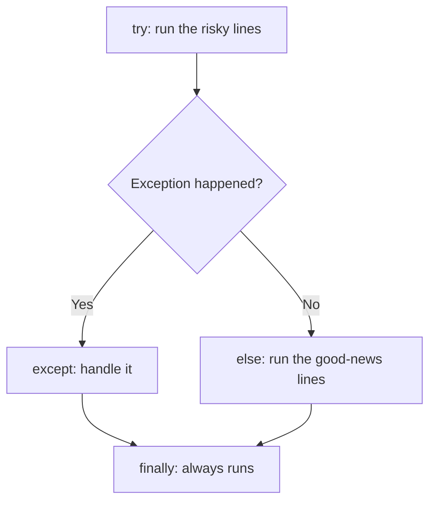

# Unit VI: File Handling and Exception

**Teaching time:** 4 hours

!!! abstract "Learning Objectives"

    Perform file operations and handle errors in Python.

    In plain words, by the end of this unit you can:

    - read text from a file and write text to a file with `open()` and `with`,
    - read and write CSV files with the `csv` module and JSON files with the `json` module,
    - stop a program from crashing on bad input by using `try` and `except`.

## 6.1 Reading and Writing Files, CSV and JSON, Exception Handling with try-except

### Why Files Matter

Everything a program keeps in a variable lives in the computer's memory. When the program ends, the variables are gone. A **file** is a named piece of storage on the disk. It stays there after the program ends. The files our examples create are saved in the folder where the program runs, and the course data files (`students.csv` and so on) must be in that same folder. In data science, data almost always lives in files, so we must be able to read a file, and to save our results in one.

Three kinds of files appear again and again. All three are plain text that you can open in Notepad. Here is the same student in each kind.

| Kind | What it holds | Example |
|---|---|---|
| **Text file** (`.txt`) | any lines of text; best for notes and logs | `Asha scored 78 in maths` |
| **CSV file** (`.csv`) | rows of values separated by commas; best for tables | `1,Asha,78` |
| **JSON file** (`.json`) | nested `{ }` and `[ ]`; best for web data | `{"roll": 1, "name": "Asha", "math": 78}` |

### Reading and Writing Text Files

The built-in function `open()` opens a file. It needs the file name and a **mode** that says what you want to do.

- `"r"` reads the file (this is the default). If the file is missing, you get an error.
- `"w"` writes. **If the file already exists, its old content is erased.**
- `"a"` appends. The old content stays, and new text goes at the end.

The safe way to open a file is the `with` statement. The file is open only inside the indented block. When the block ends, Python **closes the file for you**, even if an error happens inside. The method `write()` puts text into the file. The two characters `\n` mean **newline**, which ends a line. `write()` does not add one for you.

```python
with open("marks.txt", "w") as f:
    f.write("Asha 78\n")
    f.write("Bikash 64\n")
    f.write("Chandra 92\n")

print("Is the file closed?", f.closed)
```

```{ .text .output title="Output" }
Is the file closed? True
```

The variable `f` is a **file object**, the program's handle on the file. `read()` gives the rest of the file as one string. `readline()` gives one line. The file remembers where it stopped, so below `read()` gives what is left after the first line. A line still carries its `\n`, so `strip()` removes the spaces and newlines at its ends. We use `repr()` to make the hidden `\n` visible. In the next examples we are continuing the same program, so `marks.txt` already exists.

<!-- continue -->
```python
with open("marks.txt") as f:
    first = f.readline()
    rest = f.read()

print(repr(first))
print(repr(rest))
print(first.strip())
```

```{ .text .output title="Output" }
'Asha 78\n'
'Bikash 64\nChandra 92\n'
Asha 78
```

The most common way to read a file is a `for` loop over the file object, which gives one line per round. Here we split each line into a name and a mark, and add up the marks.

<!-- continue -->
```python
total = 0
with open("marks.txt") as f:
    for line in f:
        name, mark = line.strip().split()
        print(name, "scored", mark)
        total = total + int(mark)

print("Total:", total)
```

```{ .text .output title="Output" }
Asha scored 78
Bikash scored 64
Chandra scored 92
Total: 234
```

`split()` cuts a string at the spaces and gives a list. The mark `"78"` is a string, so we turn it into a number with `int()` before adding.

!!! ask "Ask the Class"

    After the loop has read all three lines, what would one more call to `f.readline()` give?

Append mode `"a"` keeps the old lines and adds new text at the end.

<!-- continue -->
```python
with open("marks.txt", "a") as f:
    f.write("Dipesh 45\n")

with open("marks.txt") as f:
    print(f.read())
```

```{ .text .output title="Output" }
Asha 78
Bikash 64
Chandra 92
Dipesh 45
```

!!! warning "Common Mistake"

    Opening an existing file with `"w"` erases what was inside it at once, with no warning. Continuing the same program, the file holds four lines. We open it again with `"w"` and write one line.

    <!-- continue -->
    ```python
    with open("marks.txt", "w") as f:
        f.write("Elina 88\n")

    with open("marks.txt") as f:
        print(f.read())
    ```

    ```{ .text .output title="Output" }
    Elina 88
    ```

    The old lines are gone. Use `"a"` to add to a file, and `"w"` only to start fresh.

!!! warning "Common Mistake"

    A wrong file name, or a file in another folder, stops the program with `FileNotFoundError`. Here we mistype `students.csv` as `student.csv`.

    <!-- error -->
    ```python
    with open("student.csv") as f:
        print(f.readline())
    ```

    ```{ .text .output title="Output" }
    Traceback (most recent call last):
      File "example.py", line 1, in <module>
        with open("student.csv") as f:
             ^^^^^^^^^^^^^^^^^^^
    FileNotFoundError: [Errno 2] No such file or directory: 'student.csv'
    ```

    Read the last line of an error first. It names the problem and the file. Check the spelling, the extension and the folder.

### Working with CSV Files

A **CSV file** (Comma-Separated Values) stores a table as text. Each line is one row, commas separate the columns, and the first line usually holds the column names. A value can itself contain a comma inside quotes, so cutting lines at commas by hand is risky. The `csv` module handles this correctly.

`csv.reader` turns every line into a **list** of strings. We open the file with `newline=""`, which the `csv` module asks for. Just copy that part.

```python
import csv

with open("students.csv", newline="") as f:
    rows = list(csv.reader(f))

print(rows[0])
print(rows[1])
```

```{ .text .output title="Output" }
['roll', 'name', 'math', 'science', 'english', 'attendance']
['1', 'Asha', '78', '85', '72', '92']
```

Look closely: every value is a string, even the marks. `csv.DictReader` reads the header line and then gives every row as a **dictionary**, so you ask for a value by its column name. Let us find the average maths mark.

```python
import csv

total = 0
count = 0
with open("students.csv", newline="") as f:
    for row in csv.DictReader(f):
        total = total + int(row["math"])
        count = count + 1

print("Average maths:", total / count)
```

```{ .text .output title="Output" }
Average maths: 68.3
```

!!! warning "Common Mistake"

    The `csv` module gives you text. If you forget `int()`, Python cannot add a number to a string.

    <!-- error -->
    ```python
    import csv

    with open("students.csv", newline="") as f:
        for row in csv.DictReader(f):
            print(row["name"], row["math"] + 10)
    ```

    ```{ .text .output title="Output" }
    Traceback (most recent call last):
      File "example.py", line 5, in <module>
        print(row["name"], row["math"] + 10)
                           ~~~~~~~~~~~~^~~~
    TypeError: can only concatenate str (not "int") to str
    ```

    The fix is `int(row["math"]) + 10`. Use `float()` for values with a decimal point.

`csv.writer` writes one row each time you call `writerow()` with a list. Below we read `students.csv`, work out each student's average mark, save a new file, and print the new file to check it.

```python
import csv

with open("students.csv", newline="") as source:
    with open("averages.csv", "w", newline="") as target:
        writer = csv.writer(target)
        writer.writerow(["name", "average"])
        for row in csv.DictReader(source):
            marks = [int(row["math"]), int(row["science"]), int(row["english"])]
            writer.writerow([row["name"], round(sum(marks) / 3, 1)])

with open("averages.csv") as f:
    print(f.read())
```

```{ .text .output title="Output" }
name,average
Asha,78.3
Bikash,64.0
Chandra,87.0
Dipesh,48.3
Elina,91.3
Gita,61.0
Hari,73.0
Isha,81.3
Jiwan,44.3
Kiran,67.3
```

### Working with JSON Files

**JSON** (JavaScript Object Notation) is a text format for data with structure. Web services use it to send data. It looks almost the same as the Python lists and dictionaries from [Unit V](unit-05-structures.md). A JSON object becomes a `dict`, an array becomes a `list`, `true` and `false` become `True` and `False`, and `null` becomes `None`.

The `json` module has four main functions. `json.load` reads a JSON **file** and `json.dump` writes one. `json.loads` reads a JSON **string** and `json.dumps` writes one. The `s` stands for **string**. Do not give `json.loads` an open file. It needs a string.

`students.json` holds our ten students as a list of records. After `json.load` we have a normal Python list of dictionaries. This time the marks are real numbers, so no `int()` is needed.

```python
import json

with open("students.json") as f:
    students = json.load(f)

print(type(students), len(students))
print("Keys:", list(students[0]))

total = 0
for s in students:
    total = total + s["attendance"]
print("Average attendance:", total / len(students))
```

```{ .text .output title="Output" }
<class 'list'> 10
Keys: ['roll', 'name', 'math', 'science', 'english', 'attendance']
Average attendance: 85.2
```

The file `api_response.json` is what a small weather service sends back. It is **nested**: a dictionary that holds a list that holds more dictionaries. We reach inside step by step.

```python
import json

with open("api_response.json") as f:
    weather = json.load(f)

print(weather["city"], "-", weather["country"])
for day in weather["forecast"]:
    if day["rain_mm"] > 5:
        print(day["day"], "rain:", day["rain_mm"], "mm")
```

```{ .text .output title="Output" }
Pokhara - Nepal
Tue rain: 12.5 mm
Wed rain: 20.1 mm
Thu rain: 6.8 mm
```

To go the other way, `json.dumps` turns Python data into JSON text (`indent=2` makes it easier to read), and `json.loads` turns text back into data. Web services send answers as JSON text, so `loads` is how a program reads an answer. To save data in a file, use `json.dump` and then check it with `json.load`.

```python
import json

student = {"roll": 1, "name": "Asha", "passed": True, "remark": None}
text = json.dumps(student)
print(text)
print(json.loads(text)["name"])

with open("result.json", "w") as f:
    json.dump([student], f, indent=2)

with open("result.json") as f:
    print(json.load(f) == [student])
```

```{ .text .output title="Output" }
{"roll": 1, "name": "Asha", "passed": true, "remark": null}
Asha
True
```

Notice that `True` became `true` and `None` became `null` in the text.

### Exceptions and try-except

A **syntax error** is a mistake in how the code is written, such as a missing colon. Python finds it before the program starts. An **exception** is an error that happens while the program is running, even though the code is written correctly. Bad data, a missing file or a division by zero all cause exceptions. If nothing handles an exception, the program stops and prints a **traceback**.

<!-- error -->
```python
marks = int("seventy")
print("Marks:", marks)
```

```{ .text .output title="Output" }
Traceback (most recent call last):
  File "example.py", line 1, in <module>
    marks = int("seventy")
            ^^^^^^^^^^^^^^
ValueError: invalid literal for int() with base 10: 'seventy'
```

The second line never ran. A real program should not die because of one bad value. Python runs the lines under `try`. If an exception happens, it jumps to the `except` lines. If nothing goes wrong, `except` is skipped.

```python
text = "seventy"

try:
    marks = int(text)
    print("Marks:", marks)
except ValueError:
    print("That is not a number")

print("The program carries on")
```

```{ .text .output title="Output" }
That is not a number
The program carries on
```

The name after `except` is the exception we expect. These are the three you will meet most often: `FileNotFoundError` (the file does not exist), `ValueError` (the value has the wrong form, like `int("abc")`) and `ZeroDivisionError` (you divide by zero). You can write several `except` lines, one for each problem, and Python uses the first one that matches. Adding `as e` stores the exception in `e`, so you can print Python's own message.

```python
def average(total_text, count_text):
    try:
        return int(total_text) / int(count_text)
    except ValueError as e:
        print("Bad input:", e)
    except ZeroDivisionError:
        print("The count cannot be zero")

print(average("683", "10"))
print(average("683", "ten"))
print(average("683", "0"))
```

```{ .text .output title="Output" }
68.3
Bad input: invalid literal for int() with base 10: 'ten'
None
The count cannot be zero
None
```

The `None` lines appear because a function that ends without `return` gives back `None`.

!!! ask "Ask the Class"

    Which `except` line runs for `average("683", "0")`? And which one runs for `average("six", "0")`? (Python stops at the first problem it meets.)

Two more parts can follow a `try`. The `else` part runs only when **no** exception happened. The `finally` part runs **always**. It is the place for tidy-up work.



```python
def show_ratio(a, b):
    try:
        ratio = a / b
    except ZeroDivisionError:
        print("Cannot divide by zero")
    else:
        print("Ratio:", ratio)
    finally:
        print("Finished with", a, "and", b)

show_ratio(10, 4)
show_ratio(10, 0)
```

```{ .text .output title="Output" }
Ratio: 2.5
Finished with 10 and 4
Cannot divide by zero
Finished with 10 and 0
```

Now we can fix the missing-file problem. The **safe file reader** below does not crash when the file is not there. It tells the user and returns an empty list.

```python
def read_lines(filename):
    try:
        with open(filename) as f:
            lines = f.readlines()   # all lines, as a list of strings
    except FileNotFoundError:
        print("Sorry,", filename, "was not found")
        return []
    else:
        return lines

with open("marks.txt", "w") as f:
    f.write("Asha 78\nBikash 64\n")

print(len(read_lines("marks.txt")), "lines read")
print(len(read_lines("mark.txt")), "lines read")
```

```{ .text .output title="Output" }
2 lines read
Sorry, mark.txt was not found
0 lines read
```

!!! warning "Common Mistake"

    A bare `except:` (with no exception name) catches every kind of error, including your own typing mistakes. It hides the real problem. Here `lenn` is a typo for `len`, but the message blames the marks, so nobody sees the typo.

    ```python
    marks = [78, 64, 92]

    try:
        print("Average:", sum(marks) / lenn(marks))
    except:
        print("Please enter valid marks")
    ```

    ```{ .text .output title="Output" }
    Please enter valid marks
    ```

    Catch only the exception you expect, here `except ZeroDivisionError:`. Then Python shows a `NameError` for the typo instead of hiding it.

## Quick Recap

- A file keeps data after the program ends. Open it with `with open(name, mode)`. Mode `"r"` reads, `"w"` writes and **erases old content**, `"a"` adds to the end.
- The `csv` module gives every value as text, so convert with `int()` or `float()`. `csv.DictReader` reads by column name.
- `json.load` and `json.dump` work with files. `json.loads` and `json.dumps` work with strings. JSON becomes Python dictionaries and lists.
- `try` runs risky lines and `except` handles the problem. `else` runs when nothing went wrong, and `finally` runs every time. Catch specific exceptions such as `FileNotFoundError`, never a bare `except:`.

## Try It Yourself

**1.** Write the cities `Pokhara`, `Kathmandu` and `Butwal` into `cities.txt`, one per line. Read the file back and print each city in capital letters.

??? success "Answer"

    ```python
    with open("cities.txt", "w") as f:
        f.write("Pokhara\nKathmandu\nButwal\n")

    with open("cities.txt") as f:
        for line in f:
            print(line.strip().upper())
    ```

    ```{ .text .output title="Output" }
    POKHARA
    KATHMANDU
    BUTWAL
    ```

**2.** Read `students.csv` with `csv.DictReader`. Print the name of every student whose attendance is below 75.

??? success "Answer"

    ```python
    import csv

    with open("students.csv", newline="") as f:
        for row in csv.DictReader(f):
            if int(row["attendance"]) < 75:
                print(row["name"], row["attendance"])
    ```

    ```{ .text .output title="Output" }
    Dipesh 70
    Jiwan 65
    ```

**3.** Read `students.json`. Print the name of every student with 80 or more marks in `english`.

??? success "Answer"

    ```python
    import json

    with open("students.json") as f:
        students = json.load(f)

    for s in students:
        if s["english"] >= 80:
            print(s["name"], s["english"])
    ```

    ```{ .text .output title="Output" }
    Chandra 81
    Elina 95
    Isha 84
    ```

**4.** Write a function `count_lines(filename)` that returns the number of lines in a file, or `-1` if the file does not exist. Test it on `students.csv` and on `nothing.csv`.

??? success "Answer"

    ```python
    def count_lines(filename):
        try:
            with open(filename) as f:
                return len(f.readlines())
        except FileNotFoundError:
            return -1

    print(count_lines("students.csv"))
    print(count_lines("nothing.csv"))
    ```

    ```{ .text .output title="Output" }
    11
    -1
    ```

## Exam Questions for This Unit

Past-paper and practice questions for this unit are collected in [Unit VI: File Handling and Exception](exam/unit-06.md).
