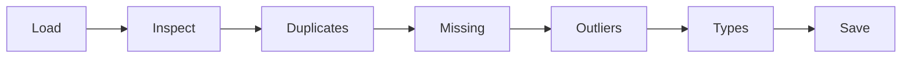

# Unit VII: Data Collection and Cleaning with Python

**Teaching time:** 4 hours

!!! abstract "Learning Objectives"

    Import and preprocess datasets; clean and transform data for analysis.

    In plain words, by the end of this unit you can:

    - load data from CSV, Excel, JSON and a web API into a Pandas table,
    - find and fix missing values, duplicate rows and outliers,
    - transform, scale and convert columns so that the data is ready for analysis.

## 7.1 Reading Data, Cleaning It and Transforming It with Pandas

Real data is never tidy. People leave cells empty, type the same row twice, add an extra zero by mistake, or write numbers as text. **Data cleaning** means finding these problems and fixing them, so that the numbers we calculate later can be trusted. In this unit we follow one path, and we walk it again at the end with a real file.



### What Pandas Is

**Pandas** is a Python library for working with tables of data. You bring it in with `import pandas as pd`. The main object of Pandas is the **DataFrame**: a table with **rows** (one per record, here one per student) and **columns** (one per property, such as `math`). One column on its own is called a **Series**.

`pd.read_csv()` reads a CSV file into a DataFrame. Three tools help you look at it first: `head()` shows the first rows, `shape` gives the number of rows and columns, and `info()` lists every column with its type and its count of filled cells.

```python
import pandas as pd

df = pd.read_csv("students.csv")
print(df.head(3))
print(df.shape)
df.info()
print("Average maths:", df["math"].mean())
```

```{ .text .output title="Output" }
   roll     name  math  science  english  attendance
0     1     Asha    78       85       72          92
1     2   Bikash    64       58       70          85
2     3  Chandra    92       88       81          97
(10, 6)
<class 'pandas.DataFrame'>
RangeIndex: 10 entries, 0 to 9
Data columns (total 6 columns):
 #   Column      Non-Null Count  Dtype
---  ------      --------------  -----
 0   roll        10 non-null     int64
 1   name        10 non-null     str  
 2   math        10 non-null     int64
 3   science     10 non-null     int64
 4   english     10 non-null     int64
 5   attendance  10 non-null     int64
dtypes: int64(5), str(1)
memory usage: 612.0 bytes
Average maths: 68.3
```

The word `int64` means whole numbers, `float64` means numbers with decimals, and `str` means text. Always look at this before you do anything else. It is the quickest way to spot a column with the wrong type or with missing values.

### Reading Data from CSV, Excel and JSON

Each file type has its own reader, and each reader gives back a DataFrame: `pd.read_csv()` for CSV, `pd.read_excel()` for Excel and `pd.read_json()` for JSON. An Excel workbook can hold several sheets, so you name the one you want with `sheet_name`. The file `shop_sales.xlsx` holds the same 42 sales as `shop_sales.csv`, on a sheet called `sales`. `students.json` is a list of records (see [Unit VI](unit-06-files.md)), and `read_json` turns it into a table directly. Pandas needs a helper library called `openpyxl` to read `.xlsx` files. Anaconda includes it. If you installed Python another way, run `pip install openpyxl`.

```python
import pandas as pd

sales = pd.read_csv("shop_sales.csv")
print(sales.head(3))

sales_x = pd.read_excel("shop_sales.xlsx", sheet_name="sales")
print(sales_x.shape, "same as the CSV?", sales_x.equals(sales))

students = pd.read_json("students.json")
print(students.head(2))
```

```{ .text .output title="Output" }
         date      item    category  quantity  price       city
0  2024-03-01  Notebook  Stationery         6     60    Pokhara
1  2024-03-01       Tea     Grocery         3    150    Pokhara
2  2024-03-02   Lentils     Grocery         3    190  Kathmandu
(42, 6) same as the CSV? True
   roll    name  math  science  english  attendance
0     1    Asha    78       85       72          92
1     2  Bikash    64       58       70          85
```

Some JSON is **nested**: records sit inside other records. `api_response.json` is a weather reply with a `forecast` list inside it. We load it with the `json` module and flatten it with `pd.json_normalize()`. The argument `record_path` names the list that becomes the rows, and `meta` lists the outer values to repeat on every row.

```python
import json
import pandas as pd

with open("api_response.json") as f:
    data = json.load(f)

forecast = pd.json_normalize(
    data, record_path="forecast", meta=["city", "country"]
)
print(forecast.head(3))
```

```{ .text .output title="Output" }
   day  temp_max  temp_min  rain_mm     city country
0  Sun        27        17      0.0  Pokhara   Nepal
1  Mon        26        18      4.2  Pokhara   Nepal
2  Tue        24        17     12.5  Pokhara   Nepal
```

### Reading Data from a Web API

An **API** (Application Programming Interface) is a way for one program to ask another program for data. Your program sends a request to a web address. The other program, the **server**, sends back an answer, usually in JSON. Think of a waiter: you place an order, and the kitchen sends back food.

First an offline example. We pretend that the text in `api_response.json` is a reply that just arrived. A reply is plain text, so we turn it into Python data with `json.loads`, then into a DataFrame.

```python
import json
import pandas as pd

reply = open("api_response.json").read()   # the text a server would send
data = json.loads(reply)

days = pd.DataFrame(data["forecast"])
print(data["city"], "average max:", days["temp_max"].mean().round(1))
print("Rainiest day:", days.loc[days["rain_mm"].idxmax(), "day"])
```

```{ .text .output title="Output" }
Pokhara average max: 26.0
Rainiest day: Wed
```

Now a real request. `requests.get()` sends it. The reply has a `status_code` (200 means success) and a `json()` method that converts the JSON text into Python data. The address below is a free practice service with ten made-up users. This example needs the internet, and the output shown was captured when the notes were built.

<!-- online -->
```python
import requests
import pandas as pd

url = "https://jsonplaceholder.typicode.com/users"
response = requests.get(url, timeout=10)
print("Status:", response.status_code)

users = pd.DataFrame(response.json())
print("Number of users:", len(users))
print("First name:", users.loc[0, "name"])
```

```{ .text .output title="Output" }
Status: 200
Number of users: 10
First name: Leanne Graham
```

!!! ask "Question"

    What happens to this program if the computer has no internet connection? Why is it a good idea to check `status_code` before using the reply?

### Handling Missing Values

A **missing value** is a cell with no data. Pandas shows it as **NaN** ("Not a Number"). Most calculations cannot use NaN, so we must deal with it. `students_raw.csv` is our class with real-world mess. `isna()` gives `True` where a cell is empty, and `sum()` counts them for each column. You can **drop** the rows that have gaps with `dropna()`, but then you lose their good values too.

Or you can **fill** the gaps with `fillna()`. A common fill is the column's mean, which keeps the row. You can also fill with a fixed value. Gita's `english` mark is empty. If that means she did not sit the exam, then 0 is a fair choice. The right fill depends on what the gap means. (`loc` picks rows and columns by label. Rows 1 and 6 are Bikash and Gita.)

```python
import pandas as pd

df = pd.read_csv("students_raw.csv")
print(df.isna().sum())
print("Rows before:", len(df), " after dropna:", len(df.dropna()))

df["science"] = df["science"].fillna(df["science"].mean())
df["english"] = df["english"].fillna(0)
print(df.loc[[1, 6], ["name", "science", "english"]])
```

```{ .text .output title="Output" }
roll          0
name          0
gender        0
math          0
science       1
english       1
attendance    0
joined        0
dtype: int64
Rows before: 11  after dropna: 9
     name  science  english
1  Bikash     69.3     70.0
6    Gita     61.0      0.0
```

!!! ask "Question"

    Would you drop Gita's row, fill her gap with the class mean, or fill it with 0? What does each choice cost us?

!!! warning "Common Mistake"

    `fillna()` does not change the table. It returns a new column. If you do not store the result, nothing changes. Always assign it back.

    ```python
    import pandas as pd

    df = pd.read_csv("students_raw.csv")
    df["science"].fillna(0)
    print("Still missing:", df["science"].isna().sum())
    ```

    ```{ .text .output title="Output" }
    Still missing: 1
    ```

### Removing Duplicates

A **duplicate** is a row that appears more than once. It counts the same thing twice and pushes averages and totals the wrong way. `duplicated()` marks every repeat after the first copy as `True`, and `drop_duplicates()` removes them. By default a row is a duplicate only when **every** column matches. To compare only some columns, use `subset`, for example `drop_duplicates(subset=["roll"])`.

```python
import pandas as pd

df = pd.read_csv("students_raw.csv")
print("Duplicate rows:", df.duplicated().sum())
print(df[df.duplicated()])

df = df.drop_duplicates()
print("Rows now:", len(df))
```

```{ .text .output title="Output" }
Duplicate rows: 1
   roll    name gender  math  science  english attendance      joined
4     4  Dipesh      M    45     52.0     48.0        70%  2024-01-16
Rows now: 10
```

After rows are removed, the row numbers (the **index**) have a gap, and `reset_index(drop=True)` numbers them again from 0.

### Finding and Handling Outliers

An **outlier** is a value very far from the rest of the data. Sometimes it is a mistake, sometimes a real but rare event. In `students_raw.csv`, Elina has 880 marks in maths. Marks cannot go above 100, so this is a typing mistake for 88. In `mobile_data.csv`, one day shows 6200 MB while the other days use 800 to 1400 MB. An outlier drags the mean away from the middle, but the **median** (the middle value after sorting) hardly moves.


A **box plot** makes outliers easy to see. The box covers the middle half of the values, the orange line is the median, and any circle far outside is a possible outlier. Notice how one huge value stretches the scale and squeezes the box.

<!-- figure: u07-box-mobile -->
```python
import pandas as pd
import matplotlib.pyplot as plt

mobile = pd.read_csv("mobile_data.csv")
plt.boxplot(mobile["mb_used"], orientation="horizontal")
plt.text(6200, 1.12, "Day 18: 6200 MB", ha="center")
plt.title("Daily Mobile Data Use")
plt.xlabel("MB used per day")
plt.yticks([])
plt.show()
```


A simple rule finds outliers without a picture. The **quartiles** split sorted data in four equal parts: `Q1` has a quarter of the values below it, and `Q3` has three quarters below it. The gap `Q3 - Q1` is the **IQR** (interquartile range). The **IQR rule** says a value is an outlier if it is more than 1.5 IQRs below `Q1` or above `Q3`. In Pandas, `quantile(0.25)` gives `Q1`.

```python
import pandas as pd

mobile = pd.read_csv("mobile_data.csv")
mb = mobile["mb_used"]
q1 = mb.quantile(0.25)
q3 = mb.quantile(0.75)
iqr = q3 - q1
low = q1 - 1.5 * iqr
high = q3 + 1.5 * iqr
print("Mean:", mb.mean().round(1), " Median:", mb.median())
print("Normal range:", low, "to", high)
print(mobile[(mb < low) | (mb > high)])
```

```{ .text .output title="Output" }
Mean: 1155.1  Median: 936.0
Normal range: 642.25 to 1290.25
    day  mb_used
6     7     1344
17   18     6200
20   21     1303
27   28     1327
```

The mean is far above the median because of one day. The rule flags four days. Days 7, 21 and 28 are only a little above the limit and look like ordinary busy days. Day 18 looks like a mistake. A rule only **flags** values, and you decide what to do using what you know about the data. You can **filter** (keep only the valid rows), **cap** (pull extreme values back to a limit with `clip()`), or **replace** the bad value with a sensible one, such as the median.

```python
import pandas as pd

df = pd.read_csv("students_raw.csv")
valid = df[df["math"] <= 100]
print("Rows kept:", len(valid), "of", len(df))

mobile = pd.read_csv("mobile_data.csv")
capped = mobile["mb_used"].clip(upper=1290.25)
print("Largest before:", mobile["mb_used"].max())
print("Largest after:", capped.max())
```

```{ .text .output title="Output" }
Rows kept: 10 of 11
Largest before: 6200
Largest after: 1290.25
```

For the marks we used a real-world rule (no mark is above 100). For the phone data we capped at the IQR limit. Never remove an outlier only because it is large. First ask if it is real. And fix outliers **before** scaling data, because one huge value squeezes all the others together.

### Data Transformation

**Data transformation** means changing the data into a more useful shape. A new column is made by calculating with old columns, and the calculation runs on every row at once. `map()` applies a rule to every value of a column. The rule can be a dictionary that says "this becomes that" (or a function you wrote). A condition such as `math >= 45` gives `True` or `False`, and `map` turns those into words.

```python
import pandas as pd

df = pd.read_csv("students.csv")
df["total"] = df["math"] + df["science"] + df["english"]
df["average"] = (df["total"] / 3).round(1)
df["math_result"] = (df["math"] >= 45).map({True: "Pass", False: "Fail"})
print(df[["name", "total", "average", "math_result"]].tail(4))
```

```{ .text .output title="Output" }
    name  total  average math_result
6   Hari    219     73.0        Pass
7   Isha    244     81.3        Pass
8  Jiwan    133     44.3        Fail
9  Kiran    202     67.3        Pass
```

Text in real files is often messy. In `students_raw.csv` the `gender` column has `M`, `F` and one lower-case `m`, so Pandas counts `m` as a different value. The `str` tools fix text for a whole column: `str.upper()` changes letters to capitals, and `str.strip()` removes spaces from both ends.

```python
import pandas as pd

df = pd.read_csv("students_raw.csv")
print(df["gender"].value_counts().to_dict())

df["gender"] = df["gender"].str.upper().map({"M": "Male", "F": "Female"})
print(df["gender"].value_counts().to_dict())

cities = pd.Series([" Pokhara", "kathmandu ", "BUTWAL"])
print(cities.str.strip().str.upper().tolist())
```

```{ .text .output title="Output" }
{'M': 6, 'F': 4, 'm': 1}
{'Male': 7, 'Female': 4}
['POKHARA', 'KATHMANDU', 'BUTWAL']
```

To **select columns**, give a list of names. To **filter rows**, give a condition. Join conditions with `&` (and) and `|` (or), each condition in its own brackets. Do not use the words `and` and `or` here: Pandas raises a `ValueError` ("The truth value of a Series is ambiguous"). Sorting uses `sort_values()`.

```python
import pandas as pd

df = pd.read_csv("students.csv")
good = df[(df["math"] >= 60) & (df["attendance"] >= 85)]
print(good[["name", "math", "attendance"]])

top = df.sort_values("math", ascending=False)
print(top[["name", "math"]].head(3))
```

```{ .text .output title="Output" }
      name  math  attendance
0     Asha    78          92
1   Bikash    64          85
2  Chandra    92          97
4    Elina    88          98
6     Hari    73          88
7     Isha    81          94
      name  math
2  Chandra    92
4    Elina    88
7     Isha    81
```

`groupby()` splits the rows into groups and then adds up (or averages) each group. Here we find how much money each category and each city brought in. We first make a `total` column, because one row holds a quantity and a unit price.

```python
import pandas as pd

sales = pd.read_csv("shop_sales.csv")
sales["total"] = sales["quantity"] * sales["price"]

print(sales.groupby("category")["total"].sum())
print(sales.groupby("city")["total"].sum().sort_values(ascending=False))
```

```{ .text .output title="Output" }
category
Grocery       15060
Household      2085
Stationery     2775
Name: total, dtype: int64
city
Pokhara      8315
Kathmandu    8265
Butwal       3340
Name: total, dtype: int64
```

### Normalization

Columns can live on very different scales. Attendance runs from 65 to 98, but mobile data runs from 800 to over 6000. Many methods, such as the machine learning methods in [Unit IX](unit-09-ml.md), treat bigger numbers as more important, so the large-scale column would win unfairly. **Normalization** (or **scaling**) puts columns on a similar scale. **Min-max scaling** squeezes values into the range 0 to 1, with the formula `(x - min) / (max - min)`. **Z-score scaling** measures how many standard deviations a value is from the mean, with the formula `(x - mean) / std`. It gives a mean near 0, and positive values are above average.

```python
import pandas as pd

df = pd.read_csv("students.csv")
m = df["math"]
df["math_minmax"] = (m - m.min()) / (m.max() - m.min())
df["math_z"] = (m - m.mean()) / m.std()

print(df[["name", "math", "math_minmax", "math_z"]].round(2).head(5))
```

```{ .text .output title="Output" }
      name  math  math_minmax  math_z
0     Asha    78         0.74    0.55
1   Bikash    64         0.47   -0.24
2  Chandra    92         1.00    1.34
3   Dipesh    45         0.11   -1.32
4    Elina    88         0.92    1.12
```

### Type Conversion

Every column has a type, and the type decides what you can do with it. You cannot calculate an average of text. When a column has the wrong type, you convert it. In `students_raw.csv` the `attendance` column holds text like `92%`, and `joined` holds dates as text. `astype()` changes a column to a type you name, such as `int` or `float`. `pd.to_numeric()` changes text to numbers, and `errors="coerce"` turns values that cannot be converted into NaN. `pd.to_datetime()` changes text to real dates, and then the `.dt` tools, such as `day_name()`, work on them.

```python
import pandas as pd

df = pd.read_csv("students_raw.csv")
print(df[["attendance", "joined"]].dtypes)

df["attendance"] = df["attendance"].str.replace("%", "").astype(int)
df["joined"] = pd.to_datetime(df["joined"])
print(df[["attendance", "joined"]].dtypes)
print("Average attendance:", df["attendance"].mean().round(1))
print(df["joined"].dt.day_name().head(3))

marks = pd.Series(["78", "64", "absent", "92"])
print(pd.to_numeric(marks, errors="coerce"))
```

```{ .text .output title="Output" }
attendance    str
joined        str
dtype: object
attendance             int64
joined        datetime64[us]
dtype: object
Average attendance: 83.8
0     Monday
1     Monday
2    Tuesday
Name: joined, dtype: str
0    78.0
1    64.0
2     NaN
3    92.0
dtype: float64
```

!!! warning "Common Mistake"

    Calling `astype(int)` on text that still has a symbol in it. Remove the `%` first, as above.

    ```python
    import pandas as pd

    df = pd.read_csv("students_raw.csv")
    try:
        df["attendance"].astype(int)
    except ValueError as e:
        print("ValueError:", e)
    ```

    ```{ .text .output title="Output" }
    ValueError: invalid literal for int() with base 10: '92%'
    ```

### Putting It Together

Now we clean `students_raw.csv` from start to end, following the path from the start of this section.

```python
import pandas as pd

# 1. Load, then inspect
df = pd.read_csv("students_raw.csv")
print("Loaded:", df.shape)
print("Missing cells:", df.isna().sum().sum())   # sum of the column counts
print("Duplicate rows:", df.duplicated().sum())

# 2. Drop duplicates
df = df.drop_duplicates().reset_index(drop=True)

# 3. Fill missing values with the column mean (one decimal)
df["science"] = df["science"].fillna(df["science"].mean().round(1))
df["english"] = df["english"].fillna(df["english"].mean().round(1))

# 4. Outliers: marks above 100 are impossible, so use the median instead
valid = df["math"] <= 100
df["math"] = df["math"].where(valid, df.loc[valid, "math"].median())

# 5. Fix text and convert types
df["gender"] = df["gender"].str.upper()
df["attendance"] = df["attendance"].str.replace("%", "").astype(int)
df["joined"] = pd.to_datetime(df["joined"])

# 6. Save
df.to_csv("students_clean.csv", index=False)
print(df)
```

```{ .text .output title="Output" }
Loaded: (11, 8)
Missing cells: 2
Duplicate rows: 1
   roll     name gender  math  science  english  attendance     joined
0     1     Asha      F    78     85.0     72.0          92 2024-01-15
1     2   Bikash      M    64     71.2     70.0          85 2024-01-15
2     3  Chandra      M    92     88.0     81.0          97 2024-01-16
3     4   Dipesh      M    45     52.0     48.0          70 2024-01-16
4     5    Elina      F    67     91.0     95.0          98 2024-01-17
5     6     Gita      F    56     61.0     71.1          80 2024-01-17
6     7     Hari      M    73     69.0     77.0          88 2024-01-18
7     8     Isha      F    81     79.0     84.0          94 2024-01-18
8     9    Jiwan      M    39     44.0     50.0          65 2024-01-19
9    10    Kiran      M    67     72.0     63.0          83 2024-01-19
```

We drop duplicates **before** filling gaps, so that a copied row cannot change the mean. That is why Bikash gets 71.2 here but got 69.3 when we filled the gap on the raw file earlier. In the outlier step, `where(valid, other)` keeps the values that pass the test and replaces the others, here with the median of the valid marks.

A CSV file stores only text, so Pandas must guess the types again when it reads the file back. Continuing the same program, let us check what we saved. The argument `parse_dates=["joined"]` turns that column into dates. Without it, `joined` would come back as text.

<!-- continue -->
```python
back = pd.read_csv("students_clean.csv", parse_dates=["joined"])
print(back.shape)
print(back.dtypes[["attendance", "joined"]])
```

```{ .text .output title="Output" }
(10, 8)
attendance             int64
joined        datetime64[us]
dtype: object
```

## Quick Recap

- A **DataFrame** is a table. Look at it first with `head()`, `shape` and `info()`. `read_csv`, `read_excel` (needs `openpyxl`) and `read_json` give DataFrames. `pd.json_normalize()` flattens nested JSON. A web API sends JSON, and `requests.get(url).json()` gives Python data.
- Missing values: `isna().sum()`, then `dropna()` or `fillna()`. Duplicates: `duplicated()` and `drop_duplicates()`. Always assign the result back.
- Outliers: flag them with the IQR rule (`quantile`), then filter, cap with `clip()` or replace.
- Transform with new columns, `map`, `str.upper()`, `str.strip()`, filtering, sorting and `groupby`. Scale with min-max or z-score. Convert types with `astype`, `pd.to_numeric` and `pd.to_datetime`.

## Try It Yourself

**1.** In `students_raw.csv`, how many cells are missing and how many rows are duplicates? After dropping the duplicates and then the rows with missing values, how many rows are left?

??? success "Answer"

    ```python
    import pandas as pd

    df = pd.read_csv("students_raw.csv")
    print("Missing cells:", df.isna().sum().sum())
    print("Duplicate rows:", df.duplicated().sum())
    print("Rows left:", len(df.drop_duplicates().dropna()))
    ```

    ```{ .text .output title="Output" }
    Missing cells: 2
    Duplicate rows: 1
    Rows left: 8
    ```

**2.** In `mobile_data.csv`, print the days that used more than 3000 MB. Then cap the `mb_used` column at 1500 and print its new mean, rounded to one decimal.

??? success "Answer"

    ```python
    import pandas as pd

    mobile = pd.read_csv("mobile_data.csv")
    print(mobile[mobile["mb_used"] > 3000])
    print(mobile["mb_used"].clip(upper=1500).mean().round(1))
    ```

    ```{ .text .output title="Output" }
        day  mb_used
    17   18     6200
    998.5
    ```

**3.** In `shop_sales.csv`, make a `total` column (`quantity * price`). Print the total of each `item`, the biggest first, and show only the top 3.

??? success "Answer"

    ```python
    import pandas as pd

    sales = pd.read_csv("shop_sales.csv")
    sales["total"] = sales["quantity"] * sales["price"]
    by_item = sales.groupby("item")["total"].sum().sort_values(ascending=False)
    print(by_item.head(3))
    ```

    ```{ .text .output title="Output" }
    item
    Tea            7200
    Cooking Oil    3640
    Lentils        2660
    Name: total, dtype: int64
    ```

**4.** In `students_raw.csv`, turn `attendance` into numbers, then min-max scale it. Which student gets 1.0, and which gets 0.0?

??? success "Answer"

    ```python
    import pandas as pd

    df = pd.read_csv("students_raw.csv").drop_duplicates()
    df["attendance"] = df["attendance"].str.replace("%", "").astype(int)

    a = df["attendance"]
    df["scaled"] = (a - a.min()) / (a.max() - a.min())
    print(df[["name", "attendance", "scaled"]].sort_values("scaled"))
    ```

    ```{ .text .output title="Output" }
           name  attendance    scaled
    9     Jiwan          65  0.000000
    3    Dipesh          70  0.151515
    6      Gita          80  0.454545
    10    Kiran          83  0.545455
    1    Bikash          85  0.606061
    7      Hari          88  0.696970
    0      Asha          92  0.818182
    8      Isha          94  0.878788
    2   Chandra          97  0.969697
    5     Elina          98  1.000000
    ```

## Exam Questions for This Unit

Past-paper and practice questions for this unit are collected in [Unit VII: Data Collection and Cleaning with Python](exam/unit-07.md).
