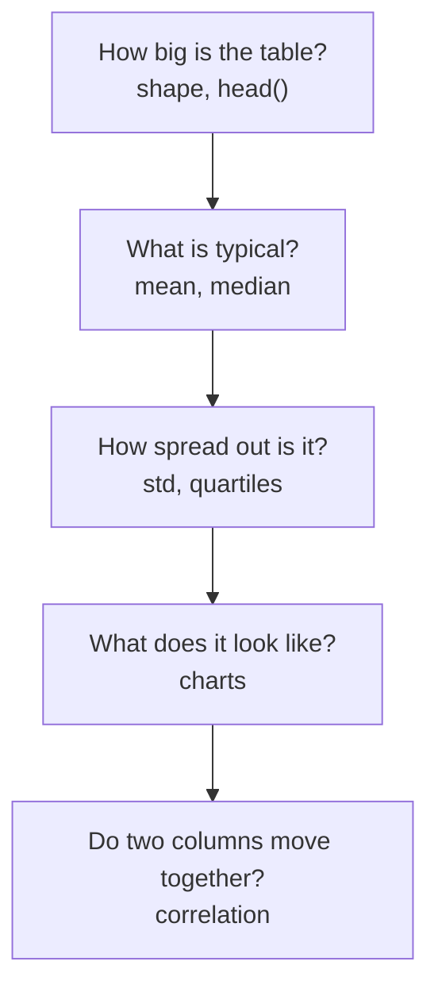
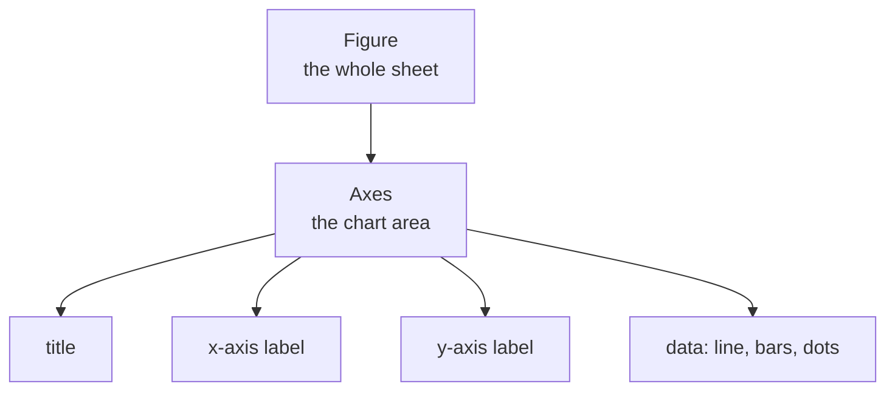

# Unit VIII: Exploratory Data Analysis

**Teaching time:** 5 hours

!!! abstract "Learning Objectives"

    Perform statistical analysis; visualize data using charts and plots.

    In plain words, by the end of this unit you can:

    - summarise a column of numbers with the mean, the median, the spread and percentiles,
    - get a first look at a table with `describe()`, `value_counts()` and `groupby()`,
    - draw the right chart for a question with Matplotlib and Seaborn,
    - measure with covariance and correlation whether two columns move together.

## 8.1 Descriptive Statistics Using Pandas and NumPy

### What Is Exploratory Data Analysis

**Exploratory Data Analysis**, or **EDA**, means looking carefully at a dataset before you do anything clever with it. You do not try to prove anything yet. You ask simple questions and let the data answer. A doctor does the same: she checks your temperature and pulse before she orders any test.

Every EDA asks the same questions, one after another. This unit gives you one tool for each. Section 8.1 answers the middle two with numbers, section 8.2 answers the fourth with pictures, and section 8.3 answers the last one.



### Finding the Centre: Mean, Median and Mode

A class of ten students has ten maths marks: 78, 64, 92, 45, 88, 56, 73, 81, 39 and 67. Ten numbers are hard to take in. "The class average is 68.3" is easy. That one number is a **statistic**: a single number that describes many numbers. **Descriptive statistics** describe the data you already have. Pandas gives each one a short method name.

The first question is "what is a typical value?" Three statistics answer it.

- The **mean** adds all values and divides by how many there are. Here the sum is 683 and there are 10 students, so the mean is 68.3.
- The **median** is the middle value after sorting. With ten values there are two middle ones, 67 and 73, so the median is halfway between them.
- The **mode** is the value that appears most often. It is mostly used for categories (see `value_counts()` below).

Why keep both the mean and the median? Look at `mobile_data.csv`: 30 days of mobile data use for one phone. On day 18 the phone used 6200 MB, far more than on any other day.

```python
import pandas as pd

students = pd.read_csv("students.csv")
mobile = pd.read_csv("mobile_data.csv")

print("Maths mean:", students["math"].mean())
print("Maths median:", students["math"].median())
print("Data mean:", round(mobile["mb_used"].mean(), 1))
print("Data median:", mobile["mb_used"].median())
```

```{ .text .output title="Output" }
Maths mean: 68.3
Maths median: 70.0
Data mean: 1155.1
Data median: 936.0
```

One strange day pulled the mean of the phone data up by more than 200 MB. The median hardly noticed. A value far away from the rest is called an **outlier**. When a column has outliers, the median describes a typical day better than the mean.

!!! ask "Ask the Class"

    Most days this phone uses about 900 MB. Someone says "this phone uses 1155 MB a day". Is that fair? Which number would you quote instead?

### Measuring the Spread: Range, Variance and Standard Deviation

Two classes can have the same mean and still be very different. Marks of 68, 68, 68 and marks of 40, 68, 96 both average 68. The **spread** tells you how far the values wander from the centre.

| Statistic | In plain words | Pandas |
|---|---|---|
| **Minimum**, **maximum** | The smallest and the largest value. | `.min()`, `.max()` |
| **Range** | Maximum minus minimum: the width of the data. | `.max() - .min()` |
| **Variance** | The average of the squared distances from the mean. | `.var()` |
| **Standard deviation** | The square root of the variance, in the same unit as the data. | `.std()` |

Why square the distances? Some marks are above the mean and some below. Squaring makes every distance positive, so they cannot cancel out. The variance is then in "marks squared", which is hard to picture. So we take the square root and get back to marks.

```python
import pandas as pd

students = pd.read_csv("students.csv")
math = students["math"]
print("Minimum:", math.min())
print("Maximum:", math.max())
print("Range:", math.max() - math.min())
print("Variance:", round(math.var(), 1))
print("Std deviation:", round(math.std(), 1))
```

```{ .text .output title="Output" }
Minimum: 39
Maximum: 92
Range: 53
Variance: 311.1
Std deviation: 17.6
```

A typical student is about 17.6 marks away from the class mean of 68.3. A small standard deviation means the marks are bunched together. A large one means they are spread out.

### Percentiles and Quartiles

A **percentile** is the value below which a given percent of the data falls. If the 25th percentile of the marks is 58, a quarter of the students scored less than 58. The **quartiles** cut the sorted data into four equal parts: the 25th percentile (Q1), the 50th (Q2, which is the median) and the 75th (Q3). The distance from Q1 to Q3 is the **interquartile range** (IQR), the width of the middle half. Pandas asks for fractions between 0 and 1, so the 25th percentile is `0.25`.

```python
import pandas as pd

students = pd.read_csv("students.csv")
print(students["math"].quantile([0.25, 0.5, 0.75]))
```

```{ .text .output title="Output" }
0.25    58.00
0.50    70.00
0.75    80.25
Name: math, dtype: float64
```

Half of the class scored between 58 and 80.25, so the IQR is 22.25 marks.

### Many Statistics at Once with `describe()`

`describe()` returns the main statistics for every numeric column in one table. `count` is how many values there are, `mean` and `std` are the centre and the spread, `min` and `max` are the two ends, and `25%`, `50%` and `75%` are the quartiles.

```python
import pandas as pd

students = pd.read_csv("students.csv")
subjects = students[["math", "science", "english"]]
print(subjects.describe().round(1))
```

```{ .text .output title="Output" }
       math  science  english
count  10.0     10.0     10.0
mean   68.3     69.9     70.6
std    17.6     16.0     14.7
min    39.0     44.0     48.0
25%    58.0     58.8     63.8
50%    70.0     70.5     71.0
75%    80.2     83.5     80.0
max    92.0     91.0     95.0
```

In one glance: English has the smallest spread (std 14.7), and Maths has the lowest mark (39).

### Counting Categories with `value_counts()`

A mean makes no sense for words like "Opener" or "Sun". For a column of categories, we count. `value_counts()` counts each value and sorts the biggest first, so its top row is the mode. With `normalize=True` it gives shares instead of counts.

```python
import pandas as pd

cricket = pd.read_csv("cricket.csv")
tips = pd.read_csv("tips.csv")
print(cricket["role"].value_counts())
print("Mode:", cricket["role"].mode()[0])
print(tips["day"].value_counts(normalize=True).round(2))
```

```{ .text .output title="Output" }
role
Middle         3
Opener         2
Top order      2
All-rounder    2
Finisher       2
Bowler         1
Name: count, dtype: int64
Mode: Middle
day
Sat     0.36
Sun     0.31
Thur    0.25
Fri     0.08
Name: proportion, dtype: float64
```

Saturday and Sunday together hold two thirds of the restaurant bills, and Friday is the quietest day. A column can have a tie for the mode, so `mode()` returns a Series and `[0]` takes the first.

### A First Look at Groups with `groupby()`

Often you want a statistic for each group, not for the whole table. **`groupby()`** splits the rows into groups, calculates a statistic for each and puts the answers in one small table. Read the line below in three steps: group by `day`, pick the column `tip`, take the `mean`.

```python
import pandas as pd

tips = pd.read_csv("tips.csv")
print(tips.groupby("day")["tip"].mean().round(2))
```

```{ .text .output title="Output" }
day
Fri     2.73
Sat     2.99
Sun     3.26
Thur    2.77
Name: tip, dtype: float64
```

Sunday has the highest average tip. Use double brackets to pick several columns, for example `tips.groupby("time")[["total_bill", "tip"]].mean()`.

### Making a New Column: Strike Rate

A **strike rate** tells how fast a batter scores: runs per 100 balls faced, so `runs / balls_faced * 100`. Pandas does arithmetic on whole columns at once, with no loop. We add the answer as a new column, then sort.

```python
import pandas as pd

cricket = pd.read_csv("cricket.csv")
cricket["strike_rate"] = (cricket["runs"] / cricket["balls_faced"] * 100).round(1)

best = cricket.sort_values("strike_rate", ascending=False)
print(best[["player", "runs", "balls_faced", "strike_rate"]].head(3))
```

```{ .text .output title="Output" }
   player  runs  balls_faced  strike_rate
8   Ishan   448          336        133.3
3  Deepak   446          350        127.4
5  Faisal   481          400        120.2
```

Ishan scored fastest, 133.3 runs per 100 balls, even though Kamal scored more runs in total.

### NumPy Arrays and Their Statistics

**NumPy** is the library that Pandas is built on. Its main object is the **array**: a row of numbers, all of the same type, stored compactly so that maths on thousands of values is fast. You make one from a list with `np.array()`. Maths works on the whole array at once, so adding 5 grace marks to every student takes one line. NumPy has a function for each statistic. `np.percentile()` takes percentages from 0 to 100 (Pandas `quantile()` takes fractions from 0 to 1).

```python
import numpy as np

marks = np.array([78, 64, 92, 45, 88, 56, 73, 81, 39, 67])
print(marks + 5)
print("Mean:", np.mean(marks))
print("Median:", np.median(marks))
print("Std deviation:", round(np.std(marks), 2))
print("Quartiles:", np.percentile(marks, [25, 50, 75]))
```

```{ .text .output title="Output" }
[83 69 97 50 93 61 78 86 44 72]
Mean: 68.3
Median: 70.0
Std deviation: 16.73
Quartiles: [58.   70.   80.25]
```

The mean, median and quartiles match what Pandas gave us. The standard deviation does not: Pandas said 17.6 and NumPy says 16.73. Is one of them wrong?

### Why NumPy and Pandas Agree, and One Difference

A Pandas column is a NumPy array with a name and an index wrapped around it. `.to_numpy()` hands you the array inside. The two tools hold the same numbers and use the same formulas, so the answers agree. Let us put them side by side.

```python
import numpy as np
import pandas as pd

students = pd.read_csv("students.csv")
math = students["math"]
arr = math.to_numpy()
print("Mean  :", math.mean(), np.mean(arr))
print("25%   :", math.quantile(0.25), np.percentile(arr, 25))
print("Std   :", round(math.std(), 2), round(np.std(arr), 2))
print("ddof=1:", round(np.std(arr, ddof=1), 2))
print("ddof=0:", round(math.std(ddof=0), 2))
```

```{ .text .output title="Output" }
Mean  : 68.3 68.3
25%   : 58.0 58.0
Std   : 17.64 16.73
ddof=1: 17.64
ddof=0: 16.73
```

Only the standard deviation differs, and neither is wrong. The two tools divide by a different number. The setting is called **`ddof`** (delta degrees of freedom), and the divisor is `n - ddof`.

| Tool | Default `ddof` | Divides by | Meaning |
|---|---|---|---|
| Pandas `std()` | 1 | n - 1 | your rows are a **sample** from a bigger group |
| NumPy `np.std()` | 0 | n | your rows are the **whole population** |

When the rows are only a sample, dividing by `n - 1` is a small correction that stops us underestimating the true spread. With 10 students the difference is visible (17.64 against 16.73). With 10,000 rows it almost disappears. Set `ddof` yourself, as in the last two lines above, and the two tools agree.

!!! warning "Common Mistake"

    Thinking that a Pandas column is safe from this difference. Even when you pass a Pandas column straight to `np.std()`, you get the NumPy default `ddof=0`. The same column gives two answers.

    ```python
    import numpy as np
    import pandas as pd

    students = pd.read_csv("students.csv")
    print("np.std(column):", round(np.std(students["math"]), 2))
    print("column.std():", round(students["math"].std(), 2))
    ```

    ```{ .text .output title="Output" }
    np.std(column): 16.73
    column.std(): 17.64
    ```

    In these notes, quote the Pandas value (`ddof=1`), the same one that `describe()` shows. Use one tool for one report.

## 8.2 Data Visualization Using Matplotlib and Seaborn

Numbers summarise a column, but a picture shows its shape. A chart can show an outlier, a gap or a trend in one second. **Data visualization** means turning data into charts. **Matplotlib** is the base library. It can draw anything, one instruction at a time. **Seaborn** is built on top of Matplotlib. It draws good-looking statistical charts straight from a DataFrame, using column names.

### Choosing the Right Chart

Start with the question, not with the chart. Each chart answers one kind of question.

| Your question | Chart | Matplotlib | Seaborn |
|---|---|---|---|
| How does a number change over days or order? | line plot | `plt.plot()` | `sns.lineplot()` |
| How do categories compare? | bar chart | `plt.bar()` | `sns.barplot()` |
| What is the shape of one number column? | histogram | `plt.hist()` | `sns.histplot()` |
| How do groups differ in spread? Any outliers? | box plot | `plt.boxplot()` | `sns.boxplot()` |
| Are two number columns related? | scatter plot | `plt.scatter()` | `sns.scatterplot()` |

To count rows in each category use `sns.countplot()`, the chart version of `value_counts()`. Avoid a pie chart for more than two or three parts: the eye cannot compare eight thin slices, and a bar chart is almost always clearer.

### Matplotlib Basics: Figure and Axes

A **figure** is the whole picture, like one sheet of paper. **Axes** (always plural, even for one chart) is the chart area on that sheet. It holds the x-axis, the y-axis, the title, the labels and the data.



You rarely build these yourself. `import matplotlib.pyplot as plt` gives you `plt`, and the first drawing call creates a figure and axes for you. Every chart follows the same four steps: load the data, draw it, label it with `plt.title()`, `plt.xlabel()` and `plt.ylabel()`, and call `plt.show()` once at the end. **Always give a chart a title and labelled axes with units.** A chart without labels forces the reader to guess.

In a script, `plt.show()` opens a window and waits until you close it. In Jupyter Notebook and Google Colab, the picture appears under the cell. To keep a chart as a file, call `plt.savefig("chart.png")` before `plt.show()`.

### Line Plot

A **line plot** joins points in order, so it shows change over time. Question: how much data did the phone use each day?

<!-- figure: u08-line-mobile -->
```python
import pandas as pd
import matplotlib.pyplot as plt

mobile = pd.read_csv("mobile_data.csv")
plt.plot(mobile["day"], mobile["mb_used"])
plt.title("Daily Mobile Data Use")
plt.xlabel("Day")
plt.ylabel("Data used (MB)")
plt.show()
```


The first argument goes on the x-axis and the second on the y-axis. The line stays near 900 MB, with one huge spike on day 18. In a table of 30 numbers this outlier is easy to miss. In the picture you cannot miss it.

### Bar Chart

A **bar chart** gives each category one bar, and the height shows the amount. Question: which category of goods has the biggest average sale? We first work out each row's sale amount (`quantity * price`), then take the mean for each category.

<!-- figure: u08-bar-category -->
```python
import pandas as pd
import matplotlib.pyplot as plt

shop = pd.read_csv("shop_sales.csv")
shop["sales"] = shop["quantity"] * shop["price"]
average = shop.groupby("category")["sales"].mean()

plt.bar(average.index, average.values)
plt.title("Average Sale Amount by Category")
plt.xlabel("Category")
plt.ylabel("Average sale (Rs.)")
plt.show()
```


`plt.bar()` needs the names for the x-axis (`average.index`) and the heights (`average.values`). A grocery sale is about four times bigger than a household or stationery sale.

### Histogram

A **histogram** shows the shape of one number column. Matplotlib cuts the range into equal slices called **bins**, counts how many values fall in each bin, and draws one bar per bin. Question: how are the marks of 60 students spread?

<!-- figure: u08-hist-marks -->
```python
import pandas as pd
import matplotlib.pyplot as plt

study = pd.read_csv("study_marks.csv")
plt.hist(study["marks"], bins=8)
plt.title("Marks of 60 Students")
plt.xlabel("Marks")
plt.ylabel("Number of students")
plt.show()
```


The tallest bars are in the middle: 43 of the 60 students scored between about 33 and 64 marks. Only 8 scored above 64. Unlike a bar chart, the bars of a histogram touch, because the bins are slices of one number line.

!!! warning "Common Mistake"

    Choosing too few or too many bins. With `bins=2` the shape is hidden. With `bins=40` the chart breaks into tiny spikes, because each bin holds only one or two students. Here are both, from the same 60 marks. `plt.subplot(1, 2, 1)` means "a grid of 1 row and 2 columns, draw in the first".

    <!-- figure: u08-bins -->
    ```python
    import pandas as pd
    import matplotlib.pyplot as plt

    study = pd.read_csv("study_marks.csv")

    plt.subplot(1, 2, 1)
    plt.hist(study["marks"], bins=2)
    plt.title("2 bins")
    plt.xlabel("Marks")
    plt.ylabel("Number of students")

    plt.subplot(1, 2, 2)
    plt.hist(study["marks"], bins=40)
    plt.title("40 bins")
    plt.xlabel("Marks")
    plt.show()
    ```

    
    

    Try 8 to 15 bins for a column of a few hundred values, and compare two or three settings before you decide.

### Scatter Plot

A **scatter plot** draws one dot per row. The dot's position comes from two columns. It answers: are these two columns related? Question: do students who study more hours get more marks?

<!-- figure: u08-scatter-hours -->
```python
import pandas as pd
import matplotlib.pyplot as plt

study = pd.read_csv("study_marks.csv")
plt.scatter(study["hours_studied"], study["marks"])
plt.title("Hours Studied and Marks")
plt.xlabel("Hours studied per day")
plt.ylabel("Marks")
plt.show()
```


The dots climb from the bottom left to the top right. The more a student studies, the higher the marks tend to be. Section 8.3 puts a number on this pattern.

### Box Plot

A **box plot** squeezes a column into five facts and is perfect for comparing columns side by side. Here we compare the marks of the three subjects.

<!-- figure: u08-box-subjects -->
```python
import pandas as pd
import matplotlib.pyplot as plt

students = pd.read_csv("students.csv")
plt.boxplot(
    [students["math"], students["science"], students["english"]],
    tick_labels=["Maths", "Science", "English"],
)
plt.title("Marks in Three Subjects")
plt.xlabel("Subject")
plt.ylabel("Marks")
plt.show()
```


How to read one box: the line inside is the **median**. The box runs from Q1 to Q3, so it holds the middle half of the values. The thin lines (**whiskers**) reach the smallest and largest normal values. A dot beyond a whisker is an **outlier**. English has the shortest box, so its marks are the most alike. No subject has outliers here.

!!! ask "Ask the Class"

    A shop owner wants to know whether sales were higher on weekends than on weekdays. Which chart from the table would you draw, and why?

### Seaborn: Charts Straight from a DataFrame

Seaborn's big advantage: you hand over the whole DataFrame with `data=` and name the columns with `x=`, `y=` and `hue=`. Seaborn does the grouping and the colouring for you. **`hue`** colours the dots or bars by a category. Titles and labels still come from `plt`, because Seaborn charts are Matplotlib charts. Seaborn is imported as `sns`. From here on we use the restaurant table `tips.csv`, whose amounts are in dollars.

`sns.scatterplot()` with `hue` shows a third piece of information through colour. Here the colour tells whether the meal was lunch or dinner.

<!-- figure: u08-sns-scatter -->
```python
import pandas as pd
import seaborn as sns
import matplotlib.pyplot as plt

tips = pd.read_csv("tips.csv")
sns.scatterplot(data=tips, x="total_bill", y="tip", hue="time")
plt.title("Tip Against Bill, by Meal Time")
plt.xlabel("Total bill (dollars)")
plt.ylabel("Tip (dollars)")
plt.show()
```


`sns.boxplot()` draws one box per group, so outliers show up as dots. `order=` lists the groups in the order you want. Without it, Seaborn uses the order in which they first appear in the file.

<!-- figure: u08-sns-box -->
```python
import pandas as pd
import seaborn as sns
import matplotlib.pyplot as plt

tips = pd.read_csv("tips.csv")
sns.boxplot(data=tips, x="day", y="total_bill", order=["Thur", "Fri", "Sat", "Sun"])
plt.title("Restaurant Bills by Day")
plt.xlabel("Day of the week")
plt.ylabel("Total bill (dollars)")
plt.show()
```


`sns.barplot()` draws the mean of a column for each category, so you skip the `groupby()` step: `sns.barplot(data=tips, x="day", y="tip")`. It adds a thin line on each bar that shows how uncertain the average is. `sns.histplot(data=tips, x="total_bill")` draws a histogram in the same style, and `sns.countplot()` counts rows. All of them follow the same `data=`, `x=`, `y=` pattern.

## 8.3 Correlation and Covariance Analysis

### Do Two Columns Move Together

In the scatter plot of hours studied and marks, the dots climbed from left to right. Students who study more tend to score more. We say the two columns move together. **Covariance** and **correlation** are two numbers that measure this "moving together". A **positive** number means that when one column goes up, the other tends to go up too. A **negative** number means that when one goes up, the other tends to go down. A number near **zero** means there is no straight-line link.

### Covariance

**Covariance** tells you the direction of the link. Pandas calculates it for every pair of columns with `df.cov()`.

```python
import pandas as pd

study = pd.read_csv("study_marks.csv")
columns = study[["hours_studied", "attendance", "marks"]]
print(columns.cov().round(2))
```

```{ .text .output title="Output" }
               hours_studied  attendance   marks
hours_studied           5.69        2.01   36.53
attendance              2.01       82.15   25.22
marks                  36.53       25.22  266.14
```

The table is mirrored along its diagonal. On the diagonal each column is paired with itself, which gives its variance. The covariance of hours and marks is 36.53. It is positive, so the two move together.

But is 36.53 a lot? Covariance has a weakness: its size depends on the units. Measure study time in minutes instead of hours and the covariance of study time and marks becomes 2191.59, which is 60 times bigger, though the students and their link are exactly the same. So covariance alone cannot tell us how strong a link is.

### Correlation

**Correlation** fixes this. It rescales the covariance so that the result is always between -1 and +1, whatever the units. Pandas calculates it with `df.corr()`. This is the usual **Pearson correlation coefficient**, written **r**.

```python
import pandas as pd

study = pd.read_csv("study_marks.csv")
columns = study[["hours_studied", "attendance", "marks"]]
print(columns.corr().round(2))
```

```{ .text .output title="Output" }
               hours_studied  attendance  marks
hours_studied           1.00        0.09   0.94
attendance              0.09        1.00   0.17
marks                   0.94        0.17   1.00
```

Every column has a correlation of 1.00 with itself. Hours studied and marks have r = 0.94, a very strong positive link. Attendance and marks have only r = 0.17, which is weak. In this data, the hours a student studies say far more about the marks than attendance does. Now the cricket table. Which batting numbers go together?

```python
import pandas as pd

cricket = pd.read_csv("cricket.csv")
columns = cricket[["runs", "balls_faced", "fours", "sixes"]]
print(columns.corr().round(2))
```

```{ .text .output title="Output" }
             runs  balls_faced  fours  sixes
runs         1.00         0.95   0.94   0.62
balls_faced  0.95         1.00   0.86   0.55
fours        0.94         0.86   1.00   0.64
sixes        0.62         0.55   0.64   1.00
```

A batter who faces more balls scores more runs (r = 0.95), and runs and fours go together too (0.94). Sixes have a weaker link to runs (0.62). A printed table is enough here. [Unit X](unit-10-visualization.md) shows how to turn a table like this into a coloured heatmap.

### How to Read a Correlation Number

The sign gives the direction. The size, without the sign, gives the strength. These cut-offs are only a rule of thumb, but they work well in class.

| Value of r | How to describe it |
|---|---|
| +0.7 to +1.0 | strong positive |
| +0.3 to +0.7 | moderate positive |
| -0.3 to +0.3 | weak or none |
| -0.7 to -0.3 | moderate negative |
| -1.0 to -0.7 | strong negative |

The best way to feel these numbers is to see them. The figure shows three made-up examples: a strong positive link, no link and a strong negative link. The value of r is in each title.


!!! ask "Ask the Class"

    Name two things from daily life that you expect to have a positive correlation, and two that you expect to have a negative one. For example: temperature and cold-drink sales, or the age of a phone and its price.

### Correlation Is Not Causation

A high correlation shows that two columns move together. It does **not** show that one causes the other. Often a hidden third thing drives both. Here are six months of made-up numbers for a seaside town.

```python
import pandas as pd

town = pd.DataFrame({
    "temperature": [18, 22, 27, 31, 35, 38],
    "ice_creams_sold": [120, 210, 340, 480, 610, 700],
    "sunburn_cases": [2, 5, 9, 14, 20, 24],
})
print(town.corr().round(2))
```

```{ .text .output title="Output" }
                 temperature  ice_creams_sold  sunburn_cases
temperature             1.00              1.0           0.99
ice_creams_sold         1.00              1.0           1.00
sunburn_cases           0.99              1.0           1.00
```

Ice cream sales and sunburn cases have a correlation of 0.99. Does eating ice cream cause sunburn? No. Hot weather makes people buy ice cream and also makes them spend longer in the sun. The hidden driver is the **temperature**.

The same care applies to our own data. Hours studied and marks have r = 0.94, and it is reasonable that study helps. But the number alone cannot prove it. A keen student may study more and also pay more attention in class. To prove a cause you need more than a correlation, such as a careful experiment. Also remember that r measures only a straight-line link. A curved pattern can have r near 0, so always draw the scatter plot as well as printing the number.

## Quick Recap

- EDA means looking at the data first: its size, its centre, its spread, its shape and its links.
- The mean is the fair share, the median is the middle value, and the mode is the most common one. Outliers pull the mean but hardly move the median.
- The standard deviation is the typical distance from the mean. Pandas `std()` divides by `n - 1`, NumPy `np.std()` divides by `n`, so set `ddof` to make them agree.
- `describe()`, `value_counts()` and `groupby().mean()` give a first look at any table.
- Choose the chart by the question: line for change, bar for categories, histogram for shape, box plot for spread, scatter for two numbers. Always add a title and axis labels.
- Correlation runs from -1 to +1. Covariance gives only the direction, and correlation does not depend on the units. Correlation is not causation.

## Try It Yourself

**1.** For the `science` column of `students.csv`, print the mean, the median and the standard deviation (rounded to 1 decimal place).

??? success "Answer"

    ```python
    import pandas as pd

    students = pd.read_csv("students.csv")
    science = students["science"]
    print("Mean:", round(science.mean(), 1))
    print("Median:", round(science.median(), 1))
    print("Std deviation:", round(science.std(), 1))
    ```

    ```{ .text .output title="Output" }
    Mean: 69.9
    Median: 70.5
    Std deviation: 16.0
    ```

**2.** Using `cricket.csv`, add a new column `boundary_runs` equal to `fours * 4 + sixes * 6`. Then print the three batters with the highest `boundary_runs`.

??? success "Answer"

    ```python
    import pandas as pd

    cricket = pd.read_csv("cricket.csv")
    cricket["boundary_runs"] = cricket["fours"] * 4 + cricket["sixes"] * 6
    best = cricket.sort_values("boundary_runs", ascending=False)
    print(best[["player", "boundary_runs"]].head(3))
    ```

    ```{ .text .output title="Output" }
       player  boundary_runs
    10  Kamal            344
    0    Anil            338
    1   Bibek            296
    ```

**3.** Using `tips.csv`, print the average `total_bill` for smokers and for non-smokers. Which group has the higher average? Then name the Seaborn function that would draw these two averages as bars.

??? success "Answer"

    ```python
    import pandas as pd

    tips = pd.read_csv("tips.csv")
    print(tips.groupby("smoker")["total_bill"].mean().round(2))
    ```

    ```{ .text .output title="Output" }
    smoker
    No     19.19
    Yes    20.76
    Name: total_bill, dtype: float64
    ```

    The smokers' average is slightly higher. `sns.barplot(data=tips, x="smoker", y="total_bill")` draws the same two averages as bars.

**4.** Using `tips.csv`, find the correlation between `total_bill` and `tip`. Is the link strong, moderate or weak? Does it prove that a big bill causes a big tip?

??? success "Answer"

    ```python
    import pandas as pd

    tips = pd.read_csv("tips.csv")
    print(round(tips["total_bill"].corr(tips["tip"]), 2))
    ```

    ```{ .text .output title="Output" }
    0.68
    ```

    A value of 0.68 is a moderate positive link, just below the "strong" band. It does not prove a cause. It only shows that bigger bills tend to come with bigger tips.

## Exam Questions for This Unit

Past-paper and practice questions for this unit are collected in [Unit VIII: Exploratory Data Analysis](exam/unit-08.md).
