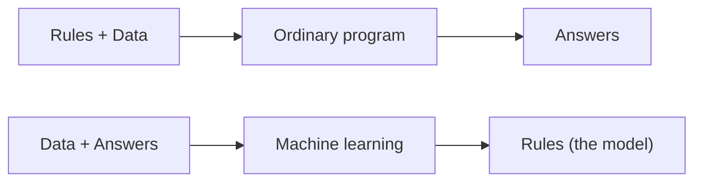
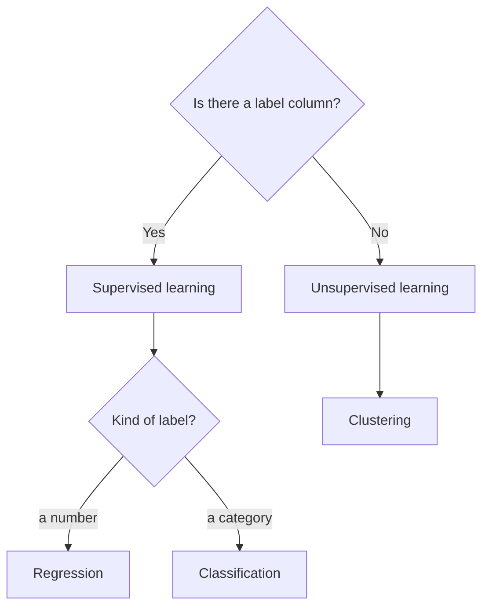
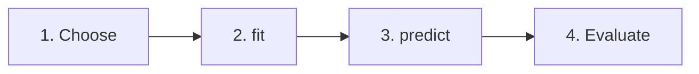
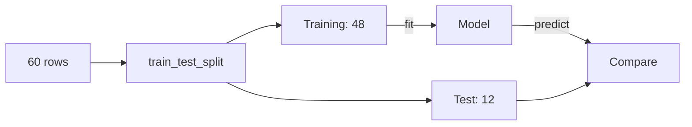

# Unit IX: Introduction to Machine Learning with Python

**Teaching time:** 6 hours

!!! abstract "Learning Objectives"

    Understand ML concepts; build regression, classification, and clustering models.

    In plain words, by the end of this unit you can:

    - explain what machine learning is, and tell supervised learning from unsupervised learning,
    - decide whether a task is regression, classification or clustering,
    - build each kind of model with scikit-learn using the same short recipe: choose, `fit`, `predict`, evaluate,
    - hold back test data and measure a model honestly on it.

## 9.1 Supervised vs Unsupervised Learning

### What Machine Learning Is

**Machine learning** (ML) means letting a computer learn a pattern from examples, instead of giving it the rules. In the earlier units you wrote the rules yourself, such as `if marks >= 45: print("Pass")`. That works when you know the rule. But what is the rule for "will this student pass, if she studies 5 hours and attends 80% of classes"? Nobody knows it exactly. What we do have is old examples: 60 students with their hours, attendance and results. A machine learning program studies those examples and finds the pattern by itself.

A teacher who has marked papers for ten years does the same thing. She has seen many students, so she can look at a new student and make a good guess.



The top row is what you did so far: you give the rules and the data, and the program gives answers. The bottom row is machine learning: you give data and the known answers, and the computer works out the rules. The pattern it finds is stored in an object called a **model**. Once we have a model, we can ask it for answers on new data.

### Features, Labels, Training and Prediction

Five words come up again and again in this unit. Learn them now.

| Word | Plain meaning | Example from `study_marks.csv` |
|---|---|---|
| **Feature** | an input column the model looks at | `hours_studied`, `attendance` |
| **Label** (also called **target**) | the answer column we want to predict | `marks`, or `result` |
| **Training** | letting the model study the examples | `model.fit(X, y)` |
| **Prediction** | the model's answer for a new row | `model.predict(new_rows)` |
| **Model** | the learned pattern, stored in a Python object | the object after `fit` |

Here is the file `study_marks.csv` that we use all through the unit. Each row is one student.

```python
import pandas as pd

students = pd.read_csv("study_marks.csv")
print(students.head(4))
```

```{ .text .output title="Output" }
   student_id  hours_studied  attendance  marks result
0           1            2.5          85     34   Fail
1           2            3.9          82     54   Pass
2           3            5.2          69     39   Fail
3           4            2.5          91     42   Fail
```

Scikit-learn (the library we use) expects the features and the label to be kept apart. By habit, the features are called `X` (a capital letter, because it is a table) and the label is called `y` (a small letter, because it is a single column).

<!-- continue -->
```python
X = students[["hours_studied", "attendance"]]   # features: a table
y = students["marks"]                           # label: one column
print("Features:", X.shape)
print("Label:", y.shape)
```

```{ .text .output title="Output" }
Features: (60, 2)
Label: (60,)
```

`X` has 60 rows and 2 columns. `y` has 60 values. Row 1 of `X` and the first value of `y` belong to the same student.

### Supervised Learning

In **supervised learning** the examples come with the right answers. The computer studies the features, compares its guesses with the label, and corrects itself. It is like a student working through a practice book that has an answer key at the back. The word "supervised" means that someone has already supplied the answers.

The goal is to predict the label for new data where the answer is not known yet. `study_marks.csv` is a supervised dataset: it has the answer columns `marks` and `result`.

### Unsupervised Learning

In **unsupervised learning** there is no answer column. The computer is not told what to find. It looks at the data and finds structure by itself. The most common job is **clustering**: putting similar rows into the same group. Look at the file of shop customers.

```python
import pandas as pd

customers = pd.read_csv("shop_customers.csv")
print(customers.head(3))
```

```{ .text .output title="Output" }
   customer_id  monthly_visits  monthly_spend
0            1             7.7           5.59
1            2             1.2           1.89
2            3             1.2           0.41
```

There is no column that says which group a customer belongs to. Nobody has labelled them. A clustering model will find the groups for us.

### Supervised or Unsupervised: Side by Side

The first question to ask about any ML task is simple: does my data have a label column?



| | Supervised learning | Unsupervised learning |
|---|---|---|
| Does the data have a label? | Yes | No |
| Goal | predict the label for new data | find groups or patterns in the data |
| Everyday example 1 | predict marks from study hours | group shop customers by visits and spending |
| Everyday example 2 | predict Pass or Fail | group news stories by topic, with no topics given |
| Kinds covered in this unit | regression, classification | clustering |

!!! ask "Ask the Class"

    Sort these four tasks. For each one, is it supervised or unsupervised? If supervised, does it predict a number or a category?

    1. Predict the price of a house in Kathmandu from its size and location.
    2. Decide whether an email is spam or not spam, using thousands of emails already marked by users.
    3. Split 500 students into groups with similar study habits. Nobody has named the groups.
    4. Predict whether it will rain tomorrow in Pokhara: yes or no.

??? success "Answer"

    1. Supervised, a number (regression).
    2. Supervised, a category (classification).
    3. Unsupervised (clustering). There is no label.
    4. Supervised, a category (classification): the answer is yes or no.

## 9.2 Regression, Classification, Clustering

These three kinds of task cover most of what a beginner builds. Each one answers a different question.

| Task | Question it answers | Learning type | What comes out | Example in this unit |
|---|---|---|---|---|
| Regression | How much? | supervised | a number | marks for 6.5 hours of study |
| Classification | Which one? | supervised | a category | Pass or Fail; iris species |
| Clustering | Which groups exist? | unsupervised | a group number | three kinds of shop customer |

We use **scikit-learn**, the most popular Python library for classic machine learning. It is installed as `scikit-learn` and imported as `sklearn`. Every model in it works the same way, and you will see that in all three sections.

### Regression: Predicting a Number

**Regression** predicts a number. We want to predict `marks`, so the label is a number and the task is regression. The simplest model is **linear regression**: it draws the straight line that passes as close as possible to all the points.

First we train it. `LinearRegression()` makes an empty model. `fit` shows it the examples and lets it learn.

```python
import pandas as pd
from sklearn.linear_model import LinearRegression

students = pd.read_csv("study_marks.csv")
X = students[["hours_studied"]]    # feature: a table, so two brackets
y = students["marks"]              # label: one column

model = LinearRegression()
model.fit(X, y)

print("Intercept:", round(model.intercept_, 2))
print("Slope:", round(model.coef_[0], 2))
```

```{ .text .output title="Output" }
Intercept: 19.5
Slope: 6.42
```

Names that end with an underscore, like `intercept_`, hold what the model learned during `fit`. The line the model drew is:

`marks = intercept + slope * hours`

The **intercept** is where the line starts: the marks predicted for 0 hours of study. The **slope** is how steep the line is: how many extra marks each extra hour of study adds. Here the line says a student who studies 0 hours gets about 19.5 marks, and every extra hour adds about 6.4 marks. To predict, the model puts the hours into this formula.

Now we use the trained model. To predict, give `predict` a table that has the same column name as the training table.

<!-- continue -->
```python
new_student = pd.DataFrame({"hours_studied": [6.5]})
predicted = model.predict(new_student)

print("Predicted marks for 6.5 hours:", round(predicted[0], 1))
print("By hand:", round(model.intercept_ + model.coef_[0] * 6.5, 1))
```

```{ .text .output title="Output" }
Predicted marks for 6.5 hours: 61.2
By hand: 61.2
```

`predict` returns a list of answers, one for each row we gave it. We gave one row, so `predicted[0]` is the answer. The second line does the sum by hand: the formula gives the same number, so there is no magic.

A picture shows the idea better. The dots are the real students. The line is the model. The star is our prediction for 6.5 hours. (In `plt.plot`, the short code `"o"` means "draw dots, not a line", and `"*"` means a star.)

<!-- continue; figure: u09-regression-line -->
```python
import matplotlib.pyplot as plt

plt.plot(students["hours_studied"], students["marks"], "o", label="Students")
plt.plot(students["hours_studied"], model.predict(X), label="Fitted line")
plt.plot([6.5], predicted, "*", markersize=18, label="Prediction")
plt.xlabel("Hours studied")
plt.ylabel("Marks")
plt.title("Marks rise with hours studied")
plt.legend()
plt.show()
```


Almost every dot sits close to the line. That is why the line makes useful predictions. The dots do not sit exactly on the line, so the predictions are good guesses, not exact answers. How good the guesses really are is measured in Section 9.3.

!!! warning "Common Mistake"

    The feature must be a table (2D), even when it has only one column. `students["hours_studied"]` is a single column (a Series), so scikit-learn refuses it. Write `students[["hours_studied"]]` with two pairs of brackets. The error is a `ValueError`. Read the last line of the error: it says what went wrong.

    <!-- error -->
    ```python
    import pandas as pd
    from sklearn.linear_model import LinearRegression

    students = pd.read_csv("study_marks.csv")
    model = LinearRegression()
    model.fit(students["hours_studied"], students["marks"])
    ```

    ```{ .text .output title="Output" }
    Traceback (most recent call last):
      File "example.py", line 6, in <module>
        model.fit(students["hours_studied"], students["marks"])
    ValueError: Expected a 2-dimensional container but got <class 'pandas.Series'> instead. Pass a DataFrame containing a single row (i.e. single sample) or a single column (i.e. single feature) instead.
    ```

!!! ask "Ask the Class"

    Our students studied between 0.5 and 8.8 hours. Would you trust the line to predict the marks of a student who studies 20 hours? Why not?

??? success "Answer"

    No. The model has never seen anyone who studied that long. A straight line keeps rising, so it would predict more than 100 marks, which is impossible. A model is only reliable for data that looks like the data it learned from.

### Classification: Predicting a Category

**Classification** predicts a category. Each possible answer is called a **class**. Pass or Fail, spam or not spam, and the species of a flower are all classes. Now the label is the column `result`, which holds the words `Pass` and `Fail`.

This time we use two features: `hours_studied` and `attendance`. The model is `LogisticRegression`. Despite the word "regression" in its name, it is a classifier: it works out how likely each class is and answers with the likelier one. The steps are exactly the same as before.

```python
import pandas as pd
from sklearn.linear_model import LogisticRegression

students = pd.read_csv("study_marks.csv")
X = students[["hours_studied", "attendance"]]
y = students["result"]

model = LogisticRegression()
model.fit(X, y)

new_students = pd.DataFrame({
    "hours_studied": [1.5, 5.0, 7.5],
    "attendance": [70, 80, 95],
})
print(model.predict(new_students))
```

```{ .text .output title="Output" }
['Fail' 'Pass' 'Pass']
```

The answer is one class for each of the three new students. The first student studied only 1.5 hours and is predicted to fail. The other two are predicted to pass.

!!! warning "Common Mistake"

    Giving `predict` different columns from the ones used in `fit`. This model was trained with two features. If we ask about a student and give only the hours, scikit-learn stops with a `ValueError`. (A plain list with the wrong number of values gives a similar error, which says how many features the model expects.)

    <!-- error -->
    ```python
    import pandas as pd
    from sklearn.linear_model import LogisticRegression

    students = pd.read_csv("study_marks.csv")
    X = students[["hours_studied", "attendance"]]
    y = students["result"]

    model = LogisticRegression()
    model.fit(X, y)

    one_feature = pd.DataFrame({"hours_studied": [5.0]})
    model.predict(one_feature)
    ```

    ```{ .text .output title="Output" }
    Traceback (most recent call last):
      File "example.py", line 12, in <module>
        model.predict(one_feature)
    ValueError: The feature names should match those that were passed during fit.
    Feature names seen at fit time, yet now missing:
    - attendance
    ```

    Always give `predict` the same features, in the same form, as `fit` received.

Let us look at the two classes. Each dot is one student, placed by hours studied and attendance.

<!-- figure: u09-pass-fail -->
```python
import pandas as pd
import matplotlib.pyplot as plt

students = pd.read_csv("study_marks.csv")

for result, marker in [("Pass", "o"), ("Fail", "s")]:
    group = students[students["result"] == result]
    plt.scatter(group["hours_studied"], group["attendance"],
                marker=marker, label=result)

plt.xlabel("Hours studied")
plt.ylabel("Attendance (%)")
plt.title("Pass and fail students")
plt.legend()
plt.show()
```


The loop draws one group at a time, so each class gets its own colour, its own marker and its own legend entry. The two classes are mostly separated from left to right: hours studied matters much more than attendance. A classification model learns where the border between the two groups lies.

`LogisticRegression` is only one of many classifiers. Here is a second one on a different dataset: the famous **iris** data that comes with scikit-learn. It has measurements of 150 flowers and the species of each. The model is `KNeighborsClassifier`. To classify a new flower, it finds the 3 most similar flowers it has seen and takes a vote.

```python
import pandas as pd
from sklearn.datasets import load_iris
from sklearn.neighbors import KNeighborsClassifier

iris = load_iris(as_frame=True)
X = iris.data
X.columns = ["sepal_length", "sepal_width", "petal_length", "petal_width"]
y = iris.target_names[iris.target]    # the species names

print(X.head(3))
print("Species:", iris.target_names)

model = KNeighborsClassifier(n_neighbors=3)
model.fit(X, y)

new_flower = pd.DataFrame([[5.0, 3.4, 1.5, 0.2]], columns=X.columns)
print("New flower is:", model.predict(new_flower)[0])
```

```{ .text .output title="Output" }
   sepal_length  sepal_width  petal_length  petal_width
0           5.1          3.5           1.4          0.2
1           4.9          3.0           1.4          0.2
2           4.7          3.2           1.3          0.2
Species: ['setosa' 'versicolor' 'virginica']
New flower is: setosa
```

Look at what changed between the two classifiers: only the name of the model. The three steps are the same: make the model, `fit` it, `predict` with it. This sameness is the best thing about scikit-learn. How accurate these models are is the subject of Section 9.3.

### Clustering: Finding Groups Without Labels

**Clustering** puts similar rows into the same group, with no label to guide it. The shop owner has 90 customers. For each, we know the visits per month and the monthly spending in Rs. thousands. She wants to know what kinds of customer she has.

We use **K-means**, the most common clustering method. We tell it how many groups to find, here 3 with `n_clusters=3`. It then places 3 centre points and moves them until each one sits in the middle of a group of customers. Each centre is called a **centroid**. Every customer joins the group of the nearest centroid. (`n_init=10` makes it try 10 starting positions and keep the best. `random_state=42` fixes the random starts so everyone gets the same answer.)

Notice that `fit` receives only `X`. There is no `y`.

```python
import pandas as pd
from sklearn.cluster import KMeans

customers = pd.read_csv("shop_customers.csv")
X = customers[["monthly_visits", "monthly_spend"]]

model = KMeans(n_clusters=3, n_init=10, random_state=42)
model.fit(X)

customers["cluster"] = model.labels_
print(customers.head(5))
print(customers["cluster"].value_counts().sort_index())
print("Inertia:", round(model.inertia_, 1))
```

```{ .text .output title="Output" }
   customer_id  monthly_visits  monthly_spend  cluster
0            1             7.7           5.59        1
1            2             1.2           1.89        2
2            3             1.2           0.41        2
3            4             7.0           6.27        1
4            5             5.8           5.63        1
cluster
0    30
1    30
2    30
Name: count, dtype: int64
Inertia: 139.8
```

`labels_` holds the group number of every customer. There are 30 customers in each group. **Inertia** is a score for how tight the groups are: it adds up how far each customer is from the centre of its own group. A smaller inertia means tighter groups.

The centroids tell us what each group looks like.

<!-- continue -->
```python
centres = pd.DataFrame(model.cluster_centers_, columns=X.columns)
print(centres.round(2))
```

```{ .text .output title="Output" }
   monthly_visits  monthly_spend
0           12.08           2.56
1            6.66           5.58
2            3.15           1.06
```

Read each row as an "average customer" of that group. Cluster 0 customers visit often (about 12 times) but spend little. Cluster 1 customers visit about 7 times and spend the most. Cluster 2 customers rarely visit and spend the least. Naming the groups is the shop owner's job, not the computer's. The group numbers 0, 1 and 2 are arbitrary labels. Another run could call the same group 2 instead of 0. Only the grouping is meaningful, never the number.

A trained K-means model can also place a new customer in a group.

<!-- continue -->
```python
new_customer = pd.DataFrame({
    "monthly_visits": [5.0],
    "monthly_spend": [5.0],
})
print("Group of the new customer:", model.predict(new_customer)[0])
```

```{ .text .output title="Output" }
Group of the new customer: 1
```

Now the picture. We draw one group at a time with a loop, and give each group its own marker. The big crosses are the centroids.

<!-- continue; figure: u09-clusters -->
```python
import matplotlib.pyplot as plt

for number, marker in [(0, "o"), (1, "s"), (2, "^")]:
    group = customers[customers["cluster"] == number]
    plt.scatter(group["monthly_visits"], group["monthly_spend"],
                marker=marker, label="Cluster " + str(number))

plt.scatter(centres["monthly_visits"], centres["monthly_spend"],
            marker="X", s=250, label="Centroids")
plt.xlabel("Monthly visits")
plt.ylabel("Monthly spend (Rs. thousands)")
plt.title("Three groups of shop customers")
plt.legend()
plt.show()
```


!!! ask "Ask the Class"

    The shop owner sees these three groups. What would you call each group? What could the shop do differently for each one?

**How many clusters?** The computer cannot decide this for us, so we try a few values of `n_clusters` and compare the inertia. Inertia always falls when we add clusters. We look for the point after which it stops falling by much.

```python
import pandas as pd
from sklearn.cluster import KMeans

customers = pd.read_csv("shop_customers.csv")
X = customers[["monthly_visits", "monthly_spend"]]

for k in range(2, 6):
    model = KMeans(n_clusters=k, n_init=10, random_state=42)
    model.fit(X)
    print(k, "clusters -> inertia", round(model.inertia_))
```

```{ .text .output title="Output" }
2 clusters -> inertia 627
3 clusters -> inertia 140
4 clusters -> inertia 105
5 clusters -> inertia 79
```

From 2 to 3 clusters the inertia falls by almost 500. After that it falls by only a few tens. So 3 is a sensible choice. (People call this the elbow method, because the fall bends like an elbow.)

## 9.3 Using Scikit-learn for Model Building

### The Scikit-learn Recipe

Every scikit-learn model is built with the same four steps. Choose the model. `fit` it, which means learn from the data. `predict`, which means give answers for new rows. Then evaluate, which means check how good the answers are. Once you know the recipe, a new model costs you only a new name.



You have already done steps 1 to 3 in Section 9.2. Step 4 is the new part of this section. Scikit-learn keeps its tools in a few modules. This table is worth remembering.

| Job | Module | Names |
|---|---|---|
| Regression model | `sklearn.linear_model` | `LinearRegression` |
| Classification model | `sklearn.linear_model` | `LogisticRegression` |
| Classification model | `sklearn.neighbors` | `KNeighborsClassifier` |
| Classification model | `sklearn.tree` | `DecisionTreeClassifier` |
| Clustering model | `sklearn.cluster` | `KMeans` |
| Split the data | `sklearn.model_selection` | `train_test_split` |
| Regression scores | `sklearn.metrics` | `r2_score`, `mean_absolute_error` |
| Classification scores | `sklearn.metrics` | `accuracy_score`, `confusion_matrix` |

The order of the steps matters. A model knows nothing until `fit` has been called.

!!! warning "Common Mistake"

    Calling `predict` before `fit`. The model is still empty, so scikit-learn stops with a `NotFittedError`. Always `fit` first.

    <!-- error -->
    ```python
    import pandas as pd
    from sklearn.linear_model import LinearRegression

    model = LinearRegression()
    new_student = pd.DataFrame({"hours_studied": [6.5]})
    model.predict(new_student)
    ```

    ```{ .text .output title="Output" }
    Traceback (most recent call last):
      File "example.py", line 6, in <module>
        model.predict(new_student)
    sklearn.exceptions.NotFittedError: This LinearRegression instance is not fitted yet. Call 'fit' with appropriate arguments before using this estimator.
    ```

### Train and Test Split

How do we know whether a model is any good? We must test it on students it has never seen. Think of a teacher who gives students 50 practice questions. If the final exam contains the same 50 questions, a high mark proves nothing. The students may only have memorised the answers. A fair exam needs new questions.

A model is the same. So before training we **split** the data into two parts. The **training set** (usually 80% of the rows) is used by `fit`. The **test set** (the other 20%) is hidden from the model until the end. We use it only to check how well the model predicts rows it has never seen.




The tool is `train_test_split`. It shuffles the rows first and then cuts them. `test_size=0.2` keeps 20% of the rows for testing. `random_state=42` fixes the shuffle, so you and your friend get exactly the same split. (Any fixed number works. These notes always use 42.) It returns four things, always in this order: `X_train`, `X_test`, `y_train`, `y_test`.

```python
import pandas as pd
from sklearn.model_selection import train_test_split

students = pd.read_csv("study_marks.csv")
X = students[["hours_studied"]]
y = students["marks"]

X_train, X_test, y_train, y_test = train_test_split(
    X, y, test_size=0.2, random_state=42
)
print("All rows:", len(X))
print("Training rows:", len(X_train))
print("Test rows:", len(X_test))
```

```{ .text .output title="Output" }
All rows: 60
Training rows: 48
Test rows: 12
```

!!! ask "Ask the Class"

    A student already saw the answers to the practice questions and scores 100% on them. Does that prove she will pass the final exam? How is this like testing a model on its own training data?

### Measuring a Regression Model

Now step 4, evaluate. We train on the training rows, predict the test rows, and compare the predictions with the real marks. For regression there are two common scores.

- **R-squared** says how much of the ups and downs in the marks the model explains. It runs up to 1. A score of 1 means perfect predictions. A score near 0 means the model is no better than always guessing the average marks.
- **Mean absolute error** (MAE) is the average size of the mistakes, in the same unit as the label. An MAE of 4 means the predictions are, on average, 4 marks away from the truth.

```python
import pandas as pd
from sklearn.linear_model import LinearRegression
from sklearn.metrics import mean_absolute_error, r2_score
from sklearn.model_selection import train_test_split

students = pd.read_csv("study_marks.csv")
X = students[["hours_studied"]]
y = students["marks"]
X_train, X_test, y_train, y_test = train_test_split(
    X, y, test_size=0.2, random_state=42
)

model = LinearRegression()
model.fit(X_train, y_train)            # learn from the training rows only
predicted = model.predict(X_test)      # predict the test rows

print("R-squared:", round(r2_score(y_test, predicted), 2))
mae = mean_absolute_error(y_test, predicted)
print("Mean absolute error:", round(mae, 1), "marks")
```

```{ .text .output title="Output" }
R-squared: 0.82
Mean absolute error: 4.4 marks
```

On students it has never seen, the model explains most of the pattern (R-squared 0.82) and is wrong by about 4 marks on average. That is a good result for a first model. A picture of predicted against actual marks makes this easy to see. A point on the line is a perfect prediction. The farther a dot is from the line, the bigger the mistake.

<!-- continue; figure: u09-test-predictions -->
```python
import matplotlib.pyplot as plt

low, high = y_test.min(), y_test.max()
plt.plot(y_test, predicted, "o", label="Test students")
plt.plot([low, high], [low, high], label="Perfect prediction")
plt.xlabel("Actual marks")
plt.ylabel("Predicted marks")
plt.title("Predicted against actual marks")
plt.legend()
plt.show()
```


### Measuring a Classification Model

For classification, the simplest score is **accuracy**: the share of predictions that are correct. If 10 of 12 test students are predicted correctly, the accuracy is 10 / 12 = 0.83.

Accuracy does not say which mistakes were made. The **confusion matrix** does. It is a small table that counts every right and wrong answer for each class.

```python
import pandas as pd
from sklearn.linear_model import LogisticRegression
from sklearn.metrics import accuracy_score, confusion_matrix
from sklearn.model_selection import train_test_split

students = pd.read_csv("study_marks.csv")
X = students[["hours_studied", "attendance"]]
y = students["result"]
X_train, X_test, y_train, y_test = train_test_split(
    X, y, test_size=0.2, random_state=42
)

model = LogisticRegression()
model.fit(X_train, y_train)
predicted = model.predict(X_test)

print("Accuracy:", round(accuracy_score(y_test, predicted), 2))

cells = confusion_matrix(y_test, predicted, labels=["Pass", "Fail"])
table = pd.DataFrame(
    cells,
    index=["Actual Pass", "Actual Fail"],
    columns=["Predicted Pass", "Predicted Fail"],
)
print(table)
```

```{ .text .output title="Output" }
Accuracy: 0.83
             Predicted Pass  Predicted Fail
Actual Pass               5               2
Actual Fail               0               5
```

Each row is what the student really got. Each column is what the model said. The four cells mean:

| Cell | Meaning | Count here |
|---|---|---|
| Actual Pass, Predicted Pass | correct: a passing student called a pass | 5 |
| Actual Fail, Predicted Fail | correct: a failing student called a fail | 5 |
| Actual Pass, Predicted Fail | wrong: a passing student called a fail | 2 |
| Actual Fail, Predicted Pass | wrong: a failing student called a pass | 0 |

The correct answers lie on the diagonal, from top left to bottom right. Everything off the diagonal is a mistake. (If "Pass" is treated as the positive class, these four cells are also called true positives, true negatives, false negatives and false positives, in the order of the table.) The test set has only 12 students, so one extra mistake would change the accuracy by about 8 points. Small test sets give shaky scores.

!!! ask "Ask the Class"

    Our model made 2 mistakes of one kind and none of the other. For a teacher who wants to help weak students, which mistake is worse: calling a failing student "Pass", or calling a passing student "Fail"? Why?

!!! warning "Common Mistake"

    Scoring the model on the same rows it trained on. The score looks wonderful, but it only shows that the model remembers its training rows. Here a **decision tree** (a model that learns a chain of yes/no questions) is scored both ways. For a classifier, `model.score` gives the accuracy.

    ```python
    import pandas as pd
    from sklearn.model_selection import train_test_split
    from sklearn.tree import DecisionTreeClassifier

    students = pd.read_csv("study_marks.csv")
    X = students[["hours_studied", "attendance"]]
    y = students["result"]
    X_train, X_test, y_train, y_test = train_test_split(
        X, y, test_size=0.2, random_state=42
    )

    model = DecisionTreeClassifier(random_state=42)
    model.fit(X_train, y_train)

    train_score = model.score(X_train, y_train)
    test_score = model.score(X_test, y_test)
    print("Score on training data:", round(train_score, 2))
    print("Score on test data:", round(test_score, 2))
    ```

    ```{ .text .output title="Output" }
    Score on training data: 1.0
    Score on test data: 0.75
    ```

    A model that does very well on its training data but badly on new data has **memorised** the examples instead of learning the pattern. Only the test score tells you how the model will behave in real life.

### Measuring a Clustering Model

Clustering needs no test split. There is no label, so there is no "right answer" to compare with, and a test set could never tell us "correct" or "wrong". We judge a clustering in two ways instead. The first is inertia: smaller means tighter groups, and we compare a few values of `n_clusters` as in Section 9.2. The second is common sense: do the groups mean something to a person who knows the data, such as the shop owner?

| Task | Score we use | What a good result looks like |
|---|---|---|
| Regression | R-squared and mean absolute error | R-squared near 1, MAE small |
| Classification | accuracy and confusion matrix | accuracy near 1, few off-diagonal cells |
| Clustering | inertia and common sense | tight groups that make sense |

For regression and classification, always compute the score on the **test** data.

### The Model Building Checklist

Use this list every time you build a model. Notice that it is the four-step recipe with the data work added before and after it.

| # | Step | Question to ask | Code you will write |
|---|---|---|---|
| 1 | State the task | What do I want: a number, a category or groups? | none yet: think first |
| 2 | Load and look | Are the data clean? (Unit VII) | `pd.read_csv`, `head()` |
| 3 | Pick features and label | Which columns are `X`? Which is `y`? | `X = df[[...]]`, `y = df[...]` |
| 4 | Split | Have I held back 20% for testing? | `train_test_split` |
| 5 | Choose a model | Does it match the task? | `LinearRegression()` and others |
| 6 | Fit | Am I using the training rows only? | `model.fit(X_train, y_train)` |
| 7 | Predict | Do the columns match those used in `fit`? | `model.predict(X_test)` |
| 8 | Evaluate | Am I scoring on the test rows? | `r2_score`, `accuracy_score` |
| 9 | Use it | Is the new data in the same form? | `model.predict(new_rows)` |

For clustering, skip steps 4 and 8, and `fit` takes only `X`.

### One Complete Example

Here is the whole journey in one program: from `read_csv` to a test score. It predicts marks from two features, hours studied and attendance. The comments follow the checklist.

```python
import pandas as pd
from sklearn.linear_model import LinearRegression
from sklearn.metrics import mean_absolute_error, r2_score
from sklearn.model_selection import train_test_split

# 2. load the data
students = pd.read_csv("study_marks.csv")

# 3. features and label
X = students[["hours_studied", "attendance"]]
y = students["marks"]

# 4. split
X_train, X_test, y_train, y_test = train_test_split(
    X, y, test_size=0.2, random_state=42
)

# 5 and 6. choose the model and fit it
model = LinearRegression()
model.fit(X_train, y_train)

# 7 and 8. predict the test rows and score them
predicted = model.predict(X_test)
print("R-squared:", round(r2_score(y_test, predicted), 2))
mae = mean_absolute_error(y_test, predicted)
print("Mean absolute error:", round(mae, 1))

# 9. use the model on a new student
new_student = pd.DataFrame({"hours_studied": [5.0], "attendance": [90]})
print("Predicted marks:", round(model.predict(new_student)[0], 1))
```

```{ .text .output title="Output" }
R-squared: 0.79
Mean absolute error: 4.5
Predicted marks: 53.3
```

The score is about the same as with hours alone. Adding `attendance` did not help, because attendance has only a weak link with marks. More columns are not always better. Choosing good features is part of the work.

## Quick Recap

- Machine learning finds a pattern in example data. The pattern is stored in a model, which then predicts for new data.
- Supervised learning has a label column (regression predicts a number, classification predicts a category). Unsupervised learning has none (clustering finds groups).
- In scikit-learn the recipe is always the same: choose the model, `fit(X, y)`, `predict(new_X)`, evaluate.
- `X` must be a table (`df[["col"]]`) and `predict` must get the same columns as `fit`.
- Split with `train_test_split(test_size=0.2, random_state=42)` and score only on the test data: R-squared and MAE for regression, accuracy and confusion matrix for classification.
- K-means (`KMeans`) gives group numbers that are arbitrary labels; inertia helps choose `n_clusters`.

## Try It Yourself

**1.** For each task, say whether it is regression, classification or clustering, and whether it is supervised or unsupervised: (a) predict tomorrow's sales in Rs. for a shop, (b) decide whether a loan request is safe or risky, from past loans marked safe or risky, (c) put 200 villages into groups by rainfall and height above sea level, with no group names given.

??? success "Answer"

    (a) Regression, supervised: the answer is a number. (b) Classification, supervised: the answer is a category, and past answers exist. (c) Clustering, unsupervised: there is no label.

**2.** Build a regression of `marks` on `attendance` alone, with the same split as in this unit. Print the R-squared on the test data and compare it with the R-squared for `hours_studied`.

??? success "Answer"

    For a regression model, `score` returns the R-squared.

    ```python
    import pandas as pd
    from sklearn.linear_model import LinearRegression
    from sklearn.model_selection import train_test_split

    students = pd.read_csv("study_marks.csv")
    y = students["marks"]

    for column in ["hours_studied", "attendance"]:
        X = students[[column]]
        X_train, X_test, y_train, y_test = train_test_split(
            X, y, test_size=0.2, random_state=42
        )
        model = LinearRegression()
        model.fit(X_train, y_train)
        r2 = model.score(X_test, y_test)
        print(column, "-> R-squared:", round(r2, 2))
    ```

    ```{ .text .output title="Output" }
    hours_studied -> R-squared: 0.82
    attendance -> R-squared: 0.08
    ```

    Attendance alone explains almost nothing (R-squared near 0.08), while hours studied explains most of the marks.

**3.** In the clustering example, change `n_clusters` to 2. Print the inertia and how many customers are in each cluster. Is the inertia bigger or smaller than for 3 clusters?

??? success "Answer"

    ```python
    import pandas as pd
    from sklearn.cluster import KMeans

    customers = pd.read_csv("shop_customers.csv")
    X = customers[["monthly_visits", "monthly_spend"]]

    model = KMeans(n_clusters=2, n_init=10, random_state=42)
    model.fit(X)

    customers["cluster"] = model.labels_
    print(customers["cluster"].value_counts().sort_index())
    print("Inertia:", round(model.inertia_, 1))
    ```

    ```{ .text .output title="Output" }
    cluster
    0    31
    1    59
    Name: count, dtype: int64
    Inertia: 627.1
    ```

    The inertia is much bigger than the 139.8 we got with 3 clusters. Two groups are too loose: they mix customers who behave differently.

**4.** Classify the iris flowers with `KNeighborsClassifier(n_neighbors=3)`. Split with `test_size=0.2`, and print the test accuracy for `random_state=42` and for `random_state=7`. Why are the two accuracies different?

??? success "Answer"

    ```python
    from sklearn.datasets import load_iris
    from sklearn.model_selection import train_test_split
    from sklearn.neighbors import KNeighborsClassifier

    iris = load_iris(as_frame=True)
    X = iris.data
    y = iris.target_names[iris.target]

    for seed in [42, 7]:
        X_train, X_test, y_train, y_test = train_test_split(
            X, y, test_size=0.2, random_state=seed
        )
        model = KNeighborsClassifier(n_neighbors=3)
        model.fit(X_train, y_train)
        accuracy = model.score(X_test, y_test)
        print(seed, "-> accuracy", round(accuracy, 2))
    ```

    ```{ .text .output title="Output" }
    42 -> accuracy 1.0
    7 -> accuracy 0.9
    ```

    A different `random_state` shuffles the rows differently, so a different 30 flowers land in the test set. With only 30 test flowers, each mistake moves the accuracy by about 3 points.

**5.** Rebuild the pass/fail model, but change only one line: use `DecisionTreeClassifier(random_state=42)` instead of `LogisticRegression()`. Print the test accuracy of each model. Which is better here?

??? success "Answer"

    ```python
    import pandas as pd
    from sklearn.linear_model import LogisticRegression
    from sklearn.model_selection import train_test_split
    from sklearn.tree import DecisionTreeClassifier

    students = pd.read_csv("study_marks.csv")
    X = students[["hours_studied", "attendance"]]
    y = students["result"]
    X_train, X_test, y_train, y_test = train_test_split(
        X, y, test_size=0.2, random_state=42
    )

    tree = DecisionTreeClassifier(random_state=42)
    for model in [LogisticRegression(), tree]:
        model.fit(X_train, y_train)
        accuracy = model.score(X_test, y_test)
        print(type(model).__name__, "->", round(accuracy, 2))
    ```

    ```{ .text .output title="Output" }
    LogisticRegression -> 0.83
    DecisionTreeClassifier -> 0.75
    ```

    The recipe is identical for both; only the model changes. Here `LogisticRegression` scores higher on the test data.

## Exam Questions for This Unit

Past-paper and practice questions for this unit are collected in [Unit IX: Introduction to Machine Learning with Python](exam/unit-09.md).
