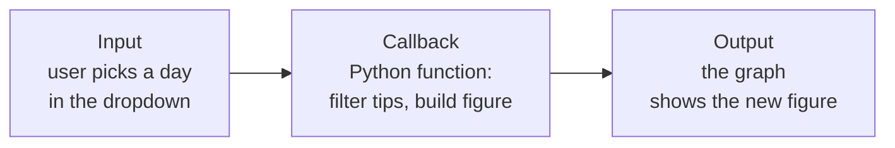
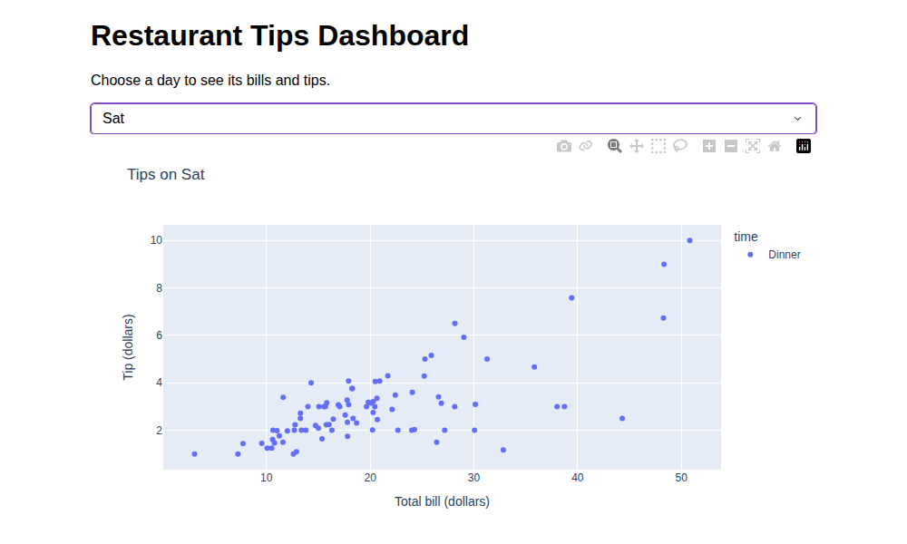

# Unit X: Data Visualization and Reporting

**Teaching time:** 4 hours

!!! abstract "Learning Objectives"

    Build advanced visualizations and dashboards; present data insights effectively.

    In plain words, by the end of this unit you can:

    - draw a heatmap and a pair plot to see many relationships at once,
    - make an interactive plot that you can hover over, zoom and pan,
    - build a small dashboard with Plotly Dash that reacts when the user picks an option,
    - present a chart so that the reader understands your message in a few seconds.

## 10.1 Advanced Visualization: Heatmaps, Pair Plots, Interactive Plots

In [Unit VIII](unit-08-eda.md) you drew one chart for one question. This unit builds on it. A **heatmap** and a **pair plot** show many relationships in one picture. An **interactive plot** lets the reader explore the picture. All three use libraries you already know: Seaborn, Matplotlib and Pandas, plus one new library, Plotly.

### Heatmaps

A **heatmap** is a grid of cells. The colour of each cell shows a number. You do not read the numbers one by one. You look for the dark and the bright cells.

Seaborn draws one with `sns.heatmap()`. The most common use is a **correlation heatmap**. In Unit VIII you printed a table of correlations. Here we give the same table to `sns.heatmap()`. The option `annot=True` writes each number inside its cell. `fmt=".2f"` keeps two decimal places. `vmin=-1` and `vmax=1` fix the colour scale from -1 to +1, so that the same colour always means the same correlation.

<!-- figure: u10-heatmap-corr -->
```python
import pandas as pd
import seaborn as sns
import matplotlib.pyplot as plt

study = pd.read_csv("study_marks.csv")
corr = study[["hours_studied", "attendance", "marks"]].corr()

sns.heatmap(corr, annot=True, fmt=".2f", cmap="coolwarm", vmin=-1, vmax=1)
plt.title("Correlation Between Study Columns")
plt.show()
```


How to read the colours. The scale bar on the right is the key.

- **Red** means a positive correlation. The more intense the red, the stronger it is.
- **Blue** means a negative correlation.
- The **middle colour** means almost no link. It is pale on the light page and dark grey on the dark page.
- The diagonal is always 1.00, because every column matches itself perfectly. The table is a mirror image across the diagonal, so you only need to read one half.

In this picture only one off-diagonal cell stands out: hours studied and marks (0.94). Attendance has hardly any link with the others.

A heatmap also works for ordinary numbers, not only correlations. Here we show the shop's sales in rupees for each category on each weekday. First we need the data in the right shape. A **pivot table** rearranges a long table into a grid: one value for the rows, one for the columns and a statistic (here `sum`) in each cell. For a table of plain amounts we use `cmap="Blues"`, a scale with one colour in many strengths.

<!-- figure: u10-heatmap-sales -->
```python
import pandas as pd
import seaborn as sns
import matplotlib.pyplot as plt

shop = pd.read_csv("shop_sales.csv")
shop["sales"] = shop["quantity"] * shop["price"]
shop["weekday"] = pd.to_datetime(shop["date"]).dt.day_name().str[:3]

table = shop.pivot_table(
    index="category", columns="weekday", values="sales",
    aggfunc="sum", fill_value=0,
)
table = table[["Mon", "Tue", "Wed", "Thu", "Fri", "Sat", "Sun"]]

sns.heatmap(table, annot=True, fmt="d", cmap="Blues")
plt.title("Sales by Category and Weekday (Rs.)")
plt.xlabel("Weekday")
plt.ylabel("Category")
plt.yticks(rotation=0)
plt.show()
```


The numbers are three weeks of sales added together. On the light page, the darker the blue, the bigger the number. On the dark page the scale is turned around: the brighter the blue, the bigger the number. Each page has its colour bar to tell you. The Grocery row has the strongest colours: grocery brings in the most money on every weekday, and the single biggest cell is Grocery on Thursday (Rs. 4400). A `0` means that the category sold nothing on that weekday. The strongest cells tell the shop owner where to look first.

!!! ask "Ask the Class"

    In a correlation heatmap, what colour would you expect for the cell "temperature against sales of woollen caps"? Why?

!!! warning "Common Mistake"

    Reading a heatmap without checking its colour scale. In one chart dark may mean "big"; in another chart red may mean "negative". Always read the colour bar first. For correlations, set `vmin=-1` and `vmax=1`, so that pale really means zero.

### Pair Plots

A **pair plot** draws a scatter plot for every pair of number columns, all in one grid. It is like ten Unit VIII scatter plots on one page. The panels on the diagonal cannot be scatter plots (a column against itself is just a straight line), so they show how that one column is spread out, as a smooth curve for each species.

We use the **iris dataset**, which ships with scikit-learn. It has 150 flowers from three **species**: setosa, versicolor and virginica. For each flower, four measurements were taken in centimetres: the length and width of the sepal and of the petal. The petal is the coloured part of the flower. The sepal is the small green leaf under it. `hue="species"` colours the dots by species, so we can see whether the three groups can be told apart.

<!-- figure: u10-pairplot-iris -->
```python
import seaborn as sns
import matplotlib.pyplot as plt
from sklearn.datasets import load_iris

iris = load_iris(as_frame=True)
flowers = iris.frame.rename(columns=lambda name: name.replace(" (cm)", ""))
flowers["species"] = iris.target_names[iris.target]
flowers = flowers.drop(columns="target")

g = sns.pairplot(flowers, hue="species", height=2.4)
g.figure.suptitle("Iris Flowers: Every Pair of Measurements", y=1.02)
plt.show()
```


How to read it. Each panel is a scatter plot. The column name on the left is the y-axis of that row. The column name at the bottom is the x-axis of that column. The panels along the diagonal show how each measurement is spread within each species.

Look at the petal length and the petal width panels. The setosa flowers sit in their own corner, far from the others. So a flower with a tiny petal is almost certainly a setosa. Versicolor and virginica overlap a little, so they are harder to tell apart. One picture has told us which measurements separate the groups. This is a very useful first look before a machine learning model in [Unit IX](unit-09-ml.md).

!!! ask "Ask the Class"

    A pair plot of a table with 8 number columns has how many panels? Would you still be able to read it on one page?

### Interactive Plots

A chart from Matplotlib or Seaborn is a still picture. An **interactive plot** responds to the mouse. You can **hover** over a point to see its values, **zoom** into a region by dragging a box around it, **pan** to slide the view, and click a legend item to hide or show a group. For a table with hundreds of points, this is much easier than squinting at a still image.

**Plotly** is a Python library for interactive charts. **Plotly Express** (imported as `px`) is its short interface: one function call builds a whole chart from a DataFrame, in the same style as Seaborn. The call gives you a `fig` object, and `fig.show()` displays it.

<!-- plotly: u10-scatter -->
```python
import pandas as pd
import plotly.express as px

tips = pd.read_csv("tips.csv")
fig = px.scatter(
    tips, x="total_bill", y="tip", color="time",
    hover_data=["day", "size"],
    title="Tip Against Bill, by Meal Time",
    labels={"total_bill": "Total bill (dollars)", "tip": "Tip (dollars)"},
)
fig.show()
```

<div class="ds-only-light"><iframe class="ds-plotly" src="../assets/plotly/u10-scatter.html" title="Interactive scatter plot of tips against total bill, coloured by lunch or dinner" loading="lazy"></iframe></div>
<div class="ds-only-dark"><iframe class="ds-plotly" src="../assets/plotly/u10-scatter-dark.html" title="Interactive scatter plot of tips against total bill, coloured by lunch or dinner" loading="lazy"></iframe></div>

Try it above. Move the mouse over a dot: a box shows its bill, tip, day and party size, because we asked for `hover_data`. Drag a rectangle to zoom in. Double-click the chart to zoom out. Click "Lunch" in the legend to hide or show the lunch dots. The icons at the top right of the chart let you pan, zoom and save a picture.

The same idea works for a bar chart. Plotly Express keeps one rule: the function name tells the chart type (`px.scatter`, `px.bar`, `px.line`, `px.histogram`), and `x=`, `y=`, `color=` name the columns.

<!-- plotly: u10-bar -->
```python
import pandas as pd
import plotly.express as px

tips = pd.read_csv("tips.csv")
average = tips.groupby("day", as_index=False)["tip"].mean()
fig = px.bar(
    average, x="day", y="tip",
    category_orders={"day": ["Thur", "Fri", "Sat", "Sun"]},
    title="Average Tip by Day",
    labels={"day": "Day of the week", "tip": "Average tip (dollars)"},
)
fig.show()
```

<div class="ds-only-light"><iframe class="ds-plotly" src="../assets/plotly/u10-bar.html" title="Interactive bar chart of the average tip on each day" loading="lazy"></iframe></div>
<div class="ds-only-dark"><iframe class="ds-plotly" src="../assets/plotly/u10-bar-dark.html" title="Interactive bar chart of the average tip on each day" loading="lazy"></iframe></div>

Hover over a bar to read its exact value. For a line chart over time, such as the daily data use of `mobile_data.csv`, you would write `px.line(mobile, x="day", y="mb_used")`.

Where does the plot appear when you run this code yourself?

| Where you run it | What `fig.show()` does |
|---|---|
| Jupyter Notebook or Google Colab | The plot appears right under the cell, and it stays interactive. |
| A Python script (`python myplot.py`) | Plotly opens your web browser and shows the plot in a new tab. The plot is a web page. |

If you want to send the chart to someone, `fig.write_html("chart.html")` saves it as a web page that works in any browser, with no Python needed.

!!! warning "Common Mistake"

    Calling `fig.show()` and expecting the plot to appear in the terminal. A plot cannot be drawn in a text window. In a script, look for the new browser tab. If a plot is meant for a printed report, use Matplotlib or Seaborn instead, because an interactive plot is not interactive on paper.

## 10.2 Creating Dashboards with Plotly Dash

### What Is a Dashboard

A **dashboard** is one web page that shows charts and controls together, so that people can explore the data without writing any code. A shop owner opens a sales dashboard each morning, picks a branch from a menu and sees that branch's numbers at once. Compared with a chart you save once, a dashboard is alive: the numbers change when the user chooses something.

**Plotly Dash** (we just say **Dash**) is a Python library for building dashboards. You write only Python. Dash builds the web page for you. (The syllabus says "Plotly Dash or Streamlit". Streamlit is another Python tool for the same job; this course uses Dash.)

### The Two Parts of a Dash App

Every Dash app has exactly two parts.

1. The **layout** is what you see. It lists the page's parts from top to bottom: a heading, a dropdown menu, a graph.
2. The **callback** is what happens when you click. It is a normal Python function. Dash calls it whenever something the user can change (the **input**) changes, and it passes the function's answer to a part of the page that should update (the **output**).



Every part of the layout that a callback talks to needs a name tag, called its **id**. The callback connects the parts by these ids. Two more words: **`html`** parts (`html.H1`, `html.P`, `html.Div`) are ordinary page elements such as a heading, a paragraph or a box. **`dcc`** parts (Dash Core Components, such as `dcc.Dropdown` and `dcc.Graph`) are the interactive ones.

### Checking the Installation

Dash is installed with `pip install dash`. This command also installs Plotly. Check that it is there and see its version. Your version number may differ from the one below.

```python
import dash
import plotly

print("Dash version:", dash.__version__)
print("Plotly version:", plotly.__version__)
```

```{ .text .output title="Output" }
Dash version: 4.4.1
Plotly version: 7.1.0
```

### A Complete Small App

Here is a full dashboard in 42 lines. It shows `tips.csv` with a dropdown for the day of the week. When you choose a day, the graph shows only that day's bills and tips. Save it as `app.py` in the same folder as `tips.csv`.

<!-- serve: 8; script: app.py -->
```python
import pandas as pd
import plotly.express as px
from dash import Dash, dcc, html, Input, Output, callback

tips = pd.read_csv("tips.csv")

app = Dash(__name__)

# The layout: what you see
app.layout = html.Div(
    [
        html.H1("Restaurant Tips Dashboard"),
        html.P("Choose a day to see its bills and tips."),
        dcc.Dropdown(
            id="day-dropdown",
            options=["Thur", "Fri", "Sat", "Sun"],
            value="Sun",
            clearable=False,
        ),
        dcc.Graph(id="tips-graph"),
    ],
    style={"fontFamily": "sans-serif", "maxWidth": "800px", "margin": "auto"},
)


# The callback: what happens when the user picks a day
@callback(
    Output("tips-graph", "figure"),
    Input("day-dropdown", "value"),
)
def update_graph(chosen_day):
    one_day = tips[tips["day"] == chosen_day]
    fig = px.scatter(
        one_day, x="total_bill", y="tip", color="time",
        title=f"Tips on {chosen_day}",
        labels={"total_bill": "Total bill (dollars)", "tip": "Tip (dollars)"},
    )
    return fig


if __name__ == "__main__":
    app.run(port=8061, debug=True)
```

```{ .text .output title="Output" }
Dash is running on http://127.0.0.1:8061/

 * Serving Flask app 'app'
 * Debug mode: on
```

Walk through it from top to bottom.

- `tips = pd.read_csv("tips.csv")` loads the data once, when the app starts.
- `app = Dash(__name__)` creates the app.
- `app.layout = html.Div([...], style=...)` is the layout. A `Div` is a box. The list inside holds its parts in order, and `style` sets a plain font and a fixed width for the page. The dropdown has `id="day-dropdown"`, the four choices in `options`, and a starting choice in `value`. The graph has `id="tips-graph"` and starts empty.
- `@callback(Output(...), Input(...))` is the callback. Read it as: "When the `value` of `day-dropdown` changes, run the function below, and put what it returns into the `figure` of `tips-graph`."
- `update_graph(chosen_day)` receives the chosen day as its argument. It keeps only that day's rows, builds a Plotly Express figure, and returns it.
- The last two lines start the app. `port=8061` is the number of the "door" on your computer that the app listens at. `debug=True` shows error messages in the browser and restarts the app each time you save the file.

The output above is what Dash prints when it starts. The app is now a small web server that runs on your own computer. `127.0.0.1` is the address that means "this computer". To use it:

1. Open a terminal in the folder that holds `app.py` and `tips.csv`.
2. Type `python app.py` and press Enter. The lines above appear.
3. Open a web browser and go to `http://127.0.0.1:8061/`.
4. Choose a day in the dropdown. The graph changes.
5. Go back to the terminal and press `Ctrl+C` to stop the app.



*A screenshot of the running app in a browser, taken after choosing "Sat". It is one picture for both light and dark pages, because the dashboard has its own light design.*

!!! ask "Ask the Class"

    In this app, which part is the input, which part is the callback and which part is the output? What would happen if you added a second dropdown for `time` to the layout but did not change the callback?

!!! warning "Common Mistake"

    Following an old tutorial and calling `app.run_server()`. Older Dash versions used this name. Current versions removed it, so the program stops at once with an error. Use `app.run()`.

    <!-- error; script: app.py -->
    ```python
    from dash import Dash, html

    app = Dash(__name__)
    app.layout = html.Div("Hello")

    if __name__ == "__main__":
        app.run_server(port=8062, debug=True)
    ```

    ```{ .text .output title="Output" }
    Traceback (most recent call last):
      File "app.py", line 7, in <module>
        app.run_server(port=8062, debug=True)
        ^^^^^^^^^^^^^^
    dash.exceptions.ObsoleteAttributeException: app.run_server has been replaced by app.run
    ```

!!! warning "Common Mistake"

    A typo in an `id`. The `id` in the layout and the `id` in the callback must be spelled the same. Suppose the callback says `Input("day-dropdwon", "value")` but the layout says `id="day-dropdown"`. Python does not complain and the server starts. But in the browser the graph stays empty. With `debug=True`, an **Errors** panel opens at the bottom right of the page, and its message names the id that it could not find. We copied this message from a real run:

    ```text title="Message in the browser (copied from a real run)"
    ID not found in layout
    Attempting to connect a callback Input item to component:
      "day-dropdwon"
    but no components with that id exist in the layout.
    ```

    When a callback does nothing, check the spelling of every `id` first.

## Presenting Data Insights Effectively

A chart is a message. If the reader needs a minute to work out what it says, the chart has failed. Five plain rules help.

1. **One message per chart.** Decide what the reader should remember, and show only that.
2. **Write the finding in the title.** "Weekend Bills Are Larger Than Weekday Bills" tells the reader what to see. "Total bill by day" does not.
3. **Label the axes and give the units.** Say what is measured and in what unit (dollars, Rs., MB, marks).
4. **Choose the chart for the question.** Use the table in [section 8.2](unit-08-eda.md#choosing-the-right-chart) and do not use a decoration instead.
5. **Keep colours meaningful.** Use colour only when it carries information, such as `hue="time"`. Keep the same colour for the same thing in every chart, and never colour bars at random.

Here is the same data drawn twice. First, a chart that ignores the rules. The days appear in alphabetical order, nothing is labelled, and the reader cannot tell what the bars are.

<!-- figure: u10-present-before -->
```python
import pandas as pd
import matplotlib.pyplot as plt

tips = pd.read_csv("tips.csv")
average = tips.groupby("day")["total_bill"].mean()
plt.bar(average.index, average.values)
plt.show()
```


Now the same numbers, after applying the rules. The days run in week order, the title states the finding, the axes have names and units, and each bar carries its value, so nobody has to guess it from the grid.

<!-- figure: u10-present-after -->
```python
import pandas as pd
import matplotlib.pyplot as plt

tips = pd.read_csv("tips.csv")
order = ["Thur", "Fri", "Sat", "Sun"]
average = tips.groupby("day")["total_bill"].mean().reindex(order)

bars = plt.bar(average.index, average.values)
plt.bar_label(bars, fmt="%.1f")
plt.title("Weekend Bills Are Larger Than Weekday Bills")
plt.xlabel("Day of the week")
plt.ylabel("Average bill (dollars)")
plt.show()
```


The data did not change. Only the care taken changed. In a dashboard, the same rules apply to every graph on the page.

## Quick Recap

- A heatmap colours a grid of numbers. A correlation heatmap uses `sns.heatmap(corr, annot=True, cmap="coolwarm")`. Always read the colour bar.
- A pair plot (`sns.pairplot(df, hue="species")`) draws a scatter plot for every pair of columns, and shows which measurements separate the groups.
- An interactive plot lets the reader hover, zoom and pan. Plotly Express builds one in a single call (`px.scatter`, `px.bar`, `px.line`) and `fig.show()` displays it.
- A Dash app has a layout (what you see) and callbacks (what happens on a click). A callback connects an `Input` to an `Output` by their `id`s.
- Run a Dash app with `python app.py` and open `http://127.0.0.1:8061/` in a browser. Stop it with `Ctrl+C`.
- Present clearly: one message per chart, a title that states the finding, labelled axes with units, the right chart type and meaningful colours.

## Try It Yourself

**1.** Draw a correlation heatmap for the `total_bill`, `tip` and `size` columns of `tips.csv`. Use `annot=True`, `cmap="coolwarm"` and a title. Which pair has the strongest correlation?

??? success "Answer"

    <!-- figure: u10-try-heatmap -->
    ```python
    import pandas as pd
    import seaborn as sns
    import matplotlib.pyplot as plt

    tips = pd.read_csv("tips.csv")
    corr = tips[["total_bill", "tip", "size"]].corr()
    sns.heatmap(corr, annot=True, fmt=".2f", cmap="coolwarm", vmin=-1, vmax=1)
    plt.title("Correlation in the Tips Table")
    plt.show()
    ```

    
    

    Total bill and tip have the strongest correlation, 0.68. Party size and total bill follow at 0.60.

**2.** Which chart is the best choice for each task: a heatmap, a pair plot or an interactive Plotly chart? (a) Compare every pair of the four iris measurements. (b) Let a manager hover over a point to read its exact bill. (c) Show sales for 5 categories across 7 weekdays in one grid.

??? success "Answer"

    (a) A pair plot, because it draws every pair of columns in one grid. (b) An interactive Plotly chart, because only it shows the values on hover. (c) A heatmap of a pivot table, because the grid has one cell for each category and weekday.

**3.** The title of a chart is "Bill by day". Rewrite it as a title that states a finding about the average bills (see the "Presenting" chart above).

??? success "Answer"

    "Weekend Bills Are Larger Than Weekday Bills". The title now gives the message, not only the topic. Any title that names the finding, such as "Sunday Has the Highest Average Bill", is a good answer.

**4.** Change the dashboard so that the dropdown lets the user choose the meal time (`Lunch` or `Dinner`), not the day. Write the complete `app.py`.

??? success "Answer"

    Three things change: the dropdown id and options, the column used to filter the rows, and the title. Every id in the callback must match the layout.

    <!-- serve: 8; script: app.py -->
    ```python
    import pandas as pd
    import plotly.express as px
    from dash import Dash, dcc, html, Input, Output, callback

    tips = pd.read_csv("tips.csv")

    app = Dash(__name__)

    app.layout = html.Div([
        html.H1("Restaurant Tips by Meal Time"),
        dcc.Dropdown(
            id="time-dropdown",
            options=["Lunch", "Dinner"],
            value="Dinner",
            clearable=False,
        ),
        dcc.Graph(id="tips-graph"),
    ])


    @callback(
        Output("tips-graph", "figure"),
        Input("time-dropdown", "value"),
    )
    def update_graph(chosen_time):
        one_meal = tips[tips["time"] == chosen_time]
        return px.scatter(
            one_meal, x="total_bill", y="tip", color="day",
            title=f"Tips at {chosen_time}",
        )


    if __name__ == "__main__":
        app.run(port=8063, debug=True)
    ```

    ```{ .text .output title="Output" }
    Dash is running on http://127.0.0.1:8063/

     * Serving Flask app 'app'
     * Debug mode: on
    ```

## Exam Questions for This Unit

Past-paper and practice questions for this unit are collected in [Unit X: Data Visualization and Reporting](exam/unit-10.md).
