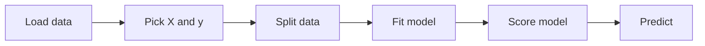
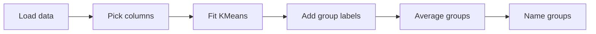
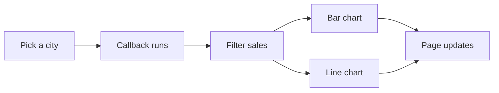
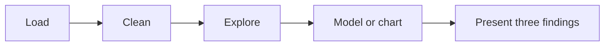

# Unit XI: Practical Lab Work

**Teaching time:** 6 hours

!!! abstract "Learning Objectives"

    Apply Python skills to real-world datasets; build small data-driven projects.

    In plain words, by the end of this unit you can:

    - solve small programming problems with loops, conditions, functions, data structures and files,
    - clean a messy dataset and prepare it for analysis,
    - explore a dataset with statistics and one chart, and answer questions from it,
    - build and score a regression model and a clustering model,
    - build a small dashboard and finish a mini project on your own.

This unit is a lab, not a lecture. There is very little new theory. You already met every tool in Units I to X, and the ten [Lab Sheets](practicals.md) gave you step-by-step practice. Here you get **challenges**: a short brief, and you decide how to solve it. Work in class for the six hours, in this order.

| Section | Time |
|---|---|
| Python Programming Exercises | about 60 minutes |
| Data Cleaning and Preprocessing | about 45 minutes |
| Exploratory Analysis | about 45 minutes |
| Basic ML Projects | about 75 minutes |
| Dashboard Creation | about 60 minutes |
| Mini Project: Putting It All Together | about 75 minutes |

!!! tip "How to Work Through a Challenge"

    1. Read the task. Try it alone for five to ten minutes.
    2. Stuck? Open the **Hint**. It gives a nudge, not the answer.
    3. Still stuck? Open the **Solution**. Read it, close it, and then type the program yourself from memory.

    The data files are listed in [Practice Data Files](setup.md#practice-data-files). Save them in your working folder, so that `pd.read_csv("students.csv")` works.

## Python Programming Exercises

**Time:** about 60 minutes. Five challenges, from easy to hard. They use loops, conditions, functions, data structures and file handling.

### Challenge 1: Data Use Alert (Easy)

**Task.** A phone's daily data use in MB is `[850, 920, 1500, -1, 780, 3100, 640]`. A value of `-1` means the phone was off that day. Go through the days in order.

- Skip the days with `-1`.
- Print `Normal` for 1000 MB or less, and `High` for more than 1000 MB.
- If a day uses more than 3000 MB, print `ALERT` and stop the loop.

??? tip "Hint"

    Use a counter for the day number. Add 1 to it at the top of the loop, before `continue`. Otherwise the skipped day is not counted.

??? success "Solution"

    ```python
    data = [850, 920, 1500, -1, 780, 3100, 640]
    day = 0
    for mb in data:
        day = day + 1
        if mb == -1:
            continue
        if mb > 3000:
            print("Day", day, "ALERT:", mb, "MB")
            break
        if mb > 1000:
            print("Day", day, "High:", mb, "MB")
        else:
            print("Day", day, "Normal:", mb, "MB")
    ```

    ```{ .text .output title="Output" }
    Day 1 Normal: 850 MB
    Day 2 Normal: 920 MB
    Day 3 High: 1500 MB
    Day 5 Normal: 780 MB
    Day 6 ALERT: 3100 MB
    ```

!!! ask "Question"

    Day 7 has 640 MB, but the program never printed it. Why?

### Challenge 2: Marks Summary (Easy to Medium)

**Task.** Write a function `summary(marks, pass_mark=45)`. It returns four values: the lowest mark, the highest mark, the average, and how many marks are at or above `pass_mark`. Call it for the marks `[78, 64, 92, 45, 88, 56, 73, 81, 39, 67]`, once with the default pass mark and once with a pass mark of 60.

??? tip "Hint"

    A function can return several values separated by commas: `return a, b, c`. The caller catches them with `low, high = summary(...)`. Use `min()`, `max()`, `sum()` and `len()`.

??? success "Solution"

    ```python
    def summary(marks, pass_mark=45):
        passed = 0
        for m in marks:
            if m >= pass_mark:
                passed = passed + 1
        return min(marks), max(marks), sum(marks) / len(marks), passed


    marks = [78, 64, 92, 45, 88, 56, 73, 81, 39, 67]

    low, high, avg, passed = summary(marks)
    print("Lowest:", low, "Highest:", high)
    print("Average:", avg, "Passed:", passed)

    low, high, avg, passed = summary(marks, 60)
    print("With pass mark 60, passed:", passed)
    ```

    ```{ .text .output title="Output" }
    Lowest: 39 Highest: 92
    Average: 68.3 Passed: 9
    With pass mark 60, passed: 7
    ```

### Challenge 3: Best-Selling Item (Medium)

**Task.** A shop wrote down every item sold today: `["Tea", "Pen", "Tea", "Rice", "Tea", "Pen", "Soap", "Rice", "Tea"]`. Build a dictionary that counts how many times each item was sold. Print the counts, then the best-selling item, then the items that sold only once.

??? tip "Hint"

    For each item, add 1 to its count. `counts.get(item, 0)` gives the current count, or 0 if the item is new. `max(counts, key=counts.get)` finds the key with the biggest value.

??? success "Solution"

    ```python
    sold = ["Tea", "Pen", "Tea", "Rice", "Tea",
            "Pen", "Soap", "Rice", "Tea"]

    counts = {}
    for item in sold:
        counts[item] = counts.get(item, 0) + 1
    print(counts)

    print("Best seller:", max(counts, key=counts.get))

    once = []
    for item in counts:
        if counts[item] == 1:
            once.append(item)
    print("Sold only once:", once)
    ```

    ```{ .text .output title="Output" }
    {'Tea': 4, 'Pen': 2, 'Rice': 2, 'Soap': 1}
    Best seller: Tea
    Sold only once: ['Soap']
    ```

### Challenge 4: Average Report File (Medium)

**Task.** Read `students.csv`. For each student, work out the average of `math`, `science` and `english`, rounded to 1 place. Write a new file `report.csv` with the columns `name`, `average` and `result` (`Pass` if the average is 45 or more, else `Fail`). Read `report.csv` back and print it. If `students.csv` is missing, print a message instead of crashing.

!!! warning "Common Mistake"

    A CSV file gives every value as text. Adding two text values joins them instead of adding them.

    ```python
    row = {"math": "78", "science": "85"}   # what the csv module gives you
    print(row["math"] + row["science"])
    ```

    ```{ .text .output title="Output" }
    7885
    ```

    Convert with `int(row["math"])` before you do any sums.

??? tip "Hint"

    Use `csv.DictReader` to read and `csv.writer` to write. Put the reading inside `try` and catch `FileNotFoundError`. Open the output file with `"w"` and `newline=""`.

??? success "Solution"

    ```python
    import csv

    try:
        with open("students.csv", newline="") as f:
            students = list(csv.DictReader(f))
    except FileNotFoundError:
        print("students.csv was not found")
        students = []

    with open("report.csv", "w", newline="") as f:
        writer = csv.writer(f)
        writer.writerow(["name", "average", "result"])
        for s in students:
            total = int(s["math"]) + int(s["science"]) + int(s["english"])
            average = round(total / 3, 1)
            if average >= 45:
                result = "Pass"
            else:
                result = "Fail"
            writer.writerow([s["name"], average, result])

    with open("report.csv") as f:
        for line in f:
            print(line.strip())
    ```

    ```{ .text .output title="Output" }
    name,average,result
    Asha,78.3,Pass
    Bikash,64.0,Pass
    Chandra,87.0,Pass
    Dipesh,48.3,Pass
    Elina,91.3,Pass
    Gita,61.0,Pass
    Hari,73.0,Pass
    Isha,81.3,Pass
    Jiwan,44.3,Fail
    Kiran,67.3,Pass
    ```

### Challenge 5: Class Ranking (Hard)

**Task.** Load `students.json`, a list of records. Write a function `total(student)` that adds the three subject marks. Sort the students from the highest total to the lowest. Print the top three as `Rank 1: Name (total)`. Save the top three to `top3.json`.

??? tip "Hint"

    `sorted(students, key=total, reverse=True)` sorts the list by whatever `total` returns for each student. Slice the first three with `ranked[:3]`. Build a new list of small dictionaries for the JSON file.

??? success "Solution"

    ```python
    import json

    with open("students.json") as f:
        students = json.load(f)


    def total(student):
        return student["math"] + student["science"] + student["english"]


    ranked = sorted(students, key=total, reverse=True)

    top3 = []
    rank = 0
    for s in ranked[:3]:
        rank = rank + 1
        print(f"Rank {rank}: {s['name']} ({total(s)})")
        top3.append({"rank": rank, "name": s["name"], "total": total(s)})

    with open("top3.json", "w") as f:
        json.dump(top3, f, indent=2)
    print("Saved top3.json with", len(top3), "records")
    ```

    ```{ .text .output title="Output" }
    Rank 1: Elina (274)
    Rank 2: Chandra (261)
    Rank 3: Isha (244)
    Saved top3.json with 3 records
    ```

## Data Cleaning and Preprocessing

**Time:** about 45 minutes. Two challenges. Real data is messy, so cleaning comes before any analysis.

### Challenge 6: Clean the Class Register

**Task.** Load `students_raw.csv`. Make it clean with these steps, then save it as `students_clean.csv`.

1. Drop duplicate rows.
2. Fill the missing `science` and `english` marks with the median of the column.
3. Find outliers in `math` with the **IQR rule** and replace them with the median. The rule says a value is an outlier when it is above `Q3 + 1.5 x IQR`. Here `Q1` and `Q3` are the 25% and 75% points of the column, and `IQR` is `Q3 - Q1`.
4. Make `gender` upper case, change `attendance` (such as `92%`) into a whole number, and change `joined` into a date.
5. Print the shape, the number of missing values and duplicates, and the highest `math` mark, to prove the table is clean.

!!! warning "Common Mistake"

    Changing `attendance` to a number without removing the `%` sign first. The text `92%` is not a number.

    <!-- error -->
    ```python
    print(int("92%"))
    ```

    ```{ .text .output title="Output" }
    Traceback (most recent call last):
      File "example.py", line 1, in <module>
        print(int("92%"))
              ^^^^^^^^^^
    ValueError: invalid literal for int() with base 10: '92%'
    ```

??? tip "Hint"

    `df["math"].where(condition, other)` keeps the values where the condition is true and uses `other` where it is false. `df["attendance"].str.replace("%", "")` removes the sign.

??? success "Solution"

    ```python
    import pandas as pd

    df = pd.read_csv("students_raw.csv")
    df = df.drop_duplicates()

    for col in ["science", "english"]:
        df[col] = df[col].fillna(df[col].median())

    q1 = df["math"].quantile(0.25)
    q3 = df["math"].quantile(0.75)
    upper = q3 + 1.5 * (q3 - q1)
    df["math"] = df["math"].where(df["math"] <= upper, df["math"].median())

    df["gender"] = df["gender"].str.upper()
    df["attendance"] = df["attendance"].str.replace("%", "").astype(int)
    df["joined"] = pd.to_datetime(df["joined"])

    df.to_csv("students_clean.csv", index=False)
    print("Shape:", df.shape)
    print("Missing values:", df.isna().sum().sum())
    print("Duplicate rows:", df.duplicated().sum())
    print("Highest math mark:", df["math"].max())
    print(sorted(df["gender"].unique()))
    ```

    ```{ .text .output title="Output" }
    Shape: (10, 8)
    Missing values: 0
    Duplicate rows: 0
    Highest math mark: 92
    ['F', 'M']
    ```

!!! ask "Question"

    The mark 880 is clearly a typing mistake. What would happen to the class average of maths if we left it in?

### Challenge 7: Prepare the Sales Data

**Task.** Load `shop_sales.csv`. First check for missing values and duplicates. Then change `date` into a real date, add a `total` column (`quantity` times `price`) and a `weekday` column with the day name. Print the first three rows of `date`, `item`, `total` and `weekday`. Print the total sales of each city. Print the weekday with the highest total sales.

??? tip "Hint"

    `pd.to_datetime(...)` makes dates. After that, `df["date"].dt.day_name()` gives names such as `Friday`. `groupby("city")["total"].sum()` adds up each city. `idxmax()` gives the label of the biggest value.

??? success "Solution"

    ```python
    import pandas as pd

    sales = pd.read_csv("shop_sales.csv")
    print("Missing:", sales.isna().sum().sum())
    print("Duplicates:", sales.duplicated().sum())

    sales["date"] = pd.to_datetime(sales["date"])
    sales["total"] = sales["quantity"] * sales["price"]
    sales["weekday"] = sales["date"].dt.day_name()

    print(sales[["date", "item", "total", "weekday"]].head(3))
    print(sales.groupby("city")["total"].sum())
    by_day = sales.groupby("weekday")["total"].sum()
    print("Busiest weekday:", by_day.idxmax())
    ```

    ```{ .text .output title="Output" }
    Missing: 0
    Duplicates: 0
            date      item  total   weekday
    0 2024-03-01  Notebook    360    Friday
    1 2024-03-01       Tea    450    Friday
    2 2024-03-02   Lentils    570  Saturday
    city
    Butwal       3340
    Kathmandu    8265
    Pokhara      8315
    Name: total, dtype: int64
    Busiest weekday: Thursday
    ```

## Exploratory Analysis

**Time:** about 45 minutes. A guided analysis of `cricket.csv`: 12 made-up batters with their matches, runs, balls faced, fours and sixes. **Exploratory analysis** means looking at data with numbers and charts to find out what is in it, before you build any model.

Start by looking at the table. Always do this first.

```python
import pandas as pd

df = pd.read_csv("cricket.csv")
print("Rows and columns:", df.shape)
print("Missing values:", df.isna().sum().sum())
print(df.head(3))
```

```{ .text .output title="Output" }
Rows and columns: (12, 7)
Missing values: 0
   player       role  matches  runs  balls_faced  fours  sixes
0    Anil     Opener       15   547          465     56     19
1   Bibek     Opener       19   506          475     47     18
2  Chiran  Top order       10   306          260     32      7
```

Answer the four questions below. Use the statistics tools from [Unit VIII](unit-08-eda.md). Each answer is hidden until you open it.

**Question 1.** Who scored the most runs? What is the average number of runs for the 12 players?

??? success "Answer"

    ```python
    import pandas as pd

    df = pd.read_csv("cricket.csv")
    best = df.loc[df["runs"].idxmax()]
    print("Most runs:", best["player"], "with", best["runs"])
    print("Average runs:", round(df["runs"].mean(), 1))
    ```

    ```{ .text .output title="Output" }
    Most runs: Kamal with 793
    Average runs: 453.8
    ```

**Question 2.** The **strike rate** is runs divided by balls faced, times 100. Who has the highest strike rate, and who has the lowest?

??? success "Answer"

    ```python
    import pandas as pd

    df = pd.read_csv("cricket.csv")
    df["strike_rate"] = (df["runs"] / df["balls_faced"] * 100).round(1)
    top = df.loc[df["strike_rate"].idxmax()]
    low = df.loc[df["strike_rate"].idxmin()]
    print("Highest:", top["player"], top["strike_rate"])
    print("Lowest:", low["player"], low["strike_rate"])
    ```

    ```{ .text .output title="Output" }
    Highest: Ishan 133.3
    Lowest: Gagan 94.5
    ```

**Question 3.** Which `role` has the highest average runs?

??? success "Answer"

    ```python
    import pandas as pd

    df = pd.read_csv("cricket.csv")
    by_role = df.groupby("role")["runs"].mean().round(1)
    print(by_role.sort_values(ascending=False))
    ```

    ```{ .text .output title="Output" }
    role
    Finisher       655.0
    Opener         526.5
    All-rounder    460.5
    Top order      376.0
    Middle         357.0
    Bowler         339.0
    Name: runs, dtype: float64
    ```

**Question 4.** Do batters who face more balls score more runs? Find the correlation and draw one scatter plot.

??? success "Answer"

    <!-- figure: u11-eda-cricket-balls-runs -->
    ```python
    import pandas as pd
    import matplotlib.pyplot as plt
    import seaborn as sns

    df = pd.read_csv("cricket.csv")
    print("Correlation:", round(df["balls_faced"].corr(df["runs"]), 2))

    sns.scatterplot(data=df, x="balls_faced", y="runs")
    plt.title("Batters Who Face More Balls Score More Runs")
    plt.xlabel("Balls faced")
    plt.ylabel("Runs")
    plt.show()
    ```

    ```{ .text .output title="Output" }
    Correlation: 0.95
    ```

    
    

!!! ask "Question"

    The correlation is close to 1. Does that prove that facing more balls causes more runs? Or could a third thing, such as batting order or skill, explain both?

## Basic ML Projects

**Time:** about 75 minutes. Two mini-projects, about 35 minutes each. In each one you follow the same plan. Load the data, split it, fit a model, score it, and use it. The tools are in [Unit IX](unit-09-ml.md).

### Project A: Predict Marks from Study Hours

**Brief.** A teacher wants to guess a student's marks from the hours the student studied. Use `study_marks.csv` (60 students). Build a regression model. Report how good it is with the R2 score on a test set. Then predict the marks for a student who studies 3 hours, 6 hours and 8 hours.



Your checklist:

- [ ] The input `X` is `hours_studied` and the target `y` is `marks`.
- [ ] You used `train_test_split` with `random_state=42`.
- [ ] You fitted the model on the training set only.
- [ ] You printed the score on the test set.
- [ ] You printed three predictions, and each one is a sensible number of marks.

??? success "Model Solution"

    ```python
    import pandas as pd
    from sklearn.linear_model import LinearRegression
    from sklearn.model_selection import train_test_split

    df = pd.read_csv("study_marks.csv")
    X = df[["hours_studied"]]
    y = df["marks"]

    X_train, X_test, y_train, y_test = train_test_split(
        X, y, test_size=0.25, random_state=42
    )
    model = LinearRegression().fit(X_train, y_train)

    print("R2 score on test set:", round(model.score(X_test, y_test), 2))
    print("Marks gained per extra hour:", round(model.coef_[0], 1))

    for hours in [3, 6, 8]:
        guess = model.predict(pd.DataFrame({"hours_studied": [hours]}))[0]
        print(hours, "hours ->", round(guess), "marks")
    ```

    ```{ .text .output title="Output" }
    R2 score on test set: 0.8
    Marks gained per extra hour: 6.6
    3 hours -> 38 marks
    6 hours -> 58 marks
    8 hours -> 71 marks
    ```

!!! ask "Question"

    The model predicts 58 marks for 6 hours. Will every student who studies 6 hours get exactly 58? What does the prediction really tell us?

### Project B: Group the Shop Customers

**Brief.** A shop owner has 90 customers and wants to treat them in groups, for example with offers. Nobody labelled the groups, so use clustering. Use `shop_customers.csv` (`monthly_visits` and `monthly_spend`, with spend in Rs. thousands). Find 3 groups with KMeans. Print the size of each group and the average visits and spend of each group.



Your checklist:

- [ ] You used only `monthly_visits` and `monthly_spend`. There is no target column.
- [ ] You used `KMeans(n_clusters=3, n_init=10, random_state=42)`.
- [ ] You added the labels as a new column called `group`.
- [ ] You printed the size and the average of each group.
- [ ] You wrote one plain sentence to describe each group.

??? success "Model Solution"

    ```python
    import pandas as pd
    from sklearn.cluster import KMeans

    df = pd.read_csv("shop_customers.csv")
    columns = ["monthly_visits", "monthly_spend"]

    model = KMeans(n_clusters=3, n_init=10, random_state=42)
    df["group"] = model.fit_predict(df[columns])

    print(df["group"].value_counts().sort_index())
    print(df.groupby("group")[columns].mean().round(1))
    ```

    ```{ .text .output title="Output" }
    group
    0    30
    1    30
    2    30
    Name: count, dtype: int64
           monthly_visits  monthly_spend
    group                               
    0                12.1            2.6
    1                 6.7            5.6
    2                 3.1            1.1
    ```

    The group numbers 0, 1 and 2 are only labels. Read the averages to name the groups. In this run, group 2 visits about 3 times and spends about Rs. 1.1 thousand: occasional shoppers. Group 0 visits about 12 times but spends only about Rs. 2.6 thousand: frequent small buyers. Group 1 visits about 7 times and spends about Rs. 5.6 thousand: the big spenders.

## Dashboard Creation

**Time:** about 60 minutes. One mini-project. The tools are in [Unit X](unit-10-visualization.md).

**Brief.** The shop owner wants a web page, not a table. Build a dashboard from `shop_sales.csv` with two charts and one dropdown. The dropdown chooses the city. When the city changes, both charts change.

- Chart 1: a bar chart of total sales for each item in the chosen city.
- Chart 2: a line chart of total sales for each date in the chosen city.



Your checklist:

- [ ] You added a `total` column (`quantity` times `price`) before building the app.
- [ ] The dropdown lists the three cities.
- [ ] One callback has one `Input` and two `Output` values.
- [ ] Both charts have a title that names the city.
- [ ] You opened the address in a browser and tested all three cities.

??? success "Model Solution"

    The notes start this app for a few seconds and show its real start-up message. On your computer, save it as `app.py`, run `python app.py`, and open `http://127.0.0.1:8072/` in your browser. The two charts appear on that page, not in the terminal. Press `Ctrl+C` to stop it.

    <!-- serve: 8; script: app.py -->
    ```python
    import pandas as pd
    import plotly.express as px
    from dash import Dash, dcc, html, Input, Output

    sales = pd.read_csv("shop_sales.csv")
    sales["total"] = sales["quantity"] * sales["price"]
    cities = sorted(sales["city"].unique())

    app = Dash(__name__)
    app.layout = html.Div([
        html.H1("Shop Sales Dashboard"),
        dcc.Dropdown(cities, "Pokhara", id="city"),
        dcc.Graph(id="by-item"),
        dcc.Graph(id="by-date"),
    ])


    @app.callback(
        Output("by-item", "figure"),
        Output("by-date", "figure"),
        Input("city", "value"),
    )
    def update(city):
        data = sales[sales["city"] == city]
        by_item = data.groupby("item", as_index=False)["total"].sum()
        by_date = data.groupby("date", as_index=False)["total"].sum()
        bar = px.bar(by_item, x="item", y="total",
                     title="Sales by Item in " + city)
        line = px.line(by_date, x="date", y="total",
                       title="Daily Sales in " + city)
        return bar, line


    if __name__ == "__main__":
        app.run(port=8072)
    ```

    ```{ .text .output title="Output" }
    Dash is running on http://127.0.0.1:8072/

     * Serving Flask app 'app'
     * Debug mode: off
    WARNING: This is a development server. Do not use it in a production deployment. Use a production WSGI server instead.
     * Running on http://127.0.0.1:8072
    Press CTRL+C to quit
    ```

## Mini Project: Putting It All Together

**Time:** about 75 minutes, working alone or in pairs.

**Brief.** Act as a junior data analyst. Choose one dataset, take it from the raw file to three findings, and present them to the class in about three minutes.

| Dataset | Ideas for a question |
|---|---|
| `cricket.csv` | Which role is the most valuable? Do sixes or fours give more runs? |
| `shop_sales.csv` | Which item or city earns the most? Is any weekday busier? |
| `tips.csv` | What makes a bigger tip: the bill, the day, or the group size? |



Here is a skeleton for `tips.csv`. It does the first three stages. Copy the shape (the five numbered comments), but use your own dataset and your own question.

```python
import pandas as pd

# 1. Load
df = pd.read_csv("tips.csv")
print("Rows and columns:", df.shape)

# 2. Clean
print("Missing values:", df.isna().sum().sum())
print("Duplicate rows:", df.duplicated().sum())
df = df.drop_duplicates()

# 3. Explore
df["tip_percent"] = (df["tip"] / df["total_bill"] * 100).round(1)
print(df.groupby("day")["tip_percent"].mean().round(1))

# 4. Model or chart: add your own code here

# 5. Findings: write three plain sentences here as comments
```

```{ .text .output title="Output" }
Rows and columns: (244, 7)
Missing values: 0
Duplicate rows: 1
day
Fri     17.0
Sat     15.3
Sun     16.7
Thur    16.1
Name: tip_percent, dtype: float64
```

A good finding is one plain sentence with a number in it. For example: "The average tip is between 15 and 17 percent of the bill on every day of the week." Write yours in the same way.

**What to hand in.** One script or notebook that runs from top to bottom, and three findings in plain sentences.

### Marking Checklist for the Instructor

The syllabus does not give an internal marking scheme for Unit XI, so the instructor decides the marks. This checklist only lists what to look for. Tick each row as Yes, Partly or No.

| Criterion | What to look for | Yes / Partly / No |
|---|---|---|
| Loads the data | Reads the file correctly and looks at its shape and first rows | |
| Cleans the data | Checks missing values and duplicates, and fixes types where needed | |
| Explores the data | Uses at least two statistics (such as a mean or a group average) | |
| Chart or model | One clear chart with title and labels, or one model with a printed score | |
| Three findings | Three plain sentences, each with a number from the data | |
| Code quality | Runs from top to bottom, sensible variable names, comments where needed | |
| Presentation | Explains in about three minutes what was done and found | |

## Quick Recap

- Start every analysis with `shape`, `head()` and a check for missing values and duplicates.
- Clean in a fixed order: duplicates, missing values, outliers, types.
- CSV values arrive as text, so convert them with `int()` or `float()` before sums.
- A model is scored on the test set, never on the training set.
- Clustering has no target column. You name the groups by reading their averages.
- A Dash dashboard is a script: a layout, a callback, and `app.run(port=...)`. The result appears in the browser.

## Try It Yourself

**1.** Use a `while` loop to print the squares of 1 to 5 (`1 x 1 = 1`, and so on).

??? success "Answer"

    ```python
    n = 1
    while n <= 5:
        print(n, "x", n, "=", n * n)
        n = n + 1
    ```

    ```{ .text .output title="Output" }
    1 x 1 = 1
    2 x 2 = 4
    3 x 3 = 9
    4 x 4 = 16
    5 x 5 = 25
    ```

**2.** In `mobile_data.csv`, find the days that used more than twice the average data. What does this tell you about the data?

??? success "Answer"

    ```python
    import pandas as pd

    df = pd.read_csv("mobile_data.csv")
    average = df["mb_used"].mean()
    print("Average:", round(average, 1))
    print(df[df["mb_used"] > 2 * average])
    ```

    ```{ .text .output title="Output" }
    Average: 1155.1
        day  mb_used
    17   18     6200
    ```

    Only one day is far above the rest. It is an outlier, and it also pulls the average up. Check such a day before you trust the average.

**3.** In `tips.csv`, find the average tip as a percent of the bill for lunch and for dinner.

??? success "Answer"

    ```python
    import pandas as pd

    tips = pd.read_csv("tips.csv")
    tips["tip_percent"] = tips["tip"] / tips["total_bill"] * 100
    print(tips.groupby("time")["tip_percent"].mean().round(1))
    ```

    ```{ .text .output title="Output" }
    time
    Dinner    16.0
    Lunch     16.4
    Name: tip_percent, dtype: float64
    ```

**4.** In `shop_sales.csv`, find the item with the highest total quantity sold.

??? success "Answer"

    ```python
    import pandas as pd

    sales = pd.read_csv("shop_sales.csv")
    by_item = sales.groupby("item")["quantity"].sum()
    print(by_item.sort_values(ascending=False).head(3))
    ```

    ```{ .text .output title="Output" }
    item
    Tea         48
    Notebook    40
    Pen         25
    Name: quantity, dtype: int64
    ```

**5.** Write a function `pass_rate(marks, pass_mark=45)` that returns the percent of marks that are at or above the pass mark. Test it on the maths marks of `students.csv`.

??? success "Answer"

    ```python
    import pandas as pd


    def pass_rate(marks, pass_mark=45):
        passed = 0
        for m in marks:
            if m >= pass_mark:
                passed = passed + 1
        return passed / len(marks) * 100


    df = pd.read_csv("students.csv")
    print(pass_rate(df["math"]), "percent passed")
    ```

    ```{ .text .output title="Output" }
    90.0 percent passed
    ```

## Exam Questions for This Unit

Past-paper and practice questions for this unit are collected in [Unit XI: Practical Lab Work](exam/unit-11.md).
